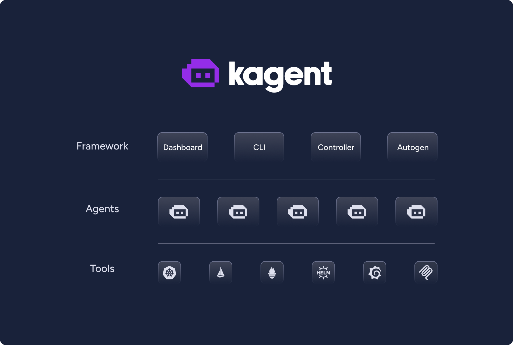
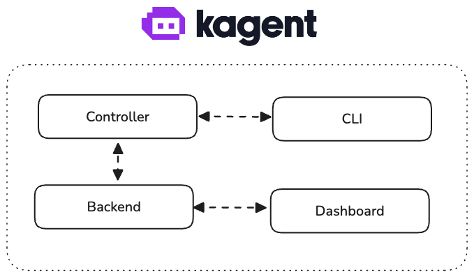

<div align="center">
  <picture>
    <source media="(prefers-color-scheme: dark)" srcset="https://raw.githubusercontent.com/kagent-dev/kagent/main/img/icon-dark.svg" alt="kagent" width="400">
    <source media="(prefers-color-scheme: light)" srcset="https://raw.githubusercontent.com/kagent-dev/kagent/main/img/icon-light.svg" alt="kagent" width="400">
    
  </picture>
  <h1>kagent: Agentic AI Framework</h1>
  <p><strong>Open-source framework for running AI agents in Kubernetes, automating complex DevOps operations and troubleshooting tasks with intelligent workflows</strong></p>
  <p><a href="https://kagent.dev">🌐 Official Website</a> | <a href="https://kagent.dev/docs">📚 Documentation</a> | <a href="https://kagent.dev/blog">📝 Blog</a></p>
  <div>
    <a href="https://github.com/kagent-dev/kagent/releases">
      
    </a>
    <a href="https://github.com/kagent-dev/kagent/actions/workflows/ci.yaml">
      
    </a>
    <a href="https://opensource.org/licenses/Apache-2.0">
      
    </a>
    <a href="https://github.com/kagent-dev/kagent">
      
    </a>
    <a href="https://discord.gg/Fu3k65f2k3">
      
    </a>
    <a href="https://deepwiki.com/kagent-dev/kagent"></a>
    <a href='https://codespaces.new/kagent-dev/kagent'>
      
    </a>
    <a href="https://www.bestpractices.dev/projects/10723"></a>
    <a href="https://kagent.dev">
      
    </a>
    <a href="https://cloud-native.slack.com/archives/C08ETST0076">
      
    </a>
  </div>
</div>

---

## 📋 Table of Contents

- [Overview](#overview)
- [Key Features](#key-features)
- [Why kagent?](#why-kagent)
- [Architecture](#architecture)
- [Core Components](#core-components)
- [Getting Started](#getting-started)
- [Use Cases](#use-cases)
- [Technical Details](#technical-details)
- [Supported Integrations](#supported-integrations)
- [Security & Compliance](#security--compliance)
- [Performance & Scalability](#performance--scalability)
- [Documentation](#documentation)
- [Community & Support](#community--support)
- [Contributing](#contributing)
- [Roadmap](#roadmap)
- [Reference](#reference)

---

## 🎯 Overview

**kagent** is an open-source, Kubernetes-native framework designed specifically for building, deploying, and managing AI agents within Kubernetes environments. As Kubernetes has become the de facto standard for container orchestration and workload management, kagent bridges the gap between modern AI agent technologies and enterprise-grade Kubernetes infrastructure.

kagent provides a comprehensive platform that enables organizations to leverage the power of Large Language Models (LLMs) and AI agents while maintaining the operational excellence, security, and scalability that Kubernetes provides. The framework is built with enterprise requirements in mind, offering declarative configuration, multi-tenancy support, comprehensive observability, and seamless integration with existing Kubernetes tooling and workflows.

> **🌐 Visit [kagent.dev](https://kagent.dev) for the latest documentation, examples, and community resources.**

kagent is a [Cloud Native Computing Foundation (CNCF) sandbox project](https://www.cncf.io/sandbox-projects/), originally created at [Solo.io](https://www.solo.io/), demonstrating its commitment to open standards and cloud-native best practices.

### What Makes kagent Unique?

- **🔒 Kubernetes-Native Security**: Full integration with Kubernetes RBAC, ServiceAccounts, and security policies
- **📦 Declarative Configuration**: Define agents, tools, and configurations as Kubernetes Custom Resources
- **🔌 Extensible Tool Ecosystem**: Connect to any MCP (Model Context Protocol) server or build custom tools
- **🌐 Multi-Provider Support**: Works with OpenAI, Anthropic, Google Vertex AI, Azure OpenAI, Ollama, and custom providers
- **📊 Enterprise Observability**: Built-in OpenTelemetry tracing, metrics, and logging
- **🚀 Production-Ready**: Battle-tested in production environments with real-world deployments

<div align="center">
  
  <p><em>kagent enables seamless AI agent operations within Kubernetes clusters</em></p>
</div>

---

## ✨ Key Features

### 🤖 Intelligent Agent Management

- **Declarative Agent Definition**: Define agents using Kubernetes Custom Resources with YAML manifests
- **Multiple Agent Types**: Support for declarative agents (system prompts + tools) and Bring-Your-Own (BYO) agents
- **Agent-to-Agent Communication**: Built-in A2A (Agent-to-Agent) protocol for multi-agent coordination
- **Session Management**: Persistent conversation sessions with state management
- **Streaming Support**: Real-time streaming responses for enhanced user experience

### 🛠️ Comprehensive Tool Integration

- **MCP Server Support**: Native integration with Model Context Protocol servers
- **Pre-built Tool Servers**: Ready-to-use tools for Kubernetes, Istio, Helm, Argo Rollouts, Prometheus, Grafana, Cilium, and more
- **Custom Tool Development**: Build and deploy custom tools as Kubernetes resources
- **Tool Reusability**: Share tools across multiple agents for efficient resource utilization
- **Remote MCP Servers**: Connect to external MCP servers securely

### 🧠 Multi-LLM Provider Support

- **OpenAI**: Full support for GPT-3.5, GPT-4, and other OpenAI models
- **Anthropic**: Integration with Claude models via API
- **Google Vertex AI**: Support for Gemini and other Vertex AI models
- **Azure OpenAI**: Enterprise Azure OpenAI Service integration
- **Ollama**: Local model deployment support
- **Custom Providers**: Extensible architecture for any LLM provider via AI gateways
- **Model Configuration**: Centralized ModelConfig resources for consistent model management

### 📊 Enterprise Observability

- **OpenTelemetry Integration**: Comprehensive distributed tracing
- **Metrics Collection**: Built-in Prometheus metrics
- **Structured Logging**: JSON-formatted logs for easy parsing and analysis
- **Session Tracking**: Full visibility into agent conversations and tool usage
- **Performance Monitoring**: Track latency, throughput, and error rates

### 🔐 Security & Compliance

- **Kubernetes RBAC Integration**: Fine-grained access control using Kubernetes ServiceAccounts
- **Secret Management**: Secure handling of API keys and credentials via Kubernetes Secrets
- **Network Policies**: Support for Kubernetes NetworkPolicies
- **Audit Logging**: Complete audit trail of all agent operations
- **CNCF Best Practices**: Following Cloud Native Computing Foundation security guidelines

### 🎨 Developer Experience

- **Web UI**: Modern Next.js-based dashboard for agent management
- **CLI Tool**: Comprehensive command-line interface (`kagent`) for all operations
- **Kubernetes API**: Native Kubernetes API integration for GitOps workflows
- **Multiple Frameworks**: Support for ADK, CrewAI, and LangGraph agent frameworks
- **Local Development**: Full support for local development and testing

---

## 🎯 Why kagent?

### The Problem

Organizations are increasingly looking to leverage AI agents for automation, but face significant challenges:

- **Infrastructure Complexity**: Deploying and managing AI agents requires complex infrastructure setup
- **Security Concerns**: Ensuring secure access to Kubernetes resources and external APIs
- **Operational Overhead**: Lack of standardized patterns for agent lifecycle management
- **Integration Challenges**: Difficulties integrating agents with existing Kubernetes tooling
- **Scalability Issues**: Challenges scaling agent deployments across multiple clusters

### The Solution

kagent addresses these challenges by providing a **Kubernetes-native framework** that makes deploying and managing AI agents as simple as deploying any other Kubernetes workload:

#### 🚀 Quick Declarative Deployment

Deploy agents in seconds using familiar Kubernetes tools and YAML manifests. No complex infrastructure setup required—just define your agent declaratively and apply it:

```yaml
apiVersion: kagent.dev/v1alpha2
kind: Agent
metadata:
  name: my-agent
spec:
  type: Declarative
  declarative:
    systemMessage: "You are a helpful assistant"
    modelConfig: default-model-config
```

Apply with standard Kubernetes tools:
```bash
kubectl apply -f agent.yaml
```

#### 🛠️ Familiar Tools, Zero Learning Curve

Use the tools you already know and love:
- **kubectl**: Deploy and manage agents like any Kubernetes resource
- **YAML**: Define agents declaratively using standard Kubernetes patterns
- **Helm**: Package and deploy agents with Helm charts
- **GitOps**: Integrate with ArgoCD, Flux, or any GitOps tool
- **RBAC**: Leverage existing Kubernetes security models

#### ☸️ Native Kubernetes Operation

Agents run seamlessly in your Kubernetes cluster:
- **First-Class Citizens**: Agents are Kubernetes Custom Resources, fully integrated with the ecosystem
- **Standard Patterns**: Use ConfigMaps, Secrets, ServiceAccounts, and all familiar Kubernetes primitives
- **Native Scaling**: Leverage Kubernetes autoscaling, resource limits, and scheduling
- **Built-in Observability**: Integrate with existing Prometheus, Grafana, and logging infrastructure

#### Additional Benefits

1. **Security by Default**: Built-in security best practices with Kubernetes-native access controls
2. **Operational Excellence**: Comprehensive observability, monitoring, and debugging capabilities
3. **Extensibility**: Flexible architecture that adapts to your specific requirements
4. **Production Ready**: Battle-tested in real-world deployments across multiple industries

### Real-World Impact

kagent is already being used in production by organizations across various industries:

- **Telecommunications**: Complex infrastructure monitoring and malicious user detection
- **Financial Services**: Secure, auditable AI-powered operations with compliance requirements
- **Identity Verification**: Reliable automation for critical verification platforms
- **Platform Engineering**: Cloud-native platform solutions for internal teams and customers

### Trusted by Industry Leaders

kagent is trusted by leading organizations worldwide:

<div align="center">
  <p><strong>Solo.io</strong> • <strong>Amdocs</strong> • <strong>Au10tix</strong> • <strong>Krateo</strong></p>
  <p><em>Join these organizations in leveraging kagent for production AI agent deployments</em></p>
</div>

---

## 🏗️ Architecture

kagent is built on a microservices architecture that seamlessly integrates with Kubernetes. The framework consists of four core components that work together to provide a complete AI agent platform.

<div align="center">
  
  <p><em>kagent's modular architecture enables flexible and scalable agent deployments</em></p>
  <p><a href="https://kagent.dev">View detailed architecture documentation and interactive diagrams on kagent.dev</a></p>
</div>

### High-Level Architecture Overview

The kagent architecture follows cloud-native principles, with each component designed to be independently scalable, maintainable, and observable. The system leverages Kubernetes Custom Resources (CRDs) for declarative configuration, ensuring that all agent definitions, tool configurations, and model settings are stored as Kubernetes resources.

### Data Flow

1. **User Interaction**: Users interact with agents via the Web UI, CLI, or Kubernetes API
2. **Controller Processing**: The Controller watches Custom Resources and manages agent lifecycle
3. **Engine Execution**: The Engine executes agent logic using the configured LLM provider
4. **Tool Invocation**: Agents invoke tools through MCP servers or direct Kubernetes API calls
5. **Observability**: All operations are traced, logged, and metered for monitoring

---

## 🔧 Core Components

### 1. Controller

The **Controller** is a Kubernetes controller implemented in Go that serves as the central orchestration component of kagent. It continuously watches kagent Custom Resources (Agents, ModelConfigs, ToolServers, RemoteMCPServers) and ensures the desired state is maintained.

**Key Responsibilities:**
- **Resource Reconciliation**: Automatically creates, updates, and deletes Kubernetes resources based on Custom Resource definitions
- **Lifecycle Management**: Manages the complete lifecycle of agent pods, services, and related resources
- **Health Monitoring**: Monitors agent health and automatically restarts failed instances
- **A2A Server Management**: Hosts Agent-to-Agent protocol servers for multi-agent communication
- **API Gateway**: Provides REST API endpoints for agent invocation and management

**Technical Details:**
- Built using [Kubebuilder](https://book.kubebuilder.io/) and the Kubernetes controller-runtime
- Supports multiple namespaces with namespace-scoped resources
- Implements leader election for high availability
- Provides comprehensive error handling and retry logic

### 2. Engine

The **Engine** is the runtime component that executes agent logic. It's built using Google's [Agent Development Kit (ADK)](https://google.github.io/adk-docs/) and provides a flexible framework for running AI agents.

**Key Capabilities:**
- **LLM Integration**: Seamlessly integrates with multiple LLM providers through a unified interface
- **Tool Execution**: Executes tools provided by MCP servers or custom implementations
- **Session Management**: Maintains conversation state and context across multiple interactions
- **Streaming Support**: Provides real-time streaming of agent responses
- **Memory Management**: Handles short-term and long-term memory for agents

**Supported Frameworks:**
- **ADK (Agent Development Kit)**: Google's official agent framework (primary)
- **CrewAI**: Multi-agent orchestration framework
- **LangGraph**: State machine-based agent workflows

**Technical Stack:**
- Implemented in Python for optimal ML/AI library support
- Containerized for consistent deployment across environments
- Supports both declarative and BYO (Bring-Your-Own) agent types

### 3. Web UI

The **Web UI** is a modern, responsive web application built with Next.js that provides a comprehensive interface for managing and interacting with kagent.

**Features:**
- **Agent Management**: Create, configure, and manage agents through an intuitive interface
- **Conversation Interface**: Chat with agents in real-time with streaming support
- **Session History**: View and search through past conversations
- **Tool Configuration**: Configure and manage MCP servers and tools
- **Model Configuration**: Set up and manage LLM provider configurations
- **Observability Dashboards**: Visualize metrics, traces, and logs
- **Multi-tenant Support**: Support for multiple namespaces and teams

**Technical Stack:**
- **Frontend**: Next.js 14+ with React and TypeScript
- **Styling**: Tailwind CSS with shadcn/ui components
- **State Management**: React hooks and context API
- **API Integration**: RESTful API communication with the Controller

### 4. CLI

The **CLI** (`kagent`) is a comprehensive command-line tool that provides full control over kagent operations from the terminal.

**Key Commands:**
- `kagent agent deploy`: Deploy agents from YAML manifests or templates
- `kagent agent list`: List all agents in a namespace
- `kagent agent invoke`: Invoke agents directly from the command line
- `kagent mcp`: Manage MCP server configurations
- `kagent modelconfig`: Configure LLM providers
- `kagent install`: Install kagent in a Kubernetes cluster

**Installation:**
```bash
curl https://raw.githubusercontent.com/kagent-dev/kagent/refs/heads/main/scripts/get-kagent | bash
```

**Use Cases:**
- CI/CD pipeline integration
- Local development workflows
- Automated testing and validation
- Script-based agent management

---

## 🚀 Getting Started

### Prerequisites

Before installing kagent, ensure you have the following:

- **Kubernetes Cluster**: Kubernetes v1.24+ (tested up to v1.33+)
- **kubectl**: Configured to access your cluster
- **Helm**: v3.8+ for package management
- **LLM Provider Access**: API keys for at least one LLM provider (OpenAI, Anthropic, etc.)

### Quick Installation

The fastest way to get started with kagent:

```bash
# Install kagent CLI
curl -fsSL https://kagent.dev/install.sh | sh

# Install kagent in your cluster
kagent install

# Configure your LLM provider
kubectl apply -f - <<EOF
apiVersion: kagent.dev/v1alpha2
kind: ModelConfig
metadata:
  name: default-model-config
  namespace: kagent
spec:
  provider: openai
  apiKey:
    secretRef:
      name: openai-secret
      key: api-key
EOF

# Create API key secret
kubectl create secret generic openai-secret \
  --from-literal=api-key=your-api-key-here \
  -n kagent
```

### Your First Agent

Create a simple agent to get started:

```yaml
apiVersion: kagent.dev/v1alpha2
kind: Agent
metadata:
  name: my-first-agent
  namespace: kagent
spec:
  type: Declarative
  description: "My first kagent AI agent"
  declarative:
    systemMessage: |
      You are a helpful AI assistant that provides clear and concise answers.
      Always be polite and professional.
    modelConfig: default-model-config
```

Apply the agent:

```bash
kubectl apply -f agent.yaml
```

### Access the Web UI

Port-forward to the UI service:

```bash
kubectl port-forward svc/kagent-ui 8001:80 -n kagent
```

Then open your browser to `http://localhost:8001` and start chatting with your agent!

### Next Steps

- 📖 [Complete Installation Guide](https://kagent.dev/docs/kagent/introduction/installation)
- 🎯 [Quick Start Tutorial](https://kagent.dev/docs/kagent/getting-started/quickstart)
- 🛠️ [Building Your First Agent](https://kagent.dev/docs/kagent/getting-started/your-first-agent)
- 🔧 [Configuring Tools](https://kagent.dev/docs/kagent/tools/overview)

---

## 💼 Use Cases

kagent is designed to address a wide range of use cases across different industries and scenarios. Based on real-world deployments, here are the common challenges kagent solves:

### 1. Automated Operations

**Challenge**: Reduce manual intervention in complex DevOps workflows with intelligent automation and decision-making capabilities.

**Solution**: Deploy specialized Kubernetes agents that can:
- Automate routine operational tasks
- Make intelligent decisions based on cluster state
- Execute complex multi-step workflows
- Reduce toil and operational overhead

**Example Agents:**
- **K8s Agent**: General Kubernetes operations and troubleshooting
- **Istio Agent**: Service mesh configuration and debugging
- **Cilium Agent**: Network policy management and troubleshooting

### 2. Connection Issues

**Challenge**: Pinpoint broken links in multi-hop connections and diagnose application unreachability.

**Solution**: Agents that can:
- Trace network paths across services
- Diagnose connectivity issues automatically
- Identify broken service dependencies
- Suggest and implement fixes

### 3. Performance Analysis

**Challenge**: Diagnose and fix application performance degradation automatically.

**Solution**: Intelligent agents that:
- Analyze performance metrics and traces
- Identify performance bottlenecks
- Correlate issues across multiple services
- Automatically optimize configurations

### 4. Traffic Configuration

**Challenge**: Troubleshoot Gateway and HTTPRoute issues for proper traffic management.

**Solution**: Specialized agents for:
- Gateway configuration validation
- HTTPRoute rule analysis
- Traffic routing optimization
- Load balancing configuration

### 5. DevOps Automation

**Scenario**: Automate CI/CD pipelines, deployment processes, and infrastructure management.

**Solution**: Agents integrated with DevOps tools:
- Helm chart management and deployment
- Argo Rollouts progressive delivery
- GitOps workflow automation
- Infrastructure provisioning

### 6. Observability & Monitoring

**Scenario**: Intelligent monitoring, alerting, and observability analysis.

**Solution**: Agents that understand observability data:
- Prometheus query generation and analysis
- Grafana dashboard creation and management
- Log analysis and pattern detection
- Anomaly detection and alerting

### 7. Platform Engineering

**Scenario**: Build internal developer platforms with AI-powered automation.

**Solution**: Multi-agent systems that:
- Provide self-service capabilities to developers
- Automate common platform operations
- Enforce policies and best practices
- Reduce operational overhead

### 8. Multi-Agent Coordination

**Scenario**: Complex workflows requiring multiple specialized agents.

**Solution**: Agent-to-Agent (A2A) protocol enables:
- Task delegation between agents
- Collaborative problem-solving
- Workflow orchestration
- Distributed agent networks

### 9. Custom Business Logic

**Scenario**: Domain-specific AI agents for business applications.

**Solution**: BYO (Bring-Your-Own) agents allow:
- Integration of custom agent frameworks (CrewAI, LangGraph)
- Domain-specific tool development
- Custom business logic implementation
- Legacy system integration

> **💡 Explore more use cases and examples at [kagent.dev/examples](https://kagent.dev/examples)**

---

## 🔬 Technical Details

### Core Concepts

#### Agents

Agents are the fundamental building blocks of kagent. An agent consists of:

- **System Prompt**: Defines the agent's personality, capabilities, and behavior
- **LLM Configuration**: Specifies which model and provider to use
- **Tools**: Set of tools the agent can invoke (MCP servers, Kubernetes APIs, etc.)
- **Memory**: Conversation history and context management

Agents are represented as Kubernetes Custom Resources, making them:
- **Version Controlled**: Store agent definitions in Git
- **Reviewable**: Use standard code review processes
- **Auditable**: Track all changes through Kubernetes events
- **Reusable**: Share agents across teams and environments

**Agent Types:**

1. **Declarative Agents**: Defined entirely through YAML with system prompts and tool references
2. **BYO (Bring-Your-Own) Agents**: Custom agent implementations using ADK, CrewAI, or LangGraph

#### LLM Providers

kagent supports multiple LLM providers through the ModelConfig Custom Resource:

- **OpenAI**: GPT-3.5, GPT-4, GPT-4 Turbo, and other OpenAI models
- **Azure OpenAI**: Enterprise Azure OpenAI Service with Azure AD integration
- **Anthropic**: Claude 3 Opus, Sonnet, Haiku, and other Claude models
- **Google Vertex AI**: Gemini Pro, PaLM, and other Vertex AI models
- **Ollama**: Local model deployment for on-premises scenarios
- **Custom Providers**: Any provider accessible via AI gateways (OpenRouter, Together AI, etc.)

**Model Configuration Features:**
- Centralized configuration management
- Secret-based API key storage
- Per-namespace model configurations
- Support for custom endpoints and parameters

#### MCP Tools

Model Context Protocol (MCP) is a standardized protocol for agent-tool communication. kagent provides:

- **Native MCP Support**: Built-in MCP server integration
- **Pre-built Tool Servers**: Ready-to-use tools for common Kubernetes operations
- **Remote MCP Servers**: Connect to external MCP servers securely
- **Custom Tool Development**: Build and deploy custom tools as Kubernetes resources

**Available Tool Servers:**
- **Kubernetes**: Full Kubernetes API operations
- **Istio**: Service mesh configuration and management
- **Helm**: Chart management and deployment
- **Argo Rollouts**: Progressive delivery operations
- **Prometheus**: Metrics querying and analysis
- **Grafana**: Dashboard and alert management
- **Cilium**: Network policy and observability

#### Observability

kagent provides comprehensive observability through:

- **OpenTelemetry Tracing**: Distributed tracing across all components
- **Prometheus Metrics**: Standard Kubernetes metrics plus custom kagent metrics
- **Structured Logging**: JSON-formatted logs for easy parsing
- **Session Tracking**: Complete conversation history and tool usage

**Observability Features:**
- Trace agent execution flows
- Monitor tool invocation latency
- Track LLM API usage and costs
- Debug agent behavior with detailed logs

### Core Principles

#### Kubernetes Native

kagent is designed from the ground up to be Kubernetes-native:

- **Custom Resources**: All configurations are Kubernetes resources
- **RBAC Integration**: Uses Kubernetes ServiceAccounts for access control
- **Resource Management**: Leverages Kubernetes resource quotas and limits
- **Service Discovery**: Uses Kubernetes services for component communication
- **ConfigMaps & Secrets**: Standard Kubernetes patterns for configuration

#### Extensible

The framework is designed for extensibility:

- **Custom Tools**: Build and deploy custom tools as Kubernetes resources
- **Multiple Frameworks**: Support for ADK, CrewAI, LangGraph, and more
- **Plugin Architecture**: Extensible controller and engine components
- **API Extensions**: RESTful APIs for custom integrations

#### Flexible

kagent adapts to your requirements:

- **Multiple Agent Types**: Declarative or BYO agents
- **Various LLM Providers**: Support for any LLM provider
- **Custom Workflows**: Define complex multi-agent workflows
- **Integration Points**: Integrate with existing tools and systems

#### Observable

Built-in observability at every level:

- **Distributed Tracing**: Track requests across all components
- **Metrics Collection**: Monitor performance and usage
- **Log Aggregation**: Centralized logging with structured data
- **Session Management**: Track conversations and agent state

#### Declarative

Infrastructure-as-code approach:

- **YAML Configuration**: Define everything in YAML manifests
- **GitOps Ready**: Works seamlessly with GitOps tools (ArgoCD, Flux)
- **Version Control**: Track all changes in Git
- **Reproducibility**: Consistent deployments across environments

#### Testable

Designed for testing and debugging:

- **Local Development**: Run components locally for testing
- **Unit Testing**: Comprehensive test coverage
- **Integration Testing**: End-to-end test suites
- **Debugging Tools**: Built-in debugging capabilities

---

## 🔌 Supported Integrations

### LLM Providers

| Provider | Models Supported | Authentication | Status |
|----------|------------------|----------------|--------|
| OpenAI | GPT-3.5, GPT-4, GPT-4 Turbo | API Key | ✅ Production Ready |
| Azure OpenAI | All OpenAI models | Azure AD / API Key | ✅ Production Ready |
| Anthropic | Claude 3 (Opus, Sonnet, Haiku) | API Key | ✅ Production Ready |
| Google Vertex AI | Gemini, PaLM | Service Account | ✅ Production Ready |
| Ollama | All Ollama models | None (local) | ✅ Production Ready |
| Custom Providers | Any via AI Gateway | Configurable | ✅ Production Ready |

### Tool Integrations

| Tool | Description | Status |
|------|-------------|--------|
| Kubernetes API | Full Kubernetes operations | ✅ Production Ready |
| Istio | Service mesh management | ✅ Production Ready |
| Helm | Chart management | ✅ Production Ready |
| Argo Rollouts | Progressive delivery | ✅ Production Ready |
| Prometheus | Metrics querying | ✅ Production Ready |
| Grafana | Dashboard management | ✅ Production Ready |
| Cilium | Network policies | ✅ Production Ready |
| GitHub | Repository operations | 🚧 In Development |

### Agent Frameworks

| Framework | Description | Status |
|-----------|-------------|--------|
| ADK (Agent Development Kit) | Google's official framework | ✅ Production Ready |
| CrewAI | Multi-agent orchestration | ✅ Production Ready |
| LangGraph | State machine workflows | ✅ Production Ready |

### Observability Tools

| Tool | Integration Type | Status |
|------|------------------|--------|
| OpenTelemetry | Distributed Tracing | ✅ Production Ready |
| Prometheus | Metrics Collection | ✅ Production Ready |
| Grafana | Visualization | ✅ Production Ready |
| Jaeger | Trace Visualization | ✅ Production Ready |

---

## 🔐 Security & Compliance

### Security Features

kagent implements multiple layers of security:

#### Kubernetes RBAC Integration

- **ServiceAccounts**: Each agent runs with its own ServiceAccount
- **Role-Based Access Control**: Fine-grained permissions using Kubernetes RBAC
- **Namespace Isolation**: Agents are isolated by namespace
- **Least Privilege**: Agents only have access to required resources

#### Secret Management

- **Kubernetes Secrets**: All sensitive data stored in Kubernetes Secrets
- **Encryption at Rest**: Leverages Kubernetes secret encryption
- **No Hardcoded Credentials**: All credentials externalized
- **Secret Rotation**: Support for secret rotation workflows

#### Network Security

- **Network Policies**: Support for Kubernetes NetworkPolicies
- **TLS Encryption**: All inter-component communication over TLS
- **Service Mesh Integration**: Works with Istio for advanced networking
- **Ingress Security**: Secure ingress configuration

#### Audit & Compliance

- **Audit Logging**: Complete audit trail of all operations
- **Event Tracking**: Kubernetes events for all resource changes
- **Compliance Ready**: Designed for SOC 2, HIPAA, and other compliance requirements
- **CNCF Security**: Following CNCF security best practices

### Security Best Practices

When deploying kagent in production:

1. **Use Namespace Isolation**: Deploy agents in separate namespaces
2. **Implement RBAC**: Use least-privilege ServiceAccounts
3. **Enable Network Policies**: Restrict network access between components
4. **Rotate Secrets Regularly**: Implement secret rotation policies
5. **Enable Audit Logging**: Configure Kubernetes audit logging
6. **Use TLS Everywhere**: Enable TLS for all communications
7. **Regular Updates**: Keep kagent and dependencies up to date
8. **Security Scanning**: Regularly scan container images for vulnerabilities

### Compliance

kagent is designed to support various compliance requirements:

- **SOC 2**: Audit logging and access controls
- **HIPAA**: Secure handling of sensitive data
- **GDPR**: Data privacy and right to deletion
- **PCI DSS**: Secure payment processing (when applicable)

---

## ⚡ Performance & Scalability

### Performance Characteristics

kagent is designed for high performance:

- **Low Latency**: Optimized for sub-second agent response times
- **High Throughput**: Supports concurrent agent invocations
- **Efficient Resource Usage**: Minimal resource footprint
- **Caching**: Built-in caching for frequently accessed data

### Scalability

The framework scales horizontally:

- **Controller Scaling**: Controller can be scaled for high availability
- **Agent Pods**: Each agent runs in its own pod, scaling independently
- **Stateless Design**: Most components are stateless for easy scaling
- **Database Options**: Supports SQLite (development) and PostgreSQL (production)

### Resource Requirements

**Minimum Requirements:**
- Controller: 500m CPU, 512Mi memory
- Engine (per agent): 500m CPU, 1Gi memory
- UI: 100m CPU, 256Mi memory

**Recommended for Production:**
- Controller: 2 CPU, 2Gi memory
- Engine (per agent): 1 CPU, 2Gi memory
- UI: 500m CPU, 512Mi memory

### Performance Optimization

Tips for optimal performance:

1. **Use Appropriate LLM Models**: Choose models that balance cost and performance
2. **Implement Caching**: Cache frequently accessed data
3. **Optimize Tool Calls**: Minimize tool invocation overhead
4. **Use Streaming**: Enable streaming for better perceived performance
5. **Monitor Metrics**: Track performance metrics and optimize bottlenecks

---

## 📚 Documentation

Comprehensive documentation, guides, and examples are available at **[kagent.dev](https://kagent.dev)**:

### Getting Started
- [Installing kagent](https://kagent.dev/docs/kagent/introduction/installation)
- [Quick Start](https://kagent.dev/docs/kagent/getting-started/quickstart)
- [First Agent Guide](https://kagent.dev/docs/kagent/getting-started/your-first-agent)
- [First MCP Tool](https://kagent.dev/docs/kagent/tools/overview)

### Documentation
- [What is kagent](https://kagent.dev/docs/kagent/introduction/overview)
- [Architecture](https://kagent.dev/docs/kagent/architecture/overview)
- [Core Concepts](https://kagent.dev/docs/kagent/concepts/agents)
- [Configuring LLM Providers](https://kagent.dev/docs/kagent/supported-providers/openai)

### Examples
- [Tools](https://kagent.dev/docs/kagent/tools/overview)
- [Agents](https://kagent.dev/docs/kagent/examples/agents)
- [A2A Agents](https://kagent.dev/docs/kagent/concepts/a2a)
- [Documentation Agent](https://kagent.dev/examples)
- [Slack and A2A](https://kagent.dev/examples)
- [Discord and A2A](https://kagent.dev/examples)

### Guides
- [Building Custom Agents](https://kagent.dev/docs/kagent/guides/custom-agents)
- [Tool Development](https://kagent.dev/docs/kagent/guides/tools)
- [Multi-Agent Workflows](https://kagent.dev/docs/kagent/guides/multi-agent)
- [Production Deployment](https://kagent.dev/docs/kagent/guides/production)

### API Reference
- [REST API](https://kagent.dev/docs/kagent/api/rest)
- [Kubernetes CRDs](https://kagent.dev/docs/kagent/api/crds)
- [CLI Reference](https://kagent.dev/docs/kagent/api/cli)

### Community Resources
- [Blog](https://kagent.dev/blog) - Latest updates, tutorials, and insights
- [FAQ](https://kagent.dev/faq) - Frequently asked questions
- [Roadmap](https://github.com/orgs/kagent-dev/projects/3) - Project roadmap and upcoming features

> **📖 Visit [kagent.dev/docs](https://kagent.dev/docs) for the complete documentation**

---

## 👥 Community & Support

### Get Help

- **📖 Documentation**: [kagent.dev](https://kagent.dev) - Comprehensive guides and API reference
- **💬 Discord**: [Join our Discord community](https://discord.gg/Fu3k65f2k3) - Real-time chat and support
- **💬 Slack**: [CNCF #kagent channel](https://cloud-native.slack.com/archives/C08ETST0076) - CNCF community discussions
- **🐛 Issues**: [GitHub Issues](https://github.com/kagent-dev/kagent/issues) - Report bugs and request features
- **❓ FAQ**: [kagent.dev/faq](https://kagent.dev/faq) - Frequently asked questions
- **❓ DeepWiki**: [Ask DeepWiki](https://deepwiki.com/kagent-dev/kagent) - AI-powered documentation search

### Community Meetings

Join our regular community meetings:

- **Schedule**: [Google Calendar](https://calendar.google.com/calendar/u/0?cid=Y183OTI0OTdhNGU1N2NiNzVhNzE0Mjg0NWFkMzVkNTVmMTkxYTAwOWVhN2ZiN2E3ZTc5NDA5Yjk5NGJhOTRhMmVhQGdyb3VwLmNhbGVuZGFyLmdvb2dsZS5jb20)
- **Format**: Monthly community calls with updates, demos, and Q&A
- **Recordings**: Available on our YouTube channel

### Stay Updated

- **GitHub Releases**: [Release Notes](https://github.com/kagent-dev/kagent/releases) - Latest features and updates
- **Blog**: [kagent.dev/blog](https://kagent.dev/blog) - Tutorials, case studies, and announcements
- **Roadmap**: [Project Kanban](https://github.com/orgs/kagent-dev/projects/3) - See what's coming next

### Get Involved

Whether you're a platform engineer, DevOps professional, or CNCF project maintainer, help us build and shape the future of AI-driven cloud-native operations. Visit [kagent.dev](https://kagent.dev) to learn more about contributing.

---

## 🤝 Contributing

We welcome contributions from the community! Contributors are expected to [respect the kagent Code of Conduct](https://github.com/kagent-dev/community/blob/main/CODE-OF-CONDUCT.md).

### How to Contribute

There are many ways to get involved:

- 🐛 **Report Bugs**: [Open an issue](https://github.com/kagent-dev/kagent/issues/) for bugs or problems
- 💡 **Suggest Features**: [Share your ideas](https://github.com/kagent-dev/kagent/issues/) for new features
- 📖 **Improve Documentation**: Help us make the docs better
- 🔧 **Submit Pull Requests**: [Contribute code](CONTRIBUTING.md)
- ⭐ **Star the Repository**: Show your support
- 💬 **Help Others**: Answer questions in Discord and Slack
- 🔒 **Report Security Issues**: [See SECURITY.md](SECURITY.md)

### Development Setup

For instructions on how to set up your development environment, see [DEVELOPMENT.md](DEVELOPMENT.md).

**Quick Start:**
```bash
# Clone the repository
git clone https://github.com/kagent-dev/kagent.git
cd kagent

# Create a local Kubernetes cluster
make create-kind-cluster

# Install dependencies and deploy
make helm-install
```

### Contribution Guidelines

- Read [CONTRIBUTING.md](CONTRIBUTING.md) for detailed guidelines
- Follow the code style and conventions
- Write tests for new features
- Update documentation as needed
- Sign your commits (DCO)

### Contributors

Thanks to all contributors who are helping to make kagent better!

<a href="https://github.com/kagent-dev/kagent/graphs/contributors">
  
</a>

---

## 🗺️ Roadmap

kagent is currently in active development. Check out our full roadmap on the [project Kanban board](https://github.com/orgs/kagent-dev/projects/3).

### Upcoming Features

- **Multi-Tenancy**: Enhanced multi-tenant support with namespace isolation
- **Advanced Caching**: Intelligent caching for improved performance
- **More Tool Integrations**: Additional pre-built tool servers
- **Enhanced UI**: Improved user experience and new features
- **Performance Optimizations**: Further performance improvements
- **Enterprise Features**: Advanced enterprise capabilities

### Version History

- **v0.x**: Current development version
- **v1.0**: Planned stable release with full feature set

---

## 📊 Star History

<a href="https://www.star-history.com/#kagent-dev/kagent&Date">
 <picture>
   <source media="(prefers-color-scheme: dark)" srcset="https://api.star-history.com/svg?repos=kagent-dev/kagent&type=Date&theme=dark" />
   <source media="(prefers-color-scheme: light)" srcset="https://api.star-history.com/svg?repos=kagent-dev/kagent&type=Date" />
   
 </picture>
</a>

---

## 📖 Reference

### License

This project is licensed under the [Apache 2.0 License](LICENSE).

### Trademarks

kagent and the kagent logo are trademarks of the kagent project.

### Acknowledgments

- Built with [Kubebuilder](https://book.kubebuilder.io/)
- Powered by [Google ADK](https://google.github.io/adk-docs/)
- Uses [Model Context Protocol](https://modelcontextprotocol.io/)
- Part of the [Cloud Native Computing Foundation](https://cncf.io/)
- Originally created at [Solo.io](https://www.solo.io/)

### Related Projects

#### kagent Ecosystem

- **[kmcp](https://kagent.dev)** - MCP Kubernetes toolkit: The easiest way to create, deploy, and securely run MCP servers on Kubernetes. Part of the kagent project family, kmcp simplifies MCP server deployment and management in Kubernetes environments.

#### Foundation Technologies

- [Agent Development Kit (ADK)](https://google.github.io/adk-docs/) - Google's official agent framework powering kagent's engine
- [Model Context Protocol (MCP)](https://modelcontextprotocol.io/) - Standardized protocol for agent-tool communication
- [Agent2Agent (A2A)](https://github.com/google/A2A) - Protocol for agent-to-agent communication and coordination
- [Kubernetes](https://kubernetes.io/) - Container orchestration platform that kagent extends

> **🔗 Explore the complete kagent ecosystem, including kmcp, at [kagent.dev](https://kagent.dev)**

---

<div align="center">
    <picture>
      <source media="(prefers-color-scheme: dark)" srcset="https://raw.githubusercontent.com/cncf/artwork/refs/heads/main/other/cncf/horizontal/color-whitetext/cncf-color-whitetext.svg">
      <source media="(prefers-color-scheme: light)" srcset="https://raw.githubusercontent.com/cncf/artwork/refs/heads/main/other/cncf/horizontal/color/cncf-color.svg">
      
    </picture>
    <p><strong>kagent is a <a href="https://cncf.io">Cloud Native Computing Foundation</a> sandbox project.</strong></p>
    <p>Originally created at <a href="https://www.solo.io">Solo.io</a> • Built with ❤️ by the kagent community</p>
    <p>
      <a href="https://kagent.dev">🌐 Official Website</a> •
      <a href="https://kagent.dev/docs">📚 Documentation</a> •
      <a href="https://kagent.dev/blog">📝 Blog</a> •
      <a href="https://github.com/kagent-dev/kagent">💻 GitHub</a>
    </p>
</div>
