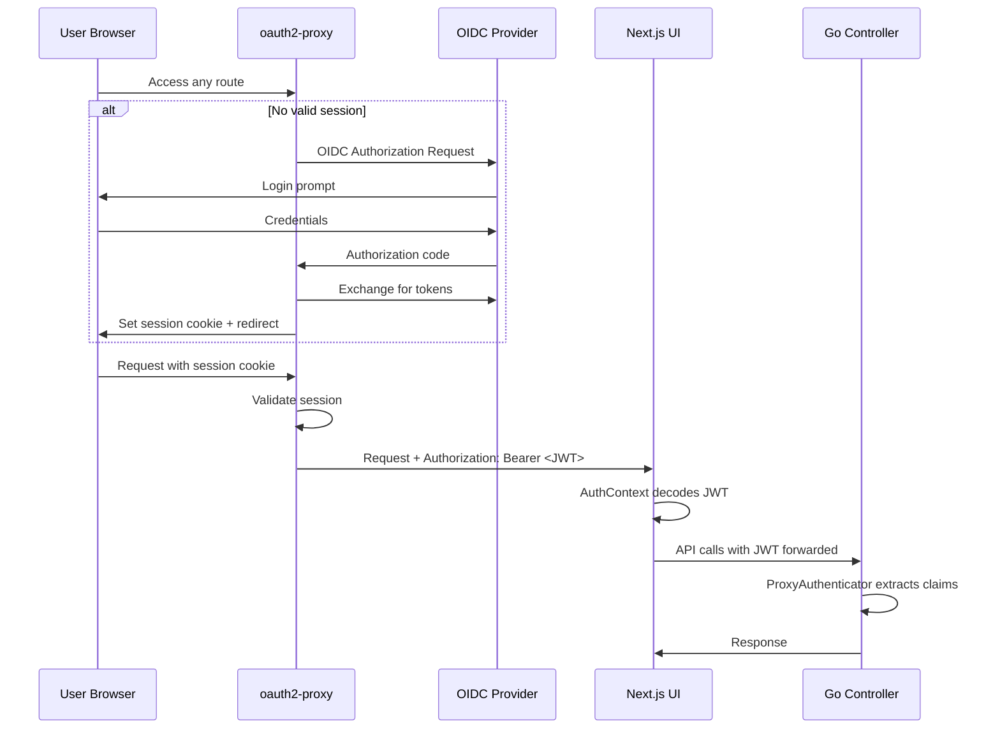
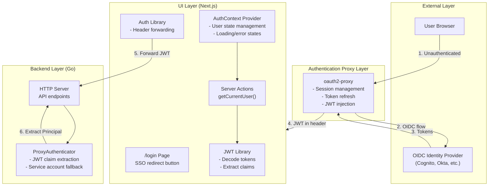
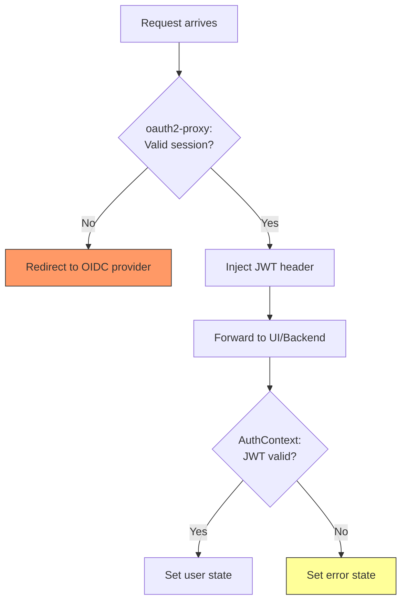
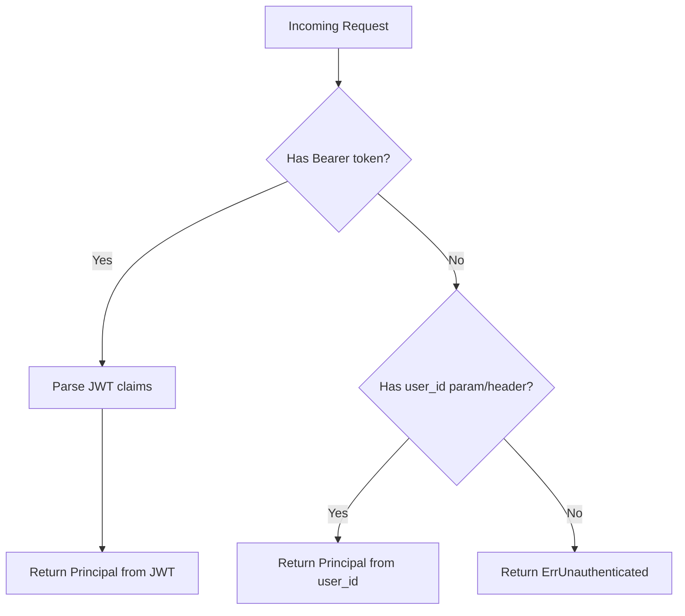
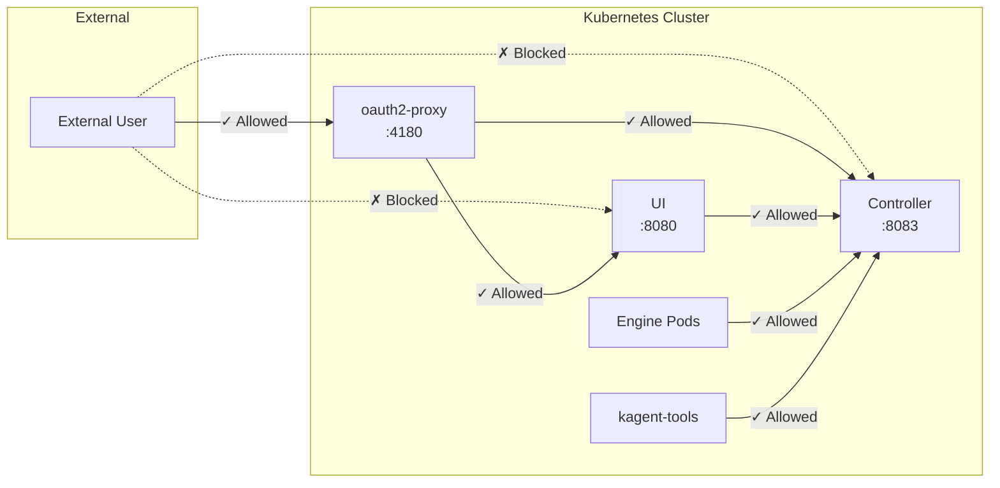

# OIDC Proxy Authentication Architecture

This document describes the authentication architecture introduced in the `feature/oidc-proxy-auth` branch.

## Overview

This PR adds OIDC proxy-based authentication to Kagent, allowing integration with enterprise identity providers via oauth2-proxy. The architecture follows a "trust the proxy" model where an upstream reverse proxy (oauth2-proxy) handles OIDC authentication and injects JWT tokens into requests.

## Authentication Flow



## Component Architecture



## Key Components

### Frontend (UI)

| Component | File | Purpose |
|-----------|------|---------|
| **Login Page** | `ui/src/app/login/page.tsx` | Branded login UI with SSO redirect button |
| **AuthContext** | `ui/src/contexts/AuthContext.tsx` | React context managing user state, loading, and error states |
| **Auth Actions** | `ui/src/app/actions/auth.ts` | Server action to get current user from JWT |
| **JWT Library** | `ui/src/lib/jwt.ts` | Decode JWT tokens and extract user claims |
| **Auth Library** | `ui/src/lib/auth.ts` | Extract and forward auth headers to backend |

### Backend (Go)

| Component | File | Purpose |
|-----------|------|---------|
| **ProxyAuthenticator** | `go/internal/httpserver/auth/proxy_authn.go` | Extract user identity from JWT Bearer tokens |

## Authentication Modes

The system supports two authentication modes via `AUTH_MODE` environment variable:

1. **`proxy`** (new): Trust oauth2-proxy to handle authentication, extract identity from JWT
2. **`noop`** (existing): No authentication, for development/testing

## JWT Claim Mapping

Claims are configurable via environment variables with sensible defaults:

| Claim | Env Var | Default | Fallbacks |
|-------|---------|---------|-----------|
| User ID | `JWT_CLAIM_USER_ID` | `sub` | - |
| Email | `JWT_CLAIM_EMAIL` | `email` | - |
| Name | `JWT_CLAIM_NAME` | - | `name`, `preferred_username` |
| Groups | `JWT_CLAIM_GROUPS` | - | `groups`, `cognito:groups`, `roles` |

## Authentication Boundary

Authentication redirects are handled entirely by oauth2-proxy at the ingress layer. The UI and backend trust that any request reaching them has already been authenticated.



**Design rationale**: The UI does not redirect on auth failure. If `getCurrentUser()` fails, it indicates a misconfiguration (oauth2-proxy should have intercepted the request) rather than a normal session expiry. The error state surfaces this for debugging rather than masking it with a redirect loop.

## Service Account Fallback

For internal agent-to-controller communication, the `ProxyAuthenticator` supports a fallback mechanism:



This allows agents running inside the cluster to authenticate without a full JWT.

## Deployment Configuration

oauth2-proxy is deployed as an optional Helm subchart dependency, configured in:
- `helm/kagent/Chart.yaml` - subchart dependency
- `helm/kagent/values.yaml` - oauth2-proxy configuration

## Security Considerations

1. **JWT validation is delegated to oauth2-proxy** - The backend does not re-validate JWT signatures, trusting that oauth2-proxy has already done so
2. **Tokens are forwarded upstream** - The original Authorization header is preserved for backend API calls
3. **Session cookies are httpOnly** - Managed by oauth2-proxy, not accessible to JavaScript
4. **Network policies enforce proxy routing** - When enabled, Kubernetes NetworkPolicies prevent direct access to UI and Controller, forcing all external traffic through oauth2-proxy

## Network Policies

When OIDC proxy authentication is enabled, Kubernetes NetworkPolicies are automatically created to enforce that all external traffic flows through oauth2-proxy. Without these policies, users could bypass authentication by accessing services directly via their ClusterIP or pod IPs.

### Protected Traffic Flow



### NetworkPolicy Rules

Two NetworkPolicies are created:

**UI NetworkPolicy** (`kagent-ui`):
- Only allows ingress from oauth2-proxy pods
- Blocks all other ingress traffic

**Controller NetworkPolicy** (`kagent-controller`):
- Allows ingress from oauth2-proxy (direct API access)
- Allows ingress from UI pods (UI → Controller communication)
- Allows ingress from engine pods (A2A communication)
- Allows ingress from kagent-tools pods (tool → Controller communication)

### Configuration

NetworkPolicies are automatically enabled when both conditions are met:
- `oauth2-proxy.enabled: true`
- `controller.auth.mode: proxy`

To disable network policies while keeping auth enabled:

```yaml
networkPolicy:
  enabled: false
```

Additional configuration options:

```yaml
networkPolicy:
  # Disable network policies (default: true when auth enabled)
  enabled: true
  # Additional labels to match oauth2-proxy pods (if using custom labels)
  oauth2ProxySelector: {}
  # Additional namespaces to allow traffic from (e.g., monitoring)
  additionalAllowedNamespaces: []
```

### Limitations

- **No egress restrictions**: Egress policies are not included to avoid breaking outbound connections to OIDC providers, databases, etc.
- **Same-namespace only**: Policies assume all Kagent components are in the same namespace
- **CNI requirement**: NetworkPolicies require a CNI plugin that supports them (Calico, Cilium, etc.)
