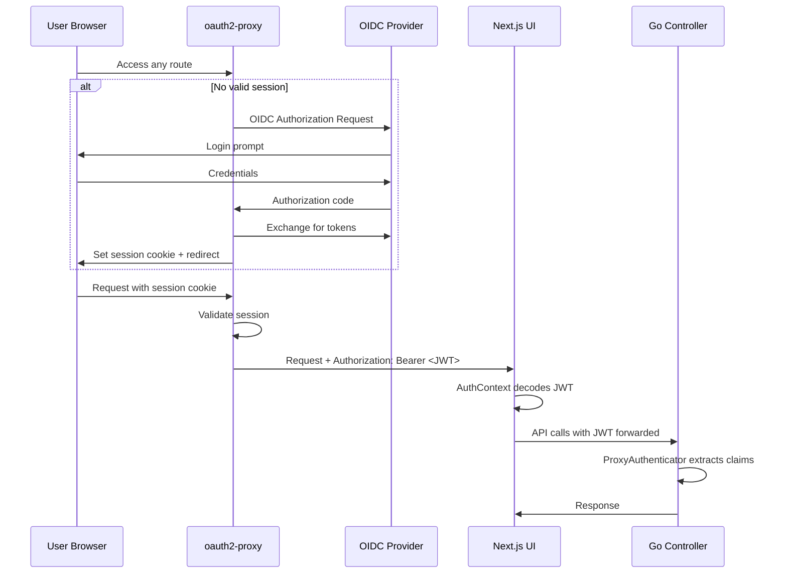
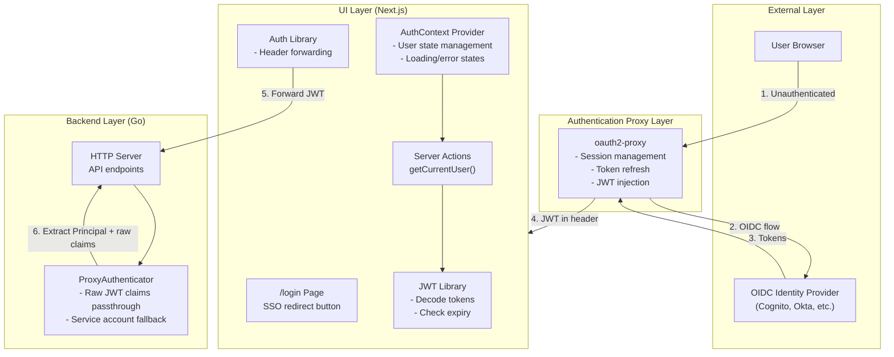
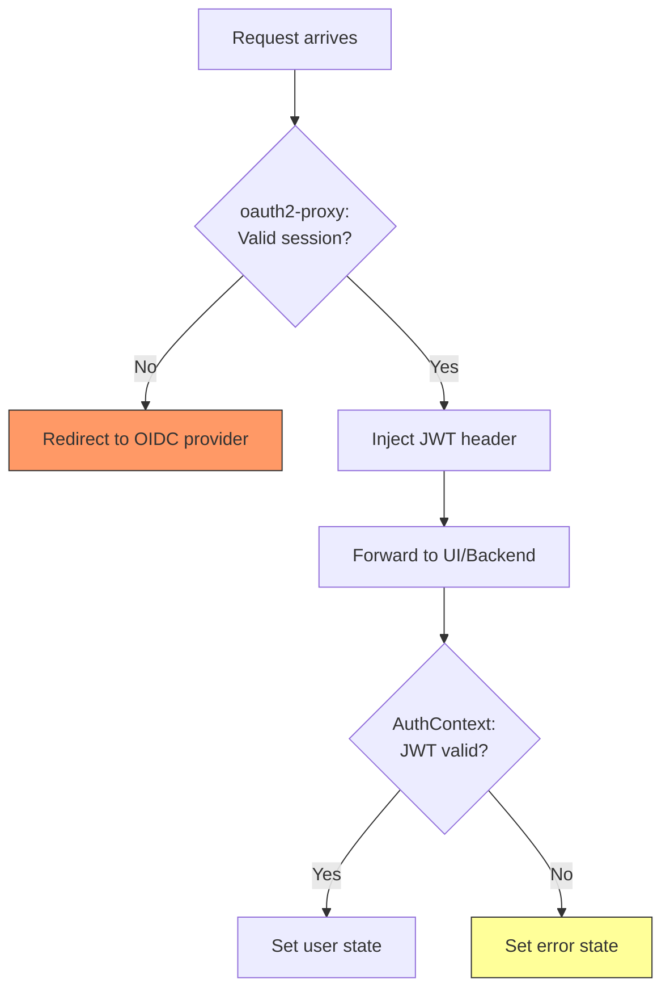
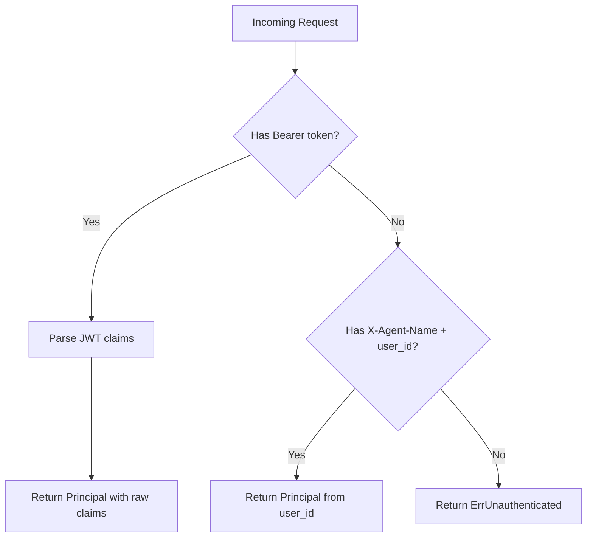

# OIDC Proxy Authentication Architecture

This document describes the authentication architecture introduced in the `feature/oidc-proxy-auth` branch.

## Overview

This PR adds OIDC proxy-based authentication to Kagent, allowing integration with enterprise identity providers via oauth2-proxy. The architecture follows a "trust the proxy" model where an upstream reverse proxy (oauth2-proxy) handles OIDC authentication and injects JWT tokens into requests.

## Authentication Flow

## Component Architecture

## Key Components

### Frontend (UI)

| Component | File | Purpose |
|-----------|------|---------|
| **Login Page** | `ui/src/app/login/page.tsx` | Branded login UI with SSO redirect button |
| **AuthContext** | `ui/src/contexts/AuthContext.tsx` | React context managing user state, loading, and error states |
| **Auth Actions** | `ui/src/app/actions/auth.ts` | Server action to get current user from JWT (returns raw claims) |
| **JWT Library** | `ui/src/lib/jwt.ts` | Decode JWT tokens and check expiry |
| **Auth Library** | `ui/src/lib/auth.ts` | Extract and forward auth headers to backend |

### Backend (Go)

| Component | File | Purpose |
|-----------|------|---------|
| **ProxyAuthenticator** | `go/internal/httpserver/auth/proxy_authn.go` | Extract user identity from JWT Bearer tokens, pass through raw claims |
| **CurrentUserHandler** | `go/internal/httpserver/handlers/current_user.go` | Returns raw JWT claims (or `{"sub": userId}` for non-JWT auth) |

## Authentication Modes

The system supports two authentication modes, configured via the `auth-mode` flag / `AUTH_MODE` environment variable:

1. **`proxy`** (new): Trust oauth2-proxy to handle authentication, extract identity from JWT
2. **`unsecure`** (existing): No authentication, for development/testing

## Configuration

Only two configuration options are needed:

| Flag | Env Var | Default | Description |
|------|---------|---------|-------------|
| `--auth-mode` | `AUTH_MODE` | `unsecure` | Authentication mode: `unsecure` or `proxy` |
| `--auth-user-id-claim` | `AUTH_USER_ID_CLAIM` | `sub` | JWT claim name for user identity |

### Raw Claims Passthrough

Instead of mapping specific JWT claims to fixed fields, the backend passes through all raw JWT claims. The `/api/me` endpoint returns the full JWT payload as-is, allowing the frontend to display whatever claims are available (name, email, groups, etc.) without backend configuration.

This approach:
- **Eliminates claim mapping configuration** — no need for `AUTH_JWT_CLAIM_EMAIL`, `AUTH_JWT_CLAIM_NAME`, etc.
- **Works with any OIDC provider** — Cognito, Okta, Azure AD, etc. all use different claim names
- **Frontend adapts automatically** — the UI tries common claim names (`name`, `preferred_username`, `email`) for display

## Authentication Boundary

Authentication redirects are handled entirely by oauth2-proxy at the ingress layer. The UI and backend trust that any request reaching them has already been authenticated.

**Design rationale**: The UI does not redirect on auth failure. If `getCurrentUser()` fails, it indicates a misconfiguration (oauth2-proxy should have intercepted the request) rather than a normal session expiry. The error state surfaces this for debugging rather than masking it with a redirect loop.

## Service Account Fallback

For internal agent-to-controller communication, the `ProxyAuthenticator` supports a fallback mechanism:

This allows agents running inside the cluster to authenticate without a full JWT.

## Deployment Configuration

oauth2-proxy is deployed as an optional Helm subchart dependency, configured in:
- `helm/kagent/Chart.yaml` - subchart dependency
- `helm/kagent/values.yaml` - oauth2-proxy configuration

## Security Considerations

1. **JWT validation is delegated to oauth2-proxy** — The backend does not re-validate JWT signatures, trusting that oauth2-proxy has already done so
2. **Tokens are forwarded upstream** — The original Authorization header is preserved for backend API calls
3. **Session cookies are httpOnly** — Managed by oauth2-proxy, not accessible to JavaScript
4. **Network policies** — NetworkPolicies to restrict direct access to UI/Controller (bypassing oauth2-proxy) are planned for a follow-up PR
