# Architecture

Kagent is a Kubernetes-native control plane for defining, compiling, running,
and invoking agents. Kubernetes stores desired agent configuration. PostgreSQL
stores runtime identity, A2A history, and lifecycle state. Substrate Actors run
the agent processes.

## Resource ownership

| Resource                      | Owner                                    | Purpose                                                                       |
| ----------------------------- | ---------------------------------------- | ----------------------------------------------------------------------------- |
| `Agent` | Kubernetes (`api.kagent.dev/v1alpha3`) | Explicit inline-or-reference template/Harness pairing, readiness, and revision selection |
| `Harness`                     | Kubernetes (`api.kagent.dev/v1alpha3`)       | Runtime implementation, workload, credentials, capacity, and snapshot policy |
| `AgentTemplate`               | Kubernetes (`api.kagent.dev/v1alpha3`)       | Portable agent behavior: model, prompt, tools, skills, and plugins            |
| prepared revision             | PostgreSQL and ate-api                   | Immutable compiled runtime input and its Substrate ActorTemplate              |
| `Session`               | PostgreSQL, exposed by gRPC              | Stable conversation identity and runtime lifecycle                                      |
| A2A context, task, and events | PostgreSQL, exposed by A2A               | Durable interaction and audit history                                         |
| checkpoint                    | PostgreSQL plus a Substrate snapshot tag | Immutable, named restart boundary                                             |
| Actor and durable directory   | Substrate                                | Process lifecycle and private runtime state                                   |

`Session` is not a Kubernetes resource. A2A owns public interaction
semantics; kagent does not maintain a parallel session or task API.

## Public surfaces

| Surface         | Role                                                                        |
| --------------- | --------------------------------------------------------------------------- |
| Kubernetes API  | Author Agents, Harnesses, AgentTemplates, models, prompts, and remote MCP servers   |
| gRPC / gRPC-Web | Manage Sessions, sharing, checkpoints, and control-plane reads        |
| A2A             | Invoke agents and manage durable tasks and streams                          |
| MCP             | Discover, invoke, checkpoint, and fork Sessions through A2A semantics |

## End-to-end flow

```mermaid
flowchart LR
    AGENT[Agent] --> AT[template or templateRef]
    AGENT --> H[harness or harnessRef]
    AT --> R[resolve tree]
    H --> R
    R --> B[build harness inputs]
    B --> C[registered harness compiler]
    C --> REV[immutable revision]
    REV --> ATE[ate-api ActorTemplate]
    ATE --> SNAP[golden snapshot ready]
    SNAP --> AI[Session]
    AI --> ACTOR[Substrate Actor]
    CLIENT[A2A client] --> GW[public A2A gateway]
    GW --> ACTOR
    ACTOR --> STORE[private gRPC TaskStore]
    STORE --> DB[(tasks and events)]
    DB --> QUIESCE[Session idle lifecycle]
    QUIESCE --> CKPT[checkpoint tag]
    CKPT --> FORK[forked Session]
```

Compilation and application are separate. The translator produces an immutable
revision; the controller applies it through ate-api. At runtime, the public A2A
gateway exposes each Agent and resolves context IDs to Sessions before routing
authorized callers to Actors through the private runtime network.
Runtimes persist A2A state through TaskStore and publish completion after native
cleanup. Session lifecycle workers independently pause/suspend idle Actors.

## Component boundaries

- API types describe agent behavior without exposing backend mechanics.
- The v2 translator resolves references and compiles explicit runtime inputs.
- The controller reconciles compiled revisions to ate-api ActorTemplates.
- Session services and workflows own lifecycle orchestration.
- The A2A gateway owns public authorization, task routing, and observation streams.
- Runtime SDKs own execution and task saves; TaskStore owns durable publication.
- The store owns transactional invariants and never performs network work.
- Substrate adapters own Actor, snapshot, and private-network operations.

## Documents

- [Configuration and compilation](configuration-and-compilation.md)
- [Runtime and lifecycle](runtime-and-lifecycle.md)
- [A2A gateway](a2a-gateway.md)
- [A2A metadata](a2a-metadata.md)
- [Persistence, checkpoints, and forks](persistence-checkpoints-and-forks.md)
- [MCP](mcp.md)
- [A2A agent tools](a2a-subagents.md)
- [Human in the loop](human-in-the-loop.md)
- [Prompt resolution](prompt-templates.md)
- [Telemetry](telemetry.md)
- [Structured output](structured-output.md)

The documents describe implemented behavior. Full cross-Session delegation
and Dedicated agents remain deferred.

## Current boundaries

Implemented end to end: kagent, Codex, Claude, and BYO compilation; ate-api
ActorTemplates; Session lifecycle; durable A2A tasks; auto-suspend;
checkpoint/fork; and MCP Tasks continuation.

Not implemented: Dedicated agent bindings, policy-enforced public
cross-Session delegation, checkpoint sharing, and multi-replica gateway
coordination.
