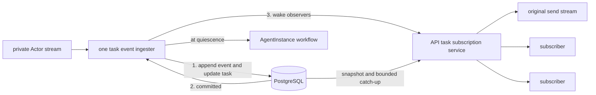

# A2A Gateway

The public gateway implements the upstream A2A handler for message send/stream,
task get/list/cancel, and subscription. It also serves the extended Agent Card
compiled into the instance's prepared revision.

## Client stream contract

`SendStreamingMessage` and `SubscribeToTask` expose upstream A2A task snapshots,
status updates, and artifact updates. A client maintains the current task by
applying each frame in order. Its transcript is a presentation of that state;
receiving a frame does not necessarily mean a new chat message arrived.

Each successful observation starts with a `Task` snapshot containing current
status, artifacts, and recovered history. Further snapshots can occur on the same
stream, including the final or waiting state. A fast task may finish before the
first read, so a single completed snapshot is a valid entire stream. Clients must
not depend on a fixed event count or on seeing every intermediate state.

### Applying frames

Keep task state scoped to the routed instance and task ID. Forks may retain the
same task/context IDs under different instance routes.

| A2A frame | Client action |
| --- | --- |
| `Task` | Replace the local task projection, including history, status, and artifacts. Initialize artifact accumulation from this snapshot. Reconcile displayed messages by ID instead of appending the entire history again. |
| `TaskStatusUpdateEvent` | Apply the task status and metadata using A2A update semantics. Inspect its status message for text or an interactive request. |
| `TaskArtifactUpdateEvent` | Match `artifactId`. With `append: true`, append the incoming parts to the existing artifact; otherwise add or replace that artifact. `lastChunk` ends that artifact's chunk sequence, not the task. |

Use the corresponding A2A SDK's task update reducer where available, keeping
snapshot replacement explicit. Preserve structured parts and metadata; only a
text renderer should flatten adjacent text parts. A plain status message is not
implicitly an append instruction.

For example, these are successive frames for the same task and artifact
(illustrative notation, not literal wire JSON):

```text
Task:           WORKING,   artifact "reply" = "hello"
ArtifactUpdate:           artifact "reply" = " world", append = true
Task:           COMPLETED, artifact "reply" = "hello world!"
```

The client displays `hello`, then `hello world`, then replaces it with
`hello world!` under the same artifact ID. A client attaching after completion may
receive only the last frame and must reach the same result.

### Completion, waiting, and reconnects

Read the task state to distinguish completion, failure, cancellation, rejection,
and waiting for input or authentication. Stream closure alone is not success.
Waiting tasks retain their task/context IDs and can be continued with a new
message. A replayed send may return only the current task snapshot; subscribe to
that task if it is still active and further observation is needed.

After a transport or observation error, retain the task ID and use `GetTask` or
`SubscribeToTask` on the same instance route to recover committed progress.
Replace the local projection from the new snapshot before applying new deltas;
do not append its history or artifacts to the previous connection's accumulator.
There is no public event cursor, and reconnects do not promise replay of the
original runtime packets. Active recovery can currently fail when ingestion is
unavailable; cross-replica ownership and delivery are not yet implemented.
Closing an observer does not cancel the task; use `CancelTask` for cancellation.

### Optional rendering conventions

The snapshot/update rules above use A2A types. Some richer presentation depends
on additional metadata and must work identically for snapshot contents and live
status updates:

- The [kagent HITL extension](human-in-the-loop.md) describes questions and tool
  approvals. Read the pending request from the waiting task's `status.message`,
  even if no live status update was observed. Advertise support using the
  extension header described in that guide.
- The [canonical metadata contract](a2a-metadata.md) defines shared keys for
  ordering, tool activity, and structured results. Runtime adapters translate
  their SDK's internal metadata before publishing. Clients use native artifact
  updates for streaming text and do not interpret runtime-specific `adk_*` keys.

Clients should keep their A2A task reducer independent of these rendering rules.
The UI adapter and its
[stream tests](../../ui/src/api/chat/a2aGrpcChatClient.test.ts) provide concrete
examples of snapshot-plus-append handling and pending requests.

## Routing and execution

Authentication establishes AgentInstance authority. The gateway
loads the instance and prepared revision, derives the private Actor route, and
forwards upstream A2A requests. Actor addresses and runtime credentials remain
internal.

The instance route (`x-kagent-agent-instance-id`) selects authorization and history.
`AgentInstance.context_id` is the bound A2A context, not the instance ID. Sends
may omit context to resolve that binding; a different nonempty context is rejected.
ListTasks may omit the context filter. Forks retain protocol IDs under distinct
instance routes, including for cancellation and subscription.

Within a gateway process, each running task has one event ingester. It owns runtime
event consumption, durable persistence, and the final quiescence transition.
Client streams and subscribers read committed records through the API task service;
the ingester only signals that progress is available. This permits multiple observers
without creating multiple Actor readers or suspending the same turn twice.
This coordination is process-local; it does not establish exclusive ingestion
across replicas.



## Durable ordering

The gateway persists the task and every ordered event before publishing the event
to observers. The store atomically applies an event to materialized task state and
appends its history row. Malformed durable events fail rather than being silently
discarded.

The persistence model enforces:

- one non-quiescent task per instance history;
- message-ID idempotency using the request hash;
- conflict rejection when an ID is reused for different content; and
- an exact snapshot identity and history sequence at each quiescent boundary.

Tasks contain current materialized A2A state. Complete message history is rebuilt
from ordered event rows, not stored as one history blob.

The log retains a canonical event representation for checkpoint replay. A Message
result is archived with its effect recorded as a status transition; a Task event
omits history already held in archive rows. This preserves replayable task state
and message history, but does not preserve every original client response shape.

## Durable reads

`GetTask` and `ListTasks` delegate to the API-owned
[`agentinstancetask` service](../../go/core/internal/service/agentinstancetask).
The gateway supplies the routed instance ID; the service independently checks
authenticated owner/share authority. Reads work while an instance is suspended
and never connect to its Actor or acquire execution ownership.

The store reads a task, its selected history, and the last committed event position
in one SQL statement. The position includes history-only records, so messages
already in the snapshot are not read again. List counts, task state, and history
share one read-only transaction snapshot. Neither read locks writers.

Recovery uses this snapshot followed by bounded reads of the existing log strictly
after its position. The records include canonical task updates and archived messages;
an observer folds them into task state and synthesized history. They are internal
recovery input, not a second archive of runtime responses to forward verbatim.
Positions are scoped to an instance history and task and must not be reused across
forks. Processing each position once prevents an artifact append from being applied
twice. No additional payload, message reference, or history copy is stored.

Local send streams and subscriptions use the task service to restore that snapshot
and follow the log. The service reuses the checkpoint reducer for task state and
adds archive rows to synthesized history. Status/artifact deltas retain their A2A
shape; archive rows are retained for the next task snapshot rather than emitted as
separate updates. Task snapshots include the recovered history. A waiting or
terminal snapshot is published only after its archived output has been read,
including across page boundaries. The UI accepts these snapshots as replacements,
seeds subsequent artifact appends, and restores interactive requests from status.
Completion snapshots replace accumulated artifacts under the same IDs; archived
messages already displayed are deduplicated by message ID.

Before each log read, an observer captures the ingester's next notification. A
commit racing with the read either appears in that read or closes the captured
channel. Notifications coalesce without retaining payloads, and slow readers catch
up in bounded pages. They cannot block ingestion. An ingester that ends with an
active task produces an explicit observation error after committed progress has
been delivered; it does not fabricate completion.

Ingestion ownership is still process-local. The legacy gateway fallback can start
an ingester when a subscription finds an active task with no local run. Removing
that fallback requires subscriber-independent ingestion for nonblocking unary sends
and verified runtime recovery. Full API-owned execution and cross-replica delivery
remain follow-up work; PostgreSQL LISTEN/NOTIFY is excluded. New unary Message/Task
response behavior is unchanged.

The implementation is in
[`go/core/internal/a2agateway`](../../go/core/internal/a2agateway).
