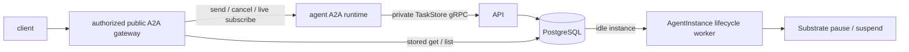

# A2A Gateway

The public gateway implements the upstream A2A handler for message send/stream,
task get/list/cancel, and subscription. It also serves the extended Agent Card
compiled into the instance's prepared revision.

## Routing and execution

Authentication establishes AgentInstance authority. The gateway
loads the instance and prepared revision, derives the private Actor route, and
forwards upstream A2A requests. Actor addresses and runtime credentials remain
internal.

The instance route (`x-kagent-agent-instance-id`) selects authorization and history.
`AgentInstance.context_id` is the bound A2A context, not the instance ID. Sends
may omit context to resolve that binding; a different nonempty context is rejected.
ListTasks may omit the context filter. Forks retain protocol IDs under distinct
instance routes, including for cancellation and subscription.

The runtime owns execution and persists updates through the private gRPC
`TaskStoreService`. The gateway owns each caller's observation connection.
Disconnecting a client or gateway does not cancel the native runner or remove
its persistence writer. Public authentication and authorization stay in the
API/gateway; the runtime SDK serializes execution and continues waiting tasks.

## Durable ordering

The SDK creates a task through CreateTask and applies versioned UpdateTask saves.
Native work waits for the initial active task save, so lifecycle operations cannot
miss an execution that has already started. Immutable storage mutation receipts
allow lost save responses to be retried without duplicating history. Both SDKs persist intermediate updates
before streaming them. Public task history remains synthesized from the retained
messages and artifacts; this is not an exact replay archive of every wire event.

The final waiting or terminal save is staged until native cleanup is complete.
The runtime acknowledges that exact version, and the store publishes task state
and history in one transaction. Clients can read completion even when runtime
pause/suspend is slow, unavailable, or has not started. TaskStore performs no
runtime lifecycle calls and runs no background workers.

An independent AgentInstance lifecycle worker pauses waiting actors or suspends
terminal ones and records their matching snapshot. A new turn can supersede idle
work that has not been claimed. Once claimed, pause/suspend blocks new execution,
explicit lifecycle changes, and checkpoint capture until its outcome is recorded.
The gateway reserves dispatch on the instance before forwarding input. A reservation
blocks idle work, checkpoint capture, and explicit lifecycle operations until the
runtime saves an active task. Continuations may first save input while waiting;
the reservation stays held until their active save. Each attempt expires after two
minutes, and late first saves are rejected before native work. This timeout never
transfers permission to execute running native work.

The gateway waits up to ten seconds for a claimed idle operation before forwarding.
A rejected send carries A2A `ErrorInfo.metadata.reason=KAGENT_SEND_NOT_ACCEPTED`
(and `retryAfterMs=100`) only if no dispatch occurred, or the unused attempt was
atomically revoked and its input was never persisted. Clients may retry that
response with the same message. They must not blindly retry transport errors.
Persistence and revocation serialize on the instance; an ambiguous outcome stays
an error, and previously accepted input is recovered only from its own saved task.
Uncertain issued work remains claimed; it cannot safely be reassigned just because
a timeout expires. It blocks new execution but never hides completed task results.

Checkpoint readiness is separate from task completion. Creating a checkpoint
requires `expected_head_task_id`, the terminal task the caller intends to capture.
The store checks that boundary atomically. `FailedPrecondition` includes a
`google.rpc.ErrorInfo` in domain `kagent.dev`: `KAGENT_CHECKPOINT_SNAPSHOT_PENDING`
permits retry with the same request and task IDs; `KAGENT_CHECKPOINT_CONVERSATION_ADVANCED`
requires refreshing the conversation and choosing a new boundary. The UI retries
only the pending reason, for at most 30 seconds. A checkpoint reservation
blocks both new turns and idle lifecycle work while the snapshot is retained.

The persistence model enforces:

- one non-quiescent task per instance history;
- task-ID uniqueness and optimistic version checks;
- idempotent retries of the same storage mutation; and
- an exact snapshot identity and history sequence for each checkpoint.

Tasks contain current materialized A2A state. Complete message history is rebuilt
from ordered event rows, not stored as one history blob.

The implementation is in
[`go/core/internal/a2agateway`](../../go/core/internal/a2agateway).

## Runtime SDK adapters

Go uses the SDK's local execution manager with `MaxExecutions: 1`. Cancellation
uses its separate path, so it remains available while execution occupies the slot.
The SDK's cluster workqueue is not enabled: with a single execution slot, that
queue also rejects cancellation while work is running.

Python (minimum SDK 1.1.5) uses the SDK's request queues and an `asyncio.Lock` to
serialize native work across tasks in one actor. Busy requests are rejected at
the handler; simultaneous requests that passed that check serialize at the lock.
Its `save(task)` adapter tracks expected versions per request and chooses ordinary
CreateTask or UpdateTask. Cancellation refreshes its version when it takes over
the SDK writer, after any in-flight execution save. Waiting task state is copied before the SDK mutates its
cache, preserving the original question for native approval/input validation.

Both adapters persist an initial active event before native work, stop execution
on persistence failure, and wait for native cleanup before settling a boundary.
Go uses the SDK cleanup callback; Python withholds the final event until its native
runner returns. Snapshot work runs independently after publication.
Substrate self-suspend is planned. Moving suspension into the runtime after native
cleanup and final persistence may remove the API-side worker and settlement
handoff. Current Go ADK cancellation and SDK-generated failures can save final
state before cleanup, so `SettleTask` remains until those ordering guarantees hold.

SDK upgrades must run the real gRPC/PostgreSQL fixtures covering failed saves,
cancellation, continuation, disconnects, and slow subscribers.

## Reconnect and client behavior

Get/List serve committed state without waking the runtime. Subscribe returns
current stored state for quiescent tasks; otherwise the runtime supplies its
initial task followed by live updates. If completion races subscription setup,
the gateway recovers the committed public result. Unary sends also recover the
task containing the input if suspension interrupts the response; ambiguous message
IDs and protocol errors are not recovered. Cancellation recovers only a terminal
task. An interrupted request with unfinished work
still returns an error. Clients can replace their
projection with that current task and apply subsequent upstream A2A updates.
There is no event cursor or promise of replaying every previous token event.
Public sends do not guarantee idempotency by message ID. Once a task ID is known,
use GetTask or SubscribeToTask to reconnect. Do not automatically resend an
ambiguous request: a second send may start another task or another turn. Storage
RPC retries are internal to the runtime adapter and have a separate guarantee.

The scheduler records its single dispatch attempt before sending. After an
uncertain send it only looks for the task in stored history; it never sends again.
A crash between claiming and sending can therefore leave an execution unresolved
until its deadline, when normal timeout cleanup runs.

Codex and Claude reserve their native session while approval/input is pending.
Their local executor interceptor rejects input for another task before SDK
execution. Other harnesses retain their existing policy for parked tasks. All harnesses permit at most one active execution.

## Runtime authority and deployment prerequisite

TaskStore currently uses a temporary unsigned
`x-kagent-insecure-runtime-identity` header carrying the projected atespace, actor
name, and UID. Go and Python reread those files on every call so restored actors
use their own identity. The API checks the requested instance, atespace, and
recorded actor UID; user and share credentials do not grant private persistence
access. Public authentication remains unchanged.

This is the single prerelease path, with no configuration switch. The header can
be forged and does not establish verified actor identity. These builds are for
isolated deployments until [Substrate #1660](https://github.com/agent-substrate/substrate/issues/1660)
supplies actor JWT injection. That implementation will replace the header path
outright, including trusted issuer/JWKS, signature, audience, and expiry validation;
there will be no fallback to unsigned headers.

Push notifications are outside this cutover and are rejected by the public gateway.
