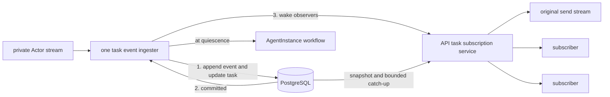

# A2A Gateway

The public gateway implements the upstream A2A handler for message send/stream,
task get/list/cancel, and subscription. It also serves the extended Agent Card
compiled into the instance's prepared revision.

## Routing and execution

Authentication establishes AgentInstance authority. The gateway
loads the instance and prepared revision, derives the private Actor route, and
forwards upstream A2A requests. Actor addresses and runtime credentials remain
internal.

The instance route (`x-kagent-agent-instance-id`) selects authorization and history.
`AgentInstance.context_id` is the bound A2A context, not the instance ID. Sends
may omit context to resolve that binding; a different nonempty context is rejected.
ListTasks may omit the context filter. Forks retain protocol IDs under distinct
instance routes, including for cancellation and subscription.

Within a gateway process, each running task has one event ingester. It owns runtime
event consumption, durable persistence, and the final quiescence transition.
Client streams and subscribers read committed records through the API task service;
the ingester only signals that progress is available. This permits multiple observers
without creating multiple Actor readers or suspending the same turn twice.
This coordination is process-local; it does not establish exclusive ingestion
across replicas.

## Durable ordering

The gateway persists the task and every ordered event before publishing the event
to observers. The store atomically applies an event to materialized task state and
appends its history row. Malformed durable events fail rather than being silently
discarded.

The persistence model enforces:

- one non-quiescent task per instance history;
- message-ID idempotency using the request hash;
- conflict rejection when an ID is reused for different content; and
- an exact snapshot identity and history sequence at each quiescent boundary.

Tasks contain current materialized A2A state. Complete message history is rebuilt
from ordered event rows, not stored as one history blob.

The log retains a canonical event representation for checkpoint replay. A Message
result is archived with its effect recorded as a status transition; a Task event
omits history already held in archive rows. This preserves replayable task state
and message history, but does not preserve every original client response shape.

## Durable reads

`GetTask` and `ListTasks` delegate to the API-owned
[`agentinstancetask` service](../../go/core/internal/service/agentinstancetask).
The gateway supplies the routed instance ID; the service independently checks
authenticated owner/share authority. Reads work while an instance is suspended
and never connect to its Actor or acquire execution ownership.

The store reads a task, its selected history, and the last committed event position
in one SQL statement. The position includes history-only records, so messages
already in the snapshot are not read again. List counts, task state, and history
share one read-only transaction snapshot. Neither read locks writers.

Recovery uses this snapshot followed by bounded reads of the existing log strictly
after its position. The records include canonical task updates and archived messages;
an observer folds them into task state and synthesized history. They are internal
recovery input, not a second archive of runtime responses to forward verbatim.
Positions are scoped to an instance history and task and must not be reused across
forks. Processing each position once prevents an artifact append from being applied
twice. No additional payload, message reference, or history copy is stored.

Local send streams and subscriptions use the task service to restore that snapshot
and follow the log. The service reuses the checkpoint reducer for task state and
adds archive rows to synthesized history. Status/artifact deltas retain their A2A
shape; archive rows are retained for the next task snapshot rather than emitted as
separate updates. Task snapshots include the recovered history. A waiting or
terminal snapshot is published only after its archived output has been read,
including across page boundaries. The UI accepts these snapshots as replacements,
seeds subsequent artifact appends, and restores interactive requests from status.
Completion snapshots preserve the displayed identity of streamed text and do not
redisplay archived chunks.

Before each log read, an observer captures the ingester's next notification. A
commit racing with the read either appears in that read or closes the captured
channel. Notifications coalesce without retaining payloads, and slow readers catch
up in bounded pages. They cannot block ingestion. An ingester that ends with an
active task produces an explicit observation error after committed progress has
been delivered; it does not fabricate completion.

Ingestion ownership is still process-local. The legacy gateway fallback can start
an ingester when a subscription finds an active task with no local run. Removing
that fallback requires subscriber-independent ingestion for nonblocking unary sends
and verified runtime recovery. Full API-owned execution and cross-replica delivery
remain follow-up work; PostgreSQL LISTEN/NOTIFY is excluded. New unary Message/Task
response behavior is unchanged.

The implementation is in
[`go/core/internal/a2agateway`](../../go/core/internal/a2agateway).
