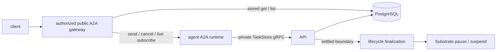

# A2A Gateway

The public gateway implements the upstream A2A handler for message send/stream,
task get/list/cancel, and subscription. It also serves the extended Agent Card
compiled into the instance's prepared revision.

## Routing and execution

Authentication establishes AgentInstance authority. The gateway
loads the instance and prepared revision, derives the private Actor route, and
forwards upstream A2A requests. Actor addresses and runtime credentials remain
internal.

The instance route (`x-kagent-agent-instance-id`) selects authorization and history.
`AgentInstance.context_id` is the bound A2A context, not the instance ID. Sends
may omit context to resolve that binding; a different nonempty context is rejected.
ListTasks may omit the context filter. Forks retain protocol IDs under distinct
instance routes, including for cancellation and subscription.

The runtime owns execution and persists updates through the private gRPC
`TaskStoreService`. The gateway owns each caller's observation connection.
Disconnecting a client or gateway does not cancel the native runner or remove
its persistence writer. Public authentication and authorization stay in the
API/gateway; admission in the runtime decides whether an authorized input starts
work, continues a waiting task, or replays an earlier result.

## Durable ordering

Admission commits the input before the SDK invokes native work. Saves require
an expected version and retain an immutable mutation receipt, so lost responses
can be retried without duplicating history. Both SDKs persist intermediate updates
before streaming them. Public task history remains synthesized from the retained
messages and artifacts; this is not an exact replay archive of every wire event.

The final waiting or terminal save is staged until native cleanup is complete.
The runtime acknowledges that exact version, then an independent API worker
claims and performs the pause/suspend. The store publishes task state, history,
and the snapshot reference atomically. The gateway closes its runtime observation
connection before waiting for publication, so it cannot prevent suspension.
Uncertain issued lifecycle work stays claimed and blocks conflicting admission.

The persistence model enforces:

- one non-quiescent task per instance history;
- message-ID idempotency using the request hash;
- conflict rejection when an ID is reused for different content; and
- an exact snapshot identity and history sequence at each quiescent boundary.

Tasks contain current materialized A2A state. Complete message history is rebuilt
from ordered event rows, not stored as one history blob.

The implementation is in
[`go/core/internal/a2agateway`](../../go/core/internal/a2agateway).

## Runtime SDK adapters

Go exposes expected task versions and an execution cleanup callback. Python's
SDK (minimum 1.1.5) exposes `save(task)` without a version, reuses mutable cached tasks,
and also calls `save` to append input before consuming execution events. The
Python adapter therefore tracks the writer version in the call context and
recognizes that input-only save: admission already persisted the input. It also
updates the cached status to the admitted state, so an artifact arriving before
a status event cannot carry the previous turn's waiting state.

Both adapters wait for native cleanup before settling a boundary. Python wraps
the executor's event queue to withhold that boundary and stops the producer if
persistence fails. Its ADK translates approval replies into a separate native
request, preserving the public message used by the SDK for persistence.

These are dependencies on the pinned SDK's sequencing. SDK upgrades must run
the real Python/gRPC/PostgreSQL fixture, including cached-history continuation,
artifact-first resume, cancellation and failed saves. Explicit SDK hooks for
already-admitted input and execution cleanup would simplify this adapter.

## Reconnect and client behavior

Get/List serve committed state without waking the runtime. Subscribe returns
current stored state for quiescent tasks; otherwise the runtime supplies its
initial task followed by live updates. If completion races subscription setup,
the gateway recovers the committed public result. Unary sends also recover the
matching accepted input if suspension interrupts the response; cancellation
recovers only a terminal task. An interrupted request with unfinished work
still returns an error. Clients can replace their
projection with that current task and apply subsequent upstream A2A updates.
There is no event cursor or promise of replaying every previous token event.
Do not resend input merely to reconnect. Retry an uncertain send with its original
message ID and content; changed content with that ID is rejected.

Codex and Claude reserve their native session while approval/input is pending.
Their adapter supplies the reserved task ID during private admission, so unrelated
input rolls back before adding a task/history entry. Other harnesses retain their
existing policy for parked tasks. All harnesses permit at most one active execution.

## Runtime authority and deployment prerequisite

TaskStore requests require the Substrate actor JWT described in
[Substrate #1660](https://github.com/agent-substrate/substrate/issues/1660).
The API verifies the trusted issuer, signature, audience, expiry, atespace,
actor name, and recorded actor UID. User and share credentials cannot grant
private persistence access. The runtime rereads its projected actor name for
routing after restore; it never issues or refreshes runtime credentials itself.

Production injection and issuer/JWKS wiring are pending upstream. The default
API rejects private TaskStore requests until that authenticator is configured;
the worktree's signed-token injection fixture is test-only. Live Substrate
restore and snapshot conformance passes with the isolated test identity below;
production actor credential injection and refresh still require verification.
Push notifications are outside this cutover and are rejected before admission.

For isolated E2E testing while Substrate actor JWT injection is pending, set
`KAGENT_INSECURE_TASK_STORE_AUTH=true` on both the API (`controller.env`) and
runtime (`Harness.spec.env`). Go and Python then send an unsigned
`x-kagent-insecure-runtime-identity` header from the projected atespace, actor
name and UID. The API still checks the recorded instance authority and UID;
public authentication is unchanged. This identity can be forged, so the switch
is default-off and must only be used in an isolated test deployment.
