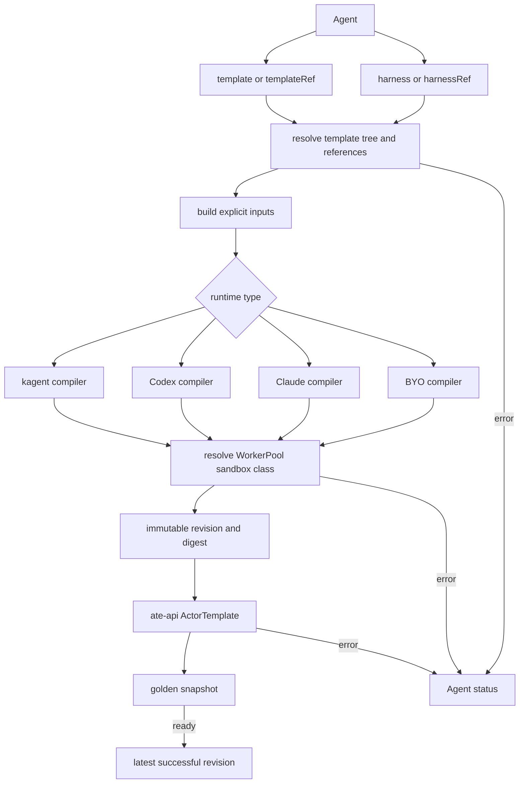

# Configuration and Compilation

## Public configuration

`Harness` describes how to run a class of agents. It selects exactly one runtime
variant—kagent, Codex, Claude, or BYO—and contains workload image/command/args,
environment and credential references, WorkerPool configuration, snapshot
location.

`AgentTemplate` describes what the agent does. It contains model configuration,
description and prompt, MCP tool bindings, skills, plugins, and Shared or
Dedicated subagent bindings (`tools[].subAgent`). Model configuration may be omitted for BYO images;
Agent compilation rejects managed harness combinations without one.

`Agent` pairs one template and one Harness. Each side independently selects either
an inline spec (`template`, `harness`) or a local reference (`templateRef`,
`harnessRef`), with exactly one choice required per side. Inline specs are complete
values, not overrides. References, including those inside inline specs, resolve in
the Agent's namespace. The reusable resources have no binding to each other. Child templates are selected
with `tools[].subAgent.templateRef` and compile under the parent Agent's Harness.
Each subagent selects exactly one of `templateRef` (Shared) or `agentRef`
(Dedicated); there is no separate `isolation` field. An `agentRef` selects an
Agent with its own Harness and conversation. Dedicated execution remains
unsupported and is rejected during compilation.

All three are `api.kagent.dev/v1alpha3` Kubernetes resources. Infrastructure-derived
values such as runtime addresses and inferred egress do not belong in the public
API.

The `api.kagent.dev` group keeps these definitions separate from legacy
`kagent.dev` resources, including the old `Agent`. `ModelConfig`,
`ModelProviderConfig`, and `RemoteMCPServer` use the new group too. KMCP's
`MCPServer` retains `kagent.dev/v1alpha1`. Examples assume a fresh installation
and use `kubectl get agent`. If both agent APIs are installed, use a qualified
resource name such as `kubectl get agents.api.kagent.dev` to select this API.

### kagent workload overrides

The kagent compiler preserves explicit `spec.workload.command` and
`spec.workload.args` in the runtime revision and generated ActorTemplate,
regardless of the runtime image's implementation language. Omitted overrides
remain unset.

For example, this Harness excerpt selects debug logging for the Go ADK image
without changing the AgentTemplate:

```yaml
spec:
  kagent: {}
  workload:
    # Retain the digest-pinned Go ADK image here.
    command: ["/app"]
    args: ["--log-level", "debug"]
```

Command and argument changes participate in revision identity. They affect newly
prepared revisions, not existing Sessions pinned to an older revision.

## Prepared revision pipeline

The controller compiles each Agent through one pipeline:



1. Resolve the template tree and referenced Kubernetes objects.
2. Build explicit, harness-independent inputs.
3. Select the harness compiler from the runtime-type registration map.
4. Produce an immutable revision containing workload, configuration, Agent Card,
   capacity, snapshot, provenance, and inferred egress inputs.
5. Resolve the Harness's WorkerPool sandbox class, hash the revision, and apply
   it as an ate-api ActorTemplate.
6. Wait for the golden snapshot to become ready.
7. Persist the revision and advance the Agent's latest-successful pointer.

Agent owns readiness, warnings, the desired revision, and the latest successful
revision. AgentTemplate is shared context with no runtime status. Child template
references are resolved under the root Agent's Harness; they do not require
separate Agents or matching Harness references.

A failed compile or apply leaves the previous successful revision available.
Sessions pin a prepared revision, so later template edits do not mutate a
running session.

Harness compilers only translate inputs. The controller and Substrate adapter own
application and readiness. The central entry points are
[`translator/compiler.go`](../../go/core/internal/translator/compiler.go) and
[`controller/reconciler.go`](../../go/core/internal/controller/reconciler.go).

Reconciliation and runtime-observation collections compare ActorTemplates and
nested revision Agent Cards with protobuf semantic equality. Lazy protobuf
reflection and size caches are not state changes and must not be inspected by
KRT's reflection-based comparison. Other fields retain their existing equality
semantics.

### WorkerPool sandbox selection

For every harness type, the controller resolves `spec.substrate.workerPoolRef`
in the Agent namespace. The pool's `spec.sandboxClass` selects
the ActorTemplate's sandbox configuration:

| WorkerPool class | ActorTemplate sandbox class | SandboxConfig name |
| --- | --- | --- |
| Empty or `gvisor` | `SANDBOX_CLASS_GVISOR` | `gvisor-default` |
| `microvm` | `SANDBOX_CLASS_MICROVM` | `microvm` |

These names follow Substrate v0.2.0-beta5's standard gVisor installation and
MicroVM setup/E2E convention. They are not API-level defaults or discovery:
Substrate requires an explicit name and rejects a missing SandboxConfig or a
class mismatch. Operators must install the corresponding cluster-scoped
SandboxConfig and provision compatible workers and runtime assets. Selecting
`microvm` does not install those prerequisites or configure a Kubernetes
RuntimeClass.

A missing WorkerPool reports `WorkerPoolNotFound`; an unsupported class reports
`RevisionInvalid`. Neither produces a desired ActorTemplate. The worker-pool
selector is unchanged. WorkerPool updates are tracked through KRT and recompute
the desired revision. Empty and explicit `gvisor` preserve the previous digest
byte-for-byte; `microvm` participates in the digest, so its prepared runtime
cannot be confused with a gVisor revision. Returning to gVisor restores the
original digest. Existing Sessions remain pinned to their revisions.

Unresolved inputs still replace the persisted desired pointer with the requested
identity shown in status, without creating a runtime revision. This releases
abandoned preparations for garbage collection while preserving the current
Agent's last-successful runtime.

Substrate and persistence failures during preparation report
`Ready=False` with reason `RuntimePreparationFailed`, rather than remaining
silently pending. Status includes a safe error code; a failed precondition also
names the expected SandboxConfig and class. Raw backend error messages are not
copied into Kubernetes status. Preparation keeps retrying and clears the failure
after the prerequisite or service recovers; terminal compilation, immutable
template conflict, and golden-snapshot failures are not retried by that poll.

This selection does not by itself guarantee full MicroVM lifecycle or
cross-node restore compatibility; those also depend on Substrate, runtime
images, and compatible worker hardware.

## Harness-specific output

- **kagent** emits configuration for the Go or Python ADK, the Harness's memory and context
  compaction policy, Shared native subagents, and the kagent HITL extension.
- **Codex** emits native App Server configuration, OpenAI or Bedrock model setup,
  Streamable HTTP MCP servers, Shared agents, and skills. Approvals are currently
  disabled by policy.
- **Claude** emits Anthropic, Bedrock, or Vertex model setup, HTTP/SSE MCP
  servers, Shared agents, and skills.
- **BYO** runs a digest-pinned user image that implements private A2A gRPC and
  `/readyz`, and uses the private TaskStore at `KAGENT_API_URL` for task creation,
  persistence and settlement. The shared Go app and Python runtime builders
  provide this integration. Other images must implement the same TaskStore
  contract; an upstream A2A server with only an in-memory store is insufficient.
  Optional model, prompt, tool, skill, and plugin configuration is
  supplied in the ADK-shaped format when requested.

Dedicated agent bindings are not compiled yet.

The Python ADK image's default entrypoint runs a named Python agent module. To
consume the kagent compiler's configuration, set `spec.workload.command` to
`["/.kagent/.venv/bin/kagent-adk", "static", "--host", "0.0.0.0", "--port", "8080"]`.
The compiler supplies the private A2A gRPC address separately.

`spec.kagent.compaction` on the Harness is runtime policy, like `spec.kagent.memory`:
it belongs to the runner that drives the root agent and is not part of the
portable template. The kagent compiler applies it to every root agent the
Harness runs. A summarizer `ModelConfig` other than the agent's own is resolved
from the Harness namespace like the memory model and joins the revision's
credentials, egress, and provenance.

## Explicit Agent examples

For a single agent, inline both specs:

```yaml
apiVersion: api.kagent.dev/v1alpha3
kind: Agent
metadata:
  name: assistant
  namespace: kagent
spec:
  template:
    modelConfig:
      name: default-model-config
    systemPrompt: You are a helpful assistant.
  harness:
    kagent: {}
    workload:
      image: example.com/runtime@sha256:0000000000000000000000000000000000000000000000000000000000000000
    substrate:
      workerPoolRef:
        name: kagent-default
      snapshotPolicy:
        location: s3://snapshots/kagent/
```

Use a real runtime image digest and snapshot location in place of the examples.
The referenced ModelConfig and WorkerPool must already exist.

To reuse existing configuration, replace either inline spec with its reference:

```yaml
spec:
  templateRef:
    name: shared-context
  harnessRef:
    name: kagent
```

These choices are independent: both inline, either side referenced, or both
referenced are supported. No synthetic Kubernetes objects are created for inline
specs.

Create a session with `kagent create session --agent assistant -n kagent`.
The gRPC create request and ScheduledRun target one `agent` resource reference.
The controller selects that Agent's latest successful revision. Deleting an Agent
retires its definition; sessions and checkpoints retain their pinned revisions.
Recreating the same name creates a new identity and cannot inherit the old
Agent's last successful revision.

This replaces implicit label selection and the old template/Harness inputs as a
breaking API change. SandboxTemplate hosting configuration is not part of this
change.
