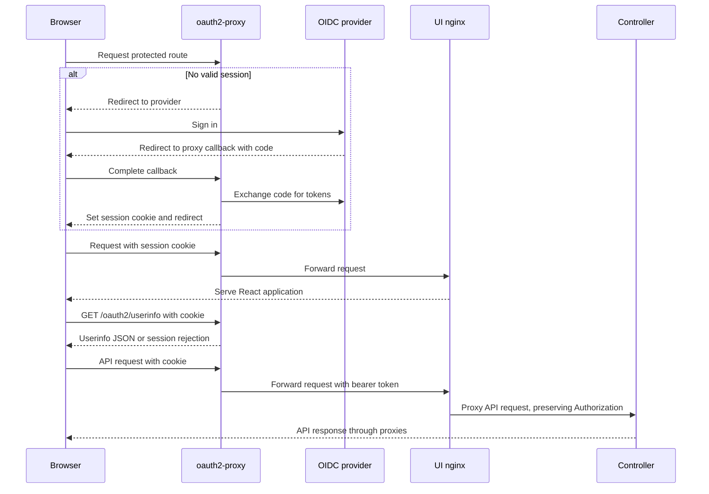

# OIDC proxy authentication

Kagent uses oauth2-proxy to integrate with OIDC identity providers. The proxy owns
sign-in, session cookies, and token refresh. It forwards a bearer token to
upstream services; the React UI reads the browser session through the proxy's
userinfo endpoint.

Browser sign-in and controller authentication are separate boundaries. The
current [controller entrypoint](../../go/core/cmd/controller/main.go) calls
`app.Run` with empty options, selecting `UnsecureAuthenticator` and
`NoopAuthorizer`. Library consumers supply their authentication and authorization
through [app.Options](../../go/core/pkg/app/app.go). Enabling the proxy in Helm
does not change those controller defaults.

## Browser session flow

The UI is a Vite-built React application served by nginx. Authentication state
comes from `GET /oauth2/userinfo` with same-origin cookies. The browser does not
decode a JWT from the request that served the page, and there are no server
actions involved.

The [userinfo source](../../ui/src/auth/oauth2ProxyAuthSource.ts) normalizes common
identity fields into a user ID, display name, email, and groups. It does not depend
on a controller `/api/me` endpoint or expose a raw JWT to the UI. The
[API transport](../../ui/src/api/transport.ts) can also attach a bearer token
provided by an application extension.

## Session state and recovery

[AuthProvider](../../ui/src/auth/AuthProvider.tsx) exposes the session result and
whether the initial lookup or an explicit refresh is in progress.

| State | Userinfo response | UI behavior |
| --- | --- | --- |
| `authenticated` | Successful JSON response identifying a user | Display the user and clear the reauthentication guard |
| `expired` | HTTP 401 or 403 | Restart sign-in, subject to the redirect guard |
| `unsecured` | Other unsuccessful responses, non-JSON or invalid data, or a network error | Show no user and do not redirect automatically |

A static deployment without oauth2-proxy can return `index.html` for the userinfo
path. Treating that response as `unsecured` avoids redirecting to a nonexistent
authentication endpoint. This UI state does not establish whether a controller
request is authorized.

On `expired`, [reauthentication](../../ui/src/auth/reauthenticate.ts) redirects to
the configured SSO start path with an `rd` parameter preserving the pathname,
query, and fragment. A `sessionStorage` guard suppresses another automatic
attempt for 60 seconds. Manual sign-in remains available when the guard blocks
an attempt; successful authentication clears it.

The proxy's session cookie and the provider's tokens have separate lifetimes.
The UI reacts to userinfo rejection rather than checking JWT expiry itself.
Token refresh remains the proxy's responsibility. The chart does not configure
`cookie-refresh`, and its default scope omits `offline_access`; operators must
configure refresh according to their identity provider's requirements.

## Controller identity

The [ProxyAuthenticator](../../go/core/internal/httpserver/auth/proxy_authn.go)
implementation decodes bearer JWT payloads without verifying signatures or
expiry. It assumes an upstream boundary already validated the credential.
It is present in core, but the current controller entrypoint does not select it.

For a direct user request, identity comes from the configured user-ID claim,
defaulting to `sub`. A missing custom claim falls back to `sub`; a missing user
identity rejects the request. The session retains raw claims and the original
authorization header. `UpstreamAuth` forwards that header and `X-User-Id` to
downstream requests.

For an agent request with `X-Agent-Name`, a parseable bearer JWT is still required.
The acting user comes from `user_id`, then `X-User-Id`, then the token's `sub`
claim. Headers alone do not authenticate an agent. This path does not perform a
Kubernetes TokenReview or otherwise validate a service-account token.

The [gRPC interceptors](../../go/core/internal/grpcserver/interceptors.go) pass
incoming authentication metadata to the configured provider. Private runtime
methods use their separate runtime authenticator; the proxy's agent-header path
does not define authentication for those methods. See the
[A2A gateway](a2a-gateway.md) for the runtime boundary.

## Deployment configuration

oauth2-proxy is an optional dependency in
[Chart-template.yaml](../../helm/kagent/Chart-template.yaml). Its
[Helm values](../../helm/kagent/values.yaml) configure the provider, client and
cookie secrets, issuer and callback URLs, and upstream UI service. The default
upstream is `http://kagent-ui:8080`; override it when the release's service name
differs.

| Setting | Default | Purpose |
| --- | --- | --- |
| `oauth2-proxy.enabled` | `false` | Install the authentication proxy |
| `oauth2-proxy.config.existingSecret` | Empty | Reference client and cookie credentials |
| `ui.auth.ssoRedirectPath` | `/oauth2/start` | Start or restart browser sign-in |
| `controller.auth.mode` | `unsecure` | Render the controller's `AUTH_MODE` environment variable |
| `controller.auth.userIdClaim` | Empty | Render `AUTH_USER_ID_CLAIM` when supplied |

The last two settings remain in the chart, but the current controller does not
consume them. Setting `controller.auth.mode: trusted-proxy` alone does not
activate `ProxyAuthenticator`, and the controller has no `--auth-mode` or
`--auth-user-id-claim` flags. A library integration must supply its own
`auth.AuthProvider` through `app.Options.Authenticator`.

The UI reads `SSO_REDIRECT_PATH` from `window.environmentVariables` at runtime
and applies its configured base path. Helm supplies that value from
`ui.auth.ssoRedirectPath`. The chart allows unauthenticated access to the login
page, health checks, and the assets required to render the login page.

## Trust boundary

The proxy validates external credentials and manages the HttpOnly session
cookie. A backend using `ProxyAuthenticator` trusts that validation; decoding
claims does not verify a token. Such a deployment must prevent callers from
bypassing the proxy or supplying trusted internal identity headers directly.

The [UI nginx configuration](../../helm/kagent/files/nginx.conf) preserves
`Authorization` while proxying API requests. It clears its listed
`X-Auth-Request-*` and `X-Forwarded-*` identity headers unless explicitly allowed
by `ui.additionalForwardedHeaders`.

The chart does not install a dedicated NetworkPolicy enforcing this boundary.
Operators own the ingress and network restrictions around the UI and controller.
The controller's authentication provider and authorizer remain responsible for
identity and access decisions on API requests.
