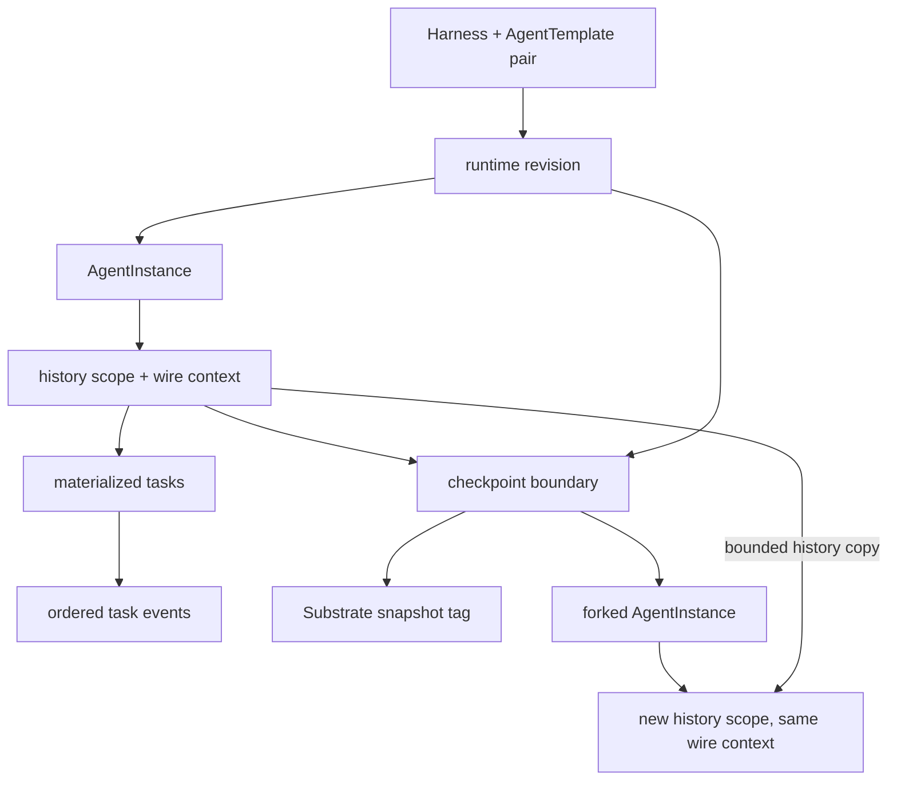

# Persistence, Checkpoints, and Forks

## Durable interaction model

`AgentInstance` represents ephemeral compute. An A2A context durably owns its
tasks and ordered events, allowing interaction history to remain as an audit trail
after compute is removed. New instances allocate independent instance, wire A2A
context, and durable history IDs. `agent_instance.history_id` selects the history;
`agent_instance.context_id` binds its public context. A composite foreign key
ensures that binding agrees with `a2a_context`. A history belongs to at most one
live instance, while multiple fork authorities may use the same wire context.

The core PostgreSQL records are:

| Record | Purpose |
| --- | --- |
| `runtime_revision` | Immutable compiled input and ate-api identity |
| `agent_template_harness_pair` | Pair status and latest successful revision |
| `agent_instance` | Compute identity, pinned revision, lifecycle phase, and Actor identity |
| `agent_instance_share` | Instance authorization grants |
| `a2a_context` | Durable history scope and its wire A2A context binding |
| `agent_instance_task` | Materialized current A2A task state |
| `agent_instance_task_event` | Append-only ordered task and message events |
| `agent_instance_checkpoint` | Named immutable snapshot/history boundary |
| `agent_instance_checkpoint_task` | Task projections frozen at checkpoint reservation |

Identity columns use PostgreSQL's native UUID type. Other framework-specific
tables are runtime implementation details, not part of this ownership model.

## Checkpoint creation

A checkpoint names a quiescent boundary already recorded by the gateway. Creating
one does not suspend the Actor again:

1. Reserve the checkpoint in PostgreSQL.
2. Verify that the suspended Actor still holds the external snapshot URI and scope recorded on the boundary.
3. Create a Substrate `Tag`, which copies the Actor's current snapshot into independent storage, and verify the source did not change during the copy.
4. Atomically persist the Tag UID and copied snapshot URI and mark the checkpoint ready.

The `CREATING` reservation blocks task admission and lifecycle changes until the
copy completes or cleanup finishes. A lost response can reuse a completed Tag;
an incomplete copy is deleted before the failed reservation is released. A
failed database finalization leaves the reservation and completed Tag for retry.
The gateway records boundaries without retaining every turn: only explicit
checkpoints survive subsequent suspends or source deletion.

The checkpoint retains source-instance provenance, source history, prepared
revision, labels, name, head task, and history sequence. Reservation freezes all
current task projections in the same transaction. Later replies to a paused task
cannot change the saved projection. The head identifies the task whose snapshot
covers the latest history event, including when an older paused task resumes. The source AgentInstance may be
deleted while its context and checkpoint remain.

Deletion first hides the checkpoint, then deletes its snapshot tag, then removes
the row. A checkpoint referenced by a fork cannot be deleted. Substrate deletes the Tag's copied snapshot with the Tag.

## Forking

Forking creates a new AgentInstance authority and durable history scope. It
preserves wire context, task, message, artifact IDs, and request deduplication
metadata while copying the frozen projections and bounded events. It creates a
separate Actor from the checkpoint's snapshot tag. Private runtime session IDs and
opaque paused-tool references therefore remain valid without runtime-specific
rewriting. New work appends only to the fork's history; source history and the
checkpoint remain immutable. The copied head boundary
uses the retained Tag URI, allowing a fresh fork to be checkpointed before its
first turn. Fork creation verifies the Tag UID and URI as well as the Actor's
source Tag, suspended state, template, and external snapshot.

Checkpoint sharing is not implemented. Future sharing must be restricted to data
snapshots without process state.

The workflow lives in
[`go/core/internal/service/checkpoint`](../../go/core/internal/service/checkpoint).

Tasks have an immutable `position` independent of their opaque IDs and mutable
status timestamps. Listing and pagination use this position; forks preserve it.
New tasks append after inherited tasks, including through repeated forks.

Authority-scoped snapshot cloning is a kagent contract; A2A does not specify
snapshot forks. A complete task address includes the instance route. Reads,
writes, cancellation, subscriptions, authorization, and deduplication remain
instance-scoped. A context or task ID alone never selects another branch.

## Upgrade behavior

The migration keeps existing wire identities and backfills history bindings and
task order. Old checkpoints whose task projections have already changed cannot
be recovered safely from the current projection; forking rejects those checkpoints
and asks for recreation. Previously broken runtime forks are not repaired by
session inference. Recreate them from a usable source checkpoint.

Deploy the controller and clients together: clients must use `AgentInstance.context_id`
or omit the context and let the routed gateway resolve it. The Down migration
restores the old schema but cannot make new authority-scoped forks usable by the
old binary; do not use it as a runtime compatibility mechanism.
