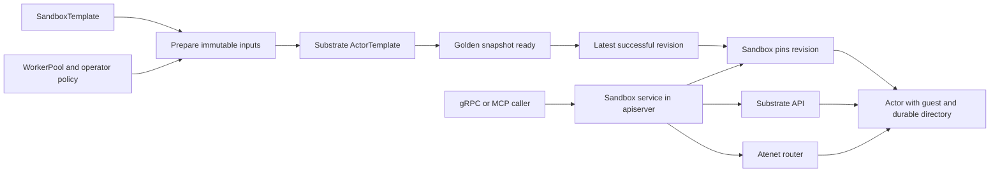

# Standalone Sandboxes

A `Sandbox` is an owner-scoped scratch environment for running commands and
working with files. Users and agents create one from a `SandboxTemplate`, use
its process and file APIs, and delete it or let its lifetime expire. PostgreSQL
stores its identity and lifecycle; a Substrate Actor runs the guest.

## Relationship to agents

The agent and sandbox APIs have separate configuration and lifecycle ownership:

| Configuration | Runtime resource | Execution interface |
| --- | --- | --- |
| `Agent` pairs an `AgentTemplate` and `Harness` | `Session` | A2A interactions and tasks |
| `SandboxTemplate` defines a tools environment | `Sandbox` | Guest process and file operations |

`Harness` owns agent startup and runtime configuration. `SandboxTemplate` owns
the standalone workload image, environment, WorkerPool reference, and snapshot
policy. It shares Go field types with Harness where the semantics match, but
neither resource references or inherits from the other.

Sessions do not run the sandbox guest. An agent can create an independent Sandbox
through MCP, using the same service as a human caller. Its conversation and the
sandbox's lifetime remain independent. Session task admission, checkpoints, and
automatic quiescence remain governed by the [Session lifecycle](runtime-and-lifecycle.md).

Shared persistence and Substrate lifecycle components implement common
mechanics. Resource-specific services retain authorization, lifecycle policy, and
recovery decisions; there is no public generic runtime-instance API.

## Configuration and preparation

`SandboxTemplate` is a namespaced `api.kagent.dev/v1alpha3` Kubernetes resource.
Creating one prepares a reusable runtime; it does not allocate a user Sandbox.
The workload image must be pinned by SHA-256 digest. The template has no startup
command or guest toggle: kagent supplies the guest entrypoint.

```yaml
apiVersion: api.kagent.dev/v1alpha3
kind: SandboxTemplate
metadata:
  namespace: team-a
  name: scratch
spec:
  workload:
    # Replace with an available tools image and its digest.
    image: registry.example.com/tools@sha256:aaaaaaaaaaaaaaaaaaaaaaaaaaaaaaaaaaaaaaaaaaaaaaaaaaaaaaaaaaaaaaaa
  env:
    - name: LANG
      value: C.UTF-8
  substrate:
    workerPoolRef:
      name: default
    snapshotPolicy:
      location: s3://example/snapshots/
```

SandboxTemplate preparation uses the shared KRT informer runtime and the same
queue pattern as Agent preparation. A pure collection resolves the WorkerPool in
the template's namespace, tracks that dependency, and combines its sandbox class
with the template and operator-controlled CPU, memory, and guest-image
settings to compute an immutable revision. WorkerPool changes and deletion
recompute affected templates without waiting for a polling interval.
Credential environment injection and reserved runtime-variable overrides are
rejected during preparation.



Registry, database, Substrate, finalizer, and status writes run outside KRT
transforms in queued workers. The configured guest image tag resolves once per
controller lifetime and its digest feeds back into the graph; a digest override
requires no registry lookup. To adopt a changed tag, restart the controller or
roll out a new guest-image setting. Only pending preparation and cleanup work
is polled, including recovery from transient failures.

The controller persists a deletion finalizer before allocating inputs, then
persists the desired revision before backend creation. It publishes a ready
runtime observation only after database persistence succeeds. Observations are
scoped to the revision, so edits and recreated templates cannot inherit stale
readiness. Deletion retires the database preparation before removing the
finalizer, including when deletion starts while the controller is offline.

The controller advances the latest-successful revision only after the golden
snapshot is ready and reports preparation through the template's `Ready`
condition and observed generation. Failed preparation preserves the previous
successful revision. Existing Sandboxes retain their revision when a template
changes. Template deletion retires preparation; retained instances continue to
pin the runtime artifacts they need.

Sandbox execution is enabled by default. Lifecycle calls run on the serving API
replica; expiration workers coordinate through PostgreSQL.
The binary defaults the guest image to
`ghcr.io/kagent-dev/kagent/sandbox-guest:<controller-version>`. Helm exposes
`controller.sandbox.guestImage.registry`, `.repository`, `.tag`, and `.digest`
through the shared image helper, with the chart's normal global overrides.
Preparation resolves guest tags to digests before recording revisions. An
explicit digest avoids registry resolution from the controller.

The remaining `controller.sandbox` settings configure CPU, memory, and default/max
TTL. Helm supplies these through the controller ConfigMap. Defaults are one CPU,
1 GiB memory, a one-hour TTL, and a 24-hour maximum TTL. Activity does not extend
expiration.

Sandboxes have no allowed egress destinations. A follow-up will add destination
configuration to `SandboxTemplate` and pin it with each prepared revision.

## Lifecycle and recovery

`SandboxService` exposes Create, Get, List, Suspend, Resume, and Delete. Creation
requires an authenticated owner, access to the named template, and a stable
request ID. Creation atomically pins the selected revision and expiration.
Concurrent requests use the unique creator/request-ID constraint and read the
winning insert, as Session creation does; there is no per-owner advisory lock or
sandbox count limit. Retrying with the same request ID and identical input returns the
same resource; it cannot allocate another Actor or extend the original lifetime.

Sessions and Sandboxes use the shared `RuntimeState` and `RuntimeOperation`
protobuf enums. State values include `CREATING`, `READY`, `SUSPENDED`, `FAILED`,
`DELETING`, and `DELETED`, with the `RUNTIME_STATE_` prefix. Operations are `NONE`,
`CREATE`, `SUSPEND`, `RESUME`, and `DELETE`, with `RUNTIME_OPERATION_` prefixes.
Clients inspect both fields because lifecycle work may still be pending.

Sandbox lifecycle mutations persist intent and execute one attempt inline. Success
returns the resulting Sandbox; transient failures return an error and leave the
operation pending. Clients repeat the same mutation to continue work. Get and
List are read-only, and there is no general lifecycle recovery sweep. See the
[client retry contract](../lifecycle-retries.md) for error handling and examples.

Each attempt has a database execution claim and a context bounded to at most two
minutes. The attempt releases its claim on return, including failures; a crashed
executor's claim expires so a later client request can take over. The durable
operation ID and last executor remain recorded until completion or supersession.
A new attempt gets a new executor ID, so late completion or release from an older
attempt cannot overwrite it. Database locks are not held over Substrate calls.
Substrate's Actor lease and reentrant workflows handle backend contention and
partial progress. Calls remain subject to caller deadlines and backend deadlines.

Every replica can delete expired sandboxes through the same inline workflow.
The periodic scan selects expired resources only; an abandoned ordinary operation
stays pending until a client retries or the Sandbox expires. Creation resumes its
guest immediately, and retries reuse the existing matching Actor and revision.

Suspension does not wait for processes, output streams, or file transfers.
Callers accept that commands and transfers may be interrupted and files may
contain partial writes. Guest requests hold no durable admission or lifecycle
reservation, and PostgreSQL does not track process completion.

A conflicting request returns ABORTED while an attempt is active. Once that
attempt ends, a new suspend or resume request can supersede its pending intent,
even if backend work was issued. The new request executes inline; operation IDs
prevent old results from overwriting newer database state.
Creation must finish before suspend/resume; deletion can supersede creation or
other operations and cannot be canceled into a live sandbox. Resume preserves
durable files; process handles last only as long as the guest's in-memory registry.
Expiration immediately rejects new guest requests and lets the worker supersede
unfinished lifecycle work with deletion. Deletion finishes after backend cleanup,
releases runtime-artifact pins, and retains a tombstone and creation receipt so
old request IDs cannot recreate compute.

Sessions use the same bounded-attempt mechanics, but retain stricter task and
checkpoint admission: issued pending Session work must be retried to completion
before admitting a conflicting operation. Automatic Session idle suspension is
separate and retains its own snapshot and execution-claim rules.

## Guest access and authorization

The guest uses `agent-substrate/env/guest` for process and filesystem services.
Kagent owns its main function, flags, logging, listener, readiness, and shutdown.
The tools image supplies installed programs; an image volume supplies the managed
guest binary and replaces the tools image's entrypoint.

The Actor mounts a durable directory at `/data`. The guest creates
`/data/workspace` before readiness and stores process output in `/data/guest-logs`.
A fresh mount hides directories baked into the tools image, so the workspace
must exist before the first command can use it as its working directory.
See the [guest runtime contract](../../go/sandbox/guest/README.md) for packaging
and upstream process semantics.

The apiserver registers three services on the same listener:

| Service | Operations |
| --- | --- |
| `kagent.api.v1alpha1.SandboxService` | Create, Get, List, Suspend, Resume, Delete |
| `ateenv.v1alpha.ProcessService` | StartProcess, GetProcess, KillProcess, StreamProcessOutputs |
| `ateenv.v1alpha.FileSystemService` | ReadFile, WriteFile |

Execution uses env's exact services, requests, responses, and streaming messages.
Clients supply exactly one `kagent-sandbox-id` gRPC metadata value containing the
Sandbox UUID. The route is fixed for the RPC, including client-streaming writes;
it grants no access on its own. For example, an upstream Go client can call:

```go
ctx = metadata.AppendToOutgoingContext(ctx, "kagent-sandbox-id", sandbox.Id)
processes := guestpb.NewProcessServiceClient(conn)
started, err := processes.StartProcess(ctx, &guestpb.StartProcessRequest{
    Command: []string{"python", "script.py"},
})
```

The sandbox service forwards upstream messages intact, resolves Actor routing,
and sends authorized traffic through the Atenet router. Incoming Actor routing
headers cannot override that resolution. WriteFile follows env's contract: the
first message supplies the path and optional mode and may also contain data.
Later messages supply more data. There is no kagent-specific file envelope.

Lifecycle calls use the Substrate API; guest calls use Atenet. Both remain in
the apiserver's sandbox service. The existing A2A gateway handles agent interactions;
moving sandbox execution to a gateway is a separate follow-up.

Env's protobuf currently has no validation annotations. Guest payload validation
is delegated to env; adding annotations upstream is a follow-up. Kagent validates
sandbox routing and enforces authorization, expiration, and transfer limits.
The env dependency remains pinned. Message changes come from the dependency;
new upstream RPCs require explicit forwarding and access policies.

Resource authorization and owner checks apply before routing guest traffic. Agent
share tokens grant no sandbox access. An agent calling MCP operates under the
identity authenticated by that MCP connection; acting for the invoking user
requires the existing credential-propagation configuration. For the Go kagent
runtime, `KAGENT_PROPAGATE_TOKEN=true` opts trusted configured MCP servers into
receiving the caller's credentials and identity.

The existing `/mcp` endpoint exposes template discovery, sandbox lifecycle,
process execution, output reads, and file transfer. All sandbox tools call the
same sandbox service as the gRPC handlers.
There is no separate lifecycle or guest tool server. gRPC file transfers are
bounded at 64 MiB. MCP file transfers and output reads are bounded at 1 MiB,
use base64 for bytes, and expose continuation offsets for output reads.

Each StartProcess call launches a new command. There is no process request ID or
durable receipt. After a timeout or lost response, callers must account for the
possibility that the command started; retrying may execute it again. Process IDs,
status, and outputs come directly from the guest; losing its in-memory registry
makes those handles unavailable. Kagent does not persist process records or
impose a second process-concurrency limit.
An interrupted file write reports an error and does not reserve lifecycle access.

## Persistence model

The [initial migration](../../go/core/pkg/migrations/core/000001_initial.sql)
defines common runtime tables with resource-specific extension tables:

| Table | Responsibility |
| --- | --- |
| `runtime_revision` | Immutable resolved inputs, backend ActorTemplate identity, and artifact retention |
| `agent_revision`, `sandbox_revision` | Configuration provenance and resource-specific revision data |
| `agent_definition`, `sandbox_template_definition` | Desired and latest-successful revision pointers |
| `runtime_instance` | Identity, owner, create request ID, revision pin, state, operation generation, and bounded executor claim |
| `session` | Complete Session protobuf, A2A/history bindings, checkpoint pins, and agent execution coordination |
| `sandbox` | Complete Sandbox protobuf, template identity, create receipt, and expiration |

Base and extension rows are written in one transaction. Primary and foreign keys
preserve references; store operations verify resource kinds at write time.
The common lifecycle enum names are persisted directly, without resource-specific
enum translation layers.

Both resource subtypes store their complete protobuf in `data`. Names, failure
details, and creation/update timestamps remain in protobuf. Relational columns
exist where identity, queries, constraints, joins, retention, or lifecycle
coordination need them. Reads overlay authoritative SQL values onto the protobuf
for duplicated fields. Transitions update both representations under the runtime
row lock, preserving unknown protobuf fields and concurrent metadata changes.

The shared `RuntimeOperation[T]` and runtime-row implementation keep operation
results typed while reusing transition and claim mechanics. Session admission
checks tasks, dispatches, cleanup, and checkpoints. Sandbox lifecycle checks
creation, deletion, and expiration; guest activity does not participate. Each
resource applies its policy in the same transaction as its lifecycle transition.

## Implementation boundaries

- [API contracts](../../proto/kagent/api/v1alpha1/sandboxes.proto) and
  [template catalog](../../proto/kagent/api/v1alpha1/sandbox_templates.proto)
  define lifecycle/catalog shapes and request-intrinsic validation. Execution
  uses the upstream [env contract](../../proto/ateenv/v1alpha/guest.proto) and
  [sandbox routing metadata](../../go/api/sandbox/metadata.go).
- [KRT collections](../../go/core/internal/controller/sandbox_collections.go)
  derive sandbox inputs, and [queued preparation](../../go/core/internal/controller/sandbox_reconciler.go)
  owns template readiness; the [Substrate compiler](../../go/core/internal/substrate/sandbox.go)
  builds immutable ActorTemplate inputs.
- [Sandbox service](../../go/core/internal/service/sandbox) owns authorization,
  lifecycle orchestration through the Substrate API, and process/file access
  through the guest.
- [Database](../../go/core/internal/database) owns transactional invariants and
  persistence; it performs no runtime network calls.
- [MCP tools](../../go/core/internal/mcp/sandboxes.go) and gRPC handlers adapt
  requests to the sandbox service.

Store and service tests cover creation idempotency, lifecycle supersession,
suspension during guest activity, revision retention, lost responses, and client retries after restart.
Transport tests exercise gRPC and MCP against an in-process guest and PostgreSQL. The [E2E suite](../../go/core/test/e2e/README.md)
exercises the public gRPC/MCP APIs against Substrate, including an agent creating
a sandbox, process/file access, suspend/resume, expiration, and controller restart.
