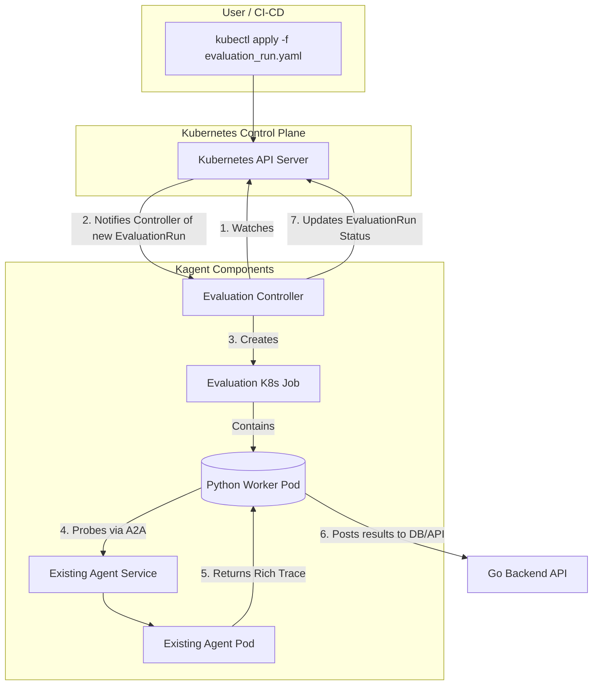

# Kagent Agent Evaluation Framework

## 1. Introduction

Evaluating Large Language Model (LLM) based agents is a critical yet complex challenge. As we integrate more sophisticated agentic systems into Kagent, providing a robust framework for measuring their performance, reliability, and cost becomes essential.

While the field of agent evaluation is rapidly evolving, a set of standard practices has emerged across the industry, adopted by major platforms and open-source frameworks alike. This proposal outlines a Kubernetes-native evaluation framework for Kagent that aligns with these industry standards while remaining tailored to our platform's unique, DevOps-centric environment. The goal is to provide developers with the tools to test, debug, and optimize their agents effectively.

**Key Industry Concepts:**

- **Trajectory and Trace Analysis:** Evaluating the sequence of steps, reasoning, and tool calls an agent makes.
- **Offline vs. Online Evaluation:** Testing agents in development (offline) versus monitoring their performance in a live environment (online samples).
- **AI-Assisted Evaluation:** Using a powerful "LLM-as-a-Judge" to score agent responses on subjective criteria like helpfulness or coherence.
- **Human-in-the-Loop:** Incorporating user feedback to refine and validate agent performance.

### Further Reading

- [Survey on Evaluation of LLM-based Agents](https://arxiv.org/pdf/2503.16416v1)

- [Azure AI Evaluation SDK](https://learn.microsoft.com/en-us/azure/ai-foundry/how-to/develop/agent-evaluate-sdk)
- [Vertex AI Evaluation SDK](https://github.com/GoogleCloudPlatform/generative-ai/blob/main/gemini/evaluation/evaluating_adk_agent.ipynb)
- [Langfuse](https://langfuse.com/docs/evaluation/overview)

- [Google ADK Evaluation](https://google.github.io/adk-docs/evaluate/)
- [LangSmith Evals](https://docs.langchain.com/langsmith/evaluation)
- [LangChain AgentEvals](https://github.com/langchain-ai/agentevals)

- [Huggingface Eval and Monitoring Cookbook](https://huggingface.co/learn/agents-course/bonus-unit2/monitoring-and-evaluating-agents-notebook)

## 2. Why Build an Evaluation Framework?

An integrated evaluation framework empowers Kagent users to answer critical questions about their agents' behavior and deliver more reliable and efficient solutions.

- **For Agent Developers:** It provides a systematic way to verify that an agent performs as expected after any change. By running a suite of evaluations, developers can catch regressions, validate new functionality, and gain confidence before deployment.
- **For Agent Optimization:** The framework enables data-driven optimization. Users can experiment with different models, prompts, or tools and compare the results to find the optimal balance between performance, cost, and latency. This ensures they can choose the most efficient configuration for their specific use case.

## 3. Proposed Implementation

We propose a Kubernetes-native approach where evaluations are defined and managed via Custom Resources (CRDs). This design is framework-agnostic, interacting with agents through a standardized Agent-to-Agent (A2A) communication protocol.

### 3.1. Test Data: The `EvalSuite` CRD

The `EvalSuite` is a reusable resource that defines a set of evaluation cases. To provide flexibility and scalability, we support a hybrid model for defining these cases.

1.  **Inline Definition:** For simple and quick tests, `evalCases` can be defined directly inside the `EvalSuite` manifest.
2.  **External Sourcing:** For large, version-controlled, or collaboratively managed suites, the `source` field can be used to point to data stored in a `ConfigMap` or a Git repository. The data format is expected to be a JSON file containing an array of `evalCase` objects.

This hybrid approach provides both ease of use for simple scenarios and robust scalability for production-grade evaluation.

```yaml
apiVersion: kagent.dev/v1alpha1
kind: EvalSuite
metadata:
  name: my-hybrid-eval-suite
  namespace: default
spec:
  description: "An EvalSuite demonstrating multiple sourcing strategies."

  # Option 1: Define a few eval cases inline for quick tests.
  # Use this for small, simple suites.
  evalCases:
    - name: "inline-exact-response-check"
      prompt: "Repeat the phrase 'Hello, world!'"
      evaluators:
        - type: "ExactMatch"
          exactMatch:
            expectedResponse: "Hello, world!"

  # Option 2: Source a larger suite from a Kubernetes ConfigMap.
  # The controller will look for the 'suite.json' key in the 'my-large-suite' ConfigMap.
  # This is ignored if 'evalCases' is defined above.
  source:
    configMapRef:
      name: my-large-eval-suite-data
      key: suite.json
```

### 3.2. Triggering Evaluations: The `EvaluationRun` CRD

This resource triggers a one-off evaluation and tracks its status. The `evaluation-controller` watches for these resources and orchestrates the evaluation job.

```yaml
apiVersion: kagent.dev/v1alpha1
kind: EvaluationRun
metadata:
  name: my-agent-run-2025-10-09
  namespace: default
spec:
  agentRef:
    # Reference to the existing kagent Agent CR to be tested
    name: my-test-agent
  evalSuiteRef:
    # Reference to the EvalSuite to use
    name: my-hybrid-eval-suite
status:
  # The controller updates this section
  phase: "Completed" # Pending -> Running -> Completed / Failed
  startTime: "2025-10-09T14:00:00Z"
  completionTime: "2025-10-09T14:02:30Z"
  passRate: "100%"
  results:
    - evalCase: "inline-exact-response-check"
      status: "Pass"
      evaluatorResults:
        - type: "ExactMatch"
          passed: true
          details: "Agent response matched expected response."
```

### 3.3. The Evaluation Worker Pod

When an `EvaluationRun` is created, the controller spins up a Kubernetes `Job` containing a Python worker pod. This pod is responsible for executing the actual evaluation logic.

**Conceptual Workflow:**

1.  **Initialization:** The pod starts. The controller provides the `EvalSuite` definition and the target agent's URL.
2.  **Data Sourcing:** The worker first checks the `EvalSuite` spec. If `evalCases` are defined inline, it uses them. Otherwise, it fetches the data from the specified `source` (e.g., by reading the mounted `ConfigMap` or cloning the Git repo).
3.  **Execution Loop:** The worker iterates through each `evalCase` from the resolved suite.
4.  **Agent Interaction & Evaluation:** For each case, it sends the `prompt` to the agent, receives the trace, and applies the specified `evaluators`.
5.  **Reporting:** The aggregated results are posted to the Kagent backend, which updates the `EvaluationRun` CRD's status.

### 3.4. Architecture Diagram



### 3.5 User Interface

- **EvaluationRun List View:** A new section in the Kagent UI to list all `EvaluationRun` resources, showing their status, pass rates, and timestamps. A detailed view for each run will display individual `evalCase` results and evaluator outputs. The user can create new `EvaluationRun` resources via a form that allows selecting an agent and an `EvalSuite`.

- **EvalSuite Management:** A dedicated UI section to create, edit, and manage `EvalSuite` resources. Eval cases are visualized and edited in a conversational chat format for ease of use.

For more information, reference [the ADK web UI](https://google.github.io/adk-docs/evaluate) for inspiration.

## 4. Future Capabilities

This initial design provides a strong foundation for more advanced evaluation features. The framework's modularity allows us to integrate custom logic without being tied to a specific toolkit like the ADK.

### Online Evaluation: Production Monitoring & Feedback

We can capture real-world agent interactions from production to identify failures and gather user feedback. A live dashboard would show success rates, error types, and user ratings. This creates a powerful continuous improvement cycle, allowing developers to filter for failed or poorly-rated conversations and add them to an eval suite with a single click.

### Advanced Evaluation Features

- **Performance vs. Cost Optimization (Pareto Analysis):** We can build a "Comparative Run" feature to automatically test multiple agent configurations (e.g., different models or prompts) and plot their performance against their cost. This helps users visualize the trade-offs and select the most efficient agent for the job.
- **LLM-as-a-Judge:** For subjective quality assessment, we can integrate an "AI Judge" evaluator. Users can define a rubric with criteria like "Helpfulness" or "Conciseness," and the judge will score the agent's responses, providing insights beyond simple pass/fail metrics.
