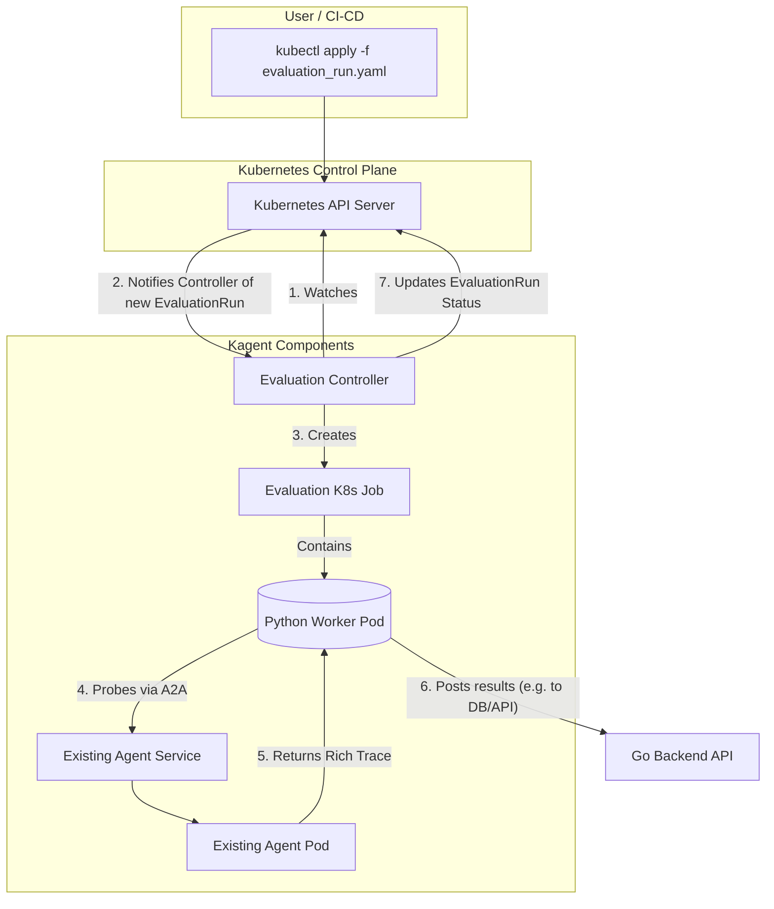

# Agent Evaluation for Kagent

## 0. Action Items and Meeting Todo

**Action items:**

1. Experiment with ADK evals on ADK agents -- is this a good idea for first step, or should we just start from scratch for better scaling

2. Are benchmarks necessary? This is where we need to ask others. If so, perhaps we should make a devops specific benchmark because this platform is so devops focused.

**Meeting:**

1. Present the literature review, our understanding of the problem and features (validate here)

2. Regardless of feature choices, present the existing solution and implmentation plan (get feedback and revalidate)

3. Discuss how to improve this in the future, what are some evolving needs of kagent

4. Tips on getting started whether is working on the design or starting implemtation since this is a HUGE feature

## I. Literature Review and Current State of the Art

[Survey on Evaluation of LLM-based Agents](https://arxiv.org/pdf/2503.16416v1)

### 1. How Agent Evaluation Is Currently Done: The Bare Minimum

Across the board, from open-source frameworks like LangChain to major cloud platforms like Google Cloud and Azure, a foundational set of features for agent evaluation has emerged. These represent the "table stakes" for any serious agent evaluation platform.

- **Offline Evaluation:** This is the most common form of evaluation, where agents are tested in a development environment before being deployed to production. This typically involves running the agent against a predefined dataset of inputs and expected outputs.
- **Trajectory and Trace Analysis:** A core concept in agent evaluation is the "trajectory" or "trace," which is the sequence of steps an agent takes to arrive at a final answer. This includes the agent's internal reasoning, the tools it calls, and the intermediate outputs it generates. All major platforms provide tools to visualize and analyze these trajectories, which is crucial for debugging and understanding agent behavior.
- **Final Response Evaluation:** This involves assessing the quality of the agent's final output. This can be as simple as a pass/fail check against a known correct answer, or it can involve more sophisticated metrics like ROUGE scores for text similarity.
- **Basic Metrics:** At a minimum, an evaluation framework should track basic operational metrics like latency (how long the agent takes to respond) and success/failure rates.
- **Dataset-Based Evaluation:** Most platforms support running evaluations on a dataset of prompts and expected outcomes. This allows for systematic and reproducible testing of agent performance.
- **Tool Use Evaluation:** Given that a key feature of agents is their ability to use tools, evaluation frameworks typically include features to assess whether the agent is calling the correct tools with the correct arguments.

### 2. Unique and Advantageous Features to Include (Level 2)

Beyond the basics, several platforms and research papers highlight more advanced and advantageous features that provide a deeper understanding of agent performance and enable more robust and reliable agent development.

- **Online Evaluation and Monitoring:** While offline evaluation is essential, it's not enough. Online evaluation involves monitoring and evaluating the agent's performance in a live, production environment. This allows you to capture real user interactions and identify issues that may not have been apparent during development. Langfuse and Databricks both offer strong support for online evaluation.
- **"LLM-as-a-Judge" and AI-Assisted Evaluation:** A significant trend is the use of a separate, powerful language model to act as a "judge" to evaluate an agent's output. This is particularly useful when there isn't a single "correct" answer. The judge can be given a set of criteria and a rubric to score the agent's response on aspects like coherence, relevance, and safety. This is a feature offered by Langfuse, Databricks, and is also discussed in the Hugging Face course.
- **Human-in-the-Loop and User Feedback:** For nuanced or subjective evaluations, human feedback is invaluable. Platforms like LangChain and Databricks provide tools for collecting and incorporating human feedback into the evaluation process. This can be as simple as a thumbs-up/thumbs-down button in a chat interface or a more detailed "Review App" for domain experts.
- **Cost and Token Usage Tracking:** A critical aspect of running agents in production is managing costs. Advanced evaluation platforms like Langfuse and the Hugging Face course demonstrate how to track token usage and estimate the cost of each agent run.
- **Custom Metrics and Evaluation Criteria:** Different agents have different goals and requirements. The ability to define custom metrics and evaluation criteria is a powerful feature. Google's ADK and the associated Google Cloud notebook show how to create custom metrics to evaluate whether an agent's response logically follows from its tool choices.
- **Comparative Evaluation and A/B Testing:** A key part of the development process is iterating and improving on your agent. Evaluation platforms should support comparing the performance of different versions of an agent (e.g., with different prompts, models, or tools) to see which one performs better. LangChain explicitly mentions this as a pillar of their evaluation framework.
- **Safety and Compliance Evaluation:** As agents become more powerful, ensuring their safety and compliance with policies is crucial. The Azure AI Evaluation SDK includes built-in evaluators for safety aspects like code vulnerabilities, violence, and hate speech. The research paper also highlights the need for more comprehensive safety benchmarks.
- **Integrated Observability and Tracing:** Evaluation is not just about scoring; it's also about debugging. The best platforms, like Langfuse, integrate evaluation with detailed tracing and observability, allowing you to drill down into the specifics of an agent's execution to understand why it failed.

### 3. The Next Steps of Agent Evaluation: Challenges and Unsolved Problems

The field of agent evaluation is still nascent, and there are many challenges and unsolved problems that need to be addressed. The research paper "Survey on Evaluation of LLM-based Agents" provides an excellent overview of the state of the art and future directions.

- **Realistic and Challenging Benchmarks:** Many current benchmarks are too simple and don't accurately reflect the complexity of real-world scenarios. There is a need for more dynamic, challenging, and continuously updated benchmarks that can keep pace with the rapid advancements in agent capabilities. The paper highlights a shift toward "live benchmarks" that use real-world data and environments.
- **Fine-Grained and Granular Evaluation:** Current evaluation often relies on coarse, end-to-end success metrics, which don't provide much insight into why an agent failed. The paper advocates for more "granular evaluation" that assesses intermediate decision-making processes, such as tool selection and reasoning quality.
- **Scaling and Automating Evaluation:** The reliance on static, human-annotated datasets is a major bottleneck for scaling agent evaluation. Future directions include leveraging synthetic data generation and using "agent-as-a-judge" approaches to automate the evaluation process.
- **Cost and Efficiency Metrics:** As agents become more complex, their resource consumption becomes a significant concern. The paper argues that future evaluation frameworks should integrate cost and efficiency as core metrics, tracking factors like token usage, API expenses, and inference time.
- **Safety, Trustworthiness, and Compliance:** A major gap in current evaluation is the lack of focus on safety, trustworthiness, and policy compliance. The paper calls for the development of multi-dimensional safety benchmarks that simulate real-world scenarios and test for robustness against adversarial inputs, bias, and policy violations.
- **Multi-Agent Evaluation:** Most current evaluation focuses on single-agent systems. However, as we move toward more complex, multi-agent systems, we will need new evaluation methodologies that can assess the emergent behaviors and risks of interacting agents.
- **Standardization of Evaluation:** With a plethora of different evaluation frameworks and metrics, it's difficult to compare the performance of different agents. There is a need for more standardization in agent evaluation to enable fair and consistent comparisons.

By addressing these challenges, we can build more robust, reliable, and trustworthy AI agents that can be deployed safely and effectively in the real world.

### 4. Sources and Further Reading

[Azure AI Evaluation SDK](https://learn.microsoft.com/en-us/azure/ai-foundry/how-to/develop/agent-evaluate-sdk)

[Google ADK Evaluation](https://google.github.io/adk-docs/evaluate/)

[Evaluating ADK Agent](https://github.com/GoogleCloudPlatform/generative-ai/blob/main/gemini/evaluation/evaluating_adk_agent.ipynb)

[Huggingface Eval and Monitoring Cookbook](https://huggingface.co/learn/agents-course/bonus-unit2/monitoring-and-evaluating-agents-notebook)

Other frameworks for reference:

These two are built on top of openeval + langchain:

- [LangSmith Evals](https://docs.langchain.com/langsmith/evaluation)
- [LangChain AgentEvals](https://github.com/langchain-ai/agentevals)

- [Langfuse](https://langfuse.com/docs/evaluation/overview), I think it's proprietary, has a nice diagram about online eval vs offline eval + gathering data from online

## II. Proposed Design for Kagent's Evaluation Framework (Phase 1)

This design uses a Kubernetes-native approach, where evaluations are defined and triggered by Custom Resources (CRDs). For Phase 1, we assume the agent being tested already exists as a running pod in the cluster, managed by its own `Agent` CRD.

This approach is framework-agnostic, as it relies on a standard Agent-to-Agent (A2A) protocol to communicate with the target agent.

### 1. The CRD-Based Workflow

1.  **Define Tests:** A user defines a reusable set of tests in a `TestSuite` CRD. This resource contains a list of prompts and the metrics to evaluate for each.
2.  **Trigger Run:** To start an evaluation, the user creates an `EvaluationRun` CRD. This resource links to the target agent (by name and namespace) and the desired `TestSuite`.
3.  **Control Loop:** A new `evaluation-controller` (part of the Go backend) constantly watches for new `EvaluationRun` resources.
4.  **Execution:** When the controller sees a new `EvaluationRun`, it:
    a. Looks up the target agent's Kubernetes `Service` to find its internal URL.
    b. Creates a Kubernetes `Job` to run the Python evaluation worker.
    c. Passes the agent URL and test suite information to the worker `Job`.
    d. Updates the `EvaluationRun` CR's status to show it's `Running`.
5.  **Evaluation:** The Python worker pod starts, probes the target agent via the A2A protocol for each test case, runs the evaluators on the rich trace data it gets back, and posts the detailed results to a database or results API.
6.  **Completion:** The controller monitors the `Job` and, upon completion, updates the `EvaluationRun` status to `Completed` or `Failed`, including a summary of the results.

### 2. Proposed Custom Resources (CRDs)

#### TestSuite CRD

This resource defines a reusable set of tests.

```yaml
apiVersion: kagent.dev/v1alpha1
kind: TestSuite
metadata:
  name: my-first-test-suite
  namespace: default
spec:
  description: "A suite of tests to check basic functionality."
  testCases:
    - name: "hello-world-check"
      prompt: "Say hello world"
      evaluators:
        - type: "ExactMatch"
          exactMatch:
            expectedOutput: "Hello, world!"
    - name: "tool-call-check"
      prompt: "What is the weather in San Francisco?"
      evaluators:
        - type: "ToolCall"
          toolCall:
            toolName: "get_weather"
```

#### EvaluationRun CRD

This resource triggers a one-off evaluation run and tracks its status.

```yaml
apiVersion: kagent.dev/v1alpha1
kind: EvaluationRun
metadata:
  name: my-agent-run-2025-10-09
  namespace: default
spec:
  agentRef:
    # Reference to the existing kagent Agent CR to be tested
    name: my-test-agent
  testSuiteRef:
    # Reference to the TestSuite to use
    name: my-first-test-suite
status:
  # The controller would update this section
  phase: "Completed" # Can be Pending -> Running -> Completed / Failed
  startTime: "2025-10-09T14:00:00Z"
  completionTime: "2025-10-09T14:02:30Z"
  passRate: "100%"
  resultsSummary:
    - testCase: "hello-world-check"
      status: "Pass"
    - testCase: "tool-call-check"
      status: "Pass"
```

### 3. Architecture Diagram



### 4. Phase 1 Implementation Plan

1.  **CRD Definition:**
    1.  Define and register the `TestSuite` and `EvaluationRun` Custom Resource Definitions.
2.  **Backend (Go Controller):**
    1.  Implement a new `evaluation-controller`.
    2.  Add the control loop logic to watch for `EvaluationRun` resources.
    3.  Implement the handler to create the Python worker `Job` and update the `EvaluationRun` status.
3.  **Backend (Python Worker):**
    1.  Containerize the Python evaluation script to run in the `Job`.
    2.  Implement logic to receive agent and test info (e.g., from mounted `ConfigMap` or env vars).
    3.  Implement the A2A client to probe the agent's service.
    4.  Implement the logic to run evaluators on the response trace and post results.
4.  **Frontend (UI):**
    1.  Build UI views that are backed by the `TestSuite` and `EvaluationRun` CRDs, allowing users to create, view, and manage them.

## III. Phase 2: Scaling up to customized, framework-agnostic evaluation

**1. Performance vs. Cost Optimization (Pareto Analysis)**

- **Concept:** Automatically run a test suite against multiple agent configurations (e.g., different foundation models, prompts, or temperatures) to visualize the trade-off between performance (Success Rate) and cost (Tokens, Latency).
- **User Experience:** A new "Comparative Run" feature. Users select a Test Suite and multiple agent versions. The result is a 2D scatter plot showing each version as a point on a Cost vs. Performance graph. The UI will highlight the "Pareto Frontier," revealing the most efficient agents that offer the best performance for a given cost.
- **Business Value:** Enables data-driven decisions to balance quality and budget. Users can confidently choose a cheaper, faster model for simple tasks and reserve expensive models for complex ones.

**2. AI-Assisted & Subjective Quality Evaluation**

- **Concept:** Integrate "LLM-as-a-Judge" evaluators to score agent responses on subjective criteria that rule-based methods cannot capture.
- **User Experience:** Users can add an "AI Judge" to their Test Suite. They define a rubric with criteria like "Helpfulness," "Correct Tone," or "Conciseness." The results will show average scores for these qualitative aspects alongside the quantitative pass/fail metrics.
- **Business Value:** Measures what actually matters for user experience, ensuring the agent is not just technically correct but also helpful and aligned with the company's brand voice.

**3. Production Monitoring & Feedback Loop**

- **Concept:** Capture and analyze real-world agent interactions from production to identify failures and gather direct user feedback.
- **User Experience:**
  - **Monitoring:** A live dashboard showing success rates, error types, and user feedback scores (e.g., thumbs up/down) from deployed agents.
  - **Feedback Loop:** A new "Review" section where developers can filter for failed or poorly-rated production conversations and, with one click, add them to a test suite for regression testing.
- **Business Value:** Creates a continuous improvement cycle. It closes the gap between development and production, allowing agents to become more robust by learning from real-world usage patterns and failures.

## IV. Future Work

Agentic evaluation is an area of active research. One of the most prominent area of future work is adding support for various benchmarks that are being published regularly. These benchmarks are specialized in a specific area that the user cares about, we can help them find them and run these evaluations on our existing eval framework. Other than this, it would be great to support multi-agent evaluation as well as safety and compliance evaluation.

For later phases, we can re-introduce the concept of pre-deployment evaluation by allowing an `EvaluationRun` to contain an inline agent configuration, which would trigger the controller to spin up a temporary "ephemeral agent" for the run.

Online evaluation can be integrated by having the Go backend log all production A2A interactions to a database. A new UI can then allow users to review these interactions and promote them to `TestCase`s in a `TestSuite`, creating a powerful feedback loop.

### Stateful Environment Evaluation ("DevOps Gyms")

A critical challenge for DevOps agents is that they interact with and modify live, stateful environments. A simple prompt-and-response evaluation is not enough; we need to verify the agent's real-world actions and their impact.

The best practice for this is to create ephemeral, reproducible, "gym-like" environments for each evaluation run. This concept, borrowed from reinforcement learning, involves:

- **Environment:** An isolated, on-demand environment (e.g., a temporary Kubernetes cluster or namespace).
- **Action:** The agent performing a real action, like running `kubectl apply` or calling a cloud API.
- **Observation:** The agent observing the result of its action (e.g., by running `kubectl get pods`).
- **Reset:** The entire environment is destroyed after the test, ensuring a clean slate for the next run and perfect reproducibility.

**Implementation Strategies:**

1.  **Ephemeral Clusters (Gold Standard):** Use tools like **vcluster** or **kind** to spin up a lightweight, temporary Kubernetes cluster for each evaluation. This offers maximum isolation.
2.  **Ephemeral Namespaces (Pragmatic Choice):** For each run, create a new namespace, apply all necessary test manifests, and delete the namespace after the test. This is simpler and sufficient for many use cases.

We can integrate this directly into our CRD design by adding an `environment` block to the `TestSuite`. This would allow users to declaratively define the exact state of the world their agent should be tested against.

**Future `TestSuite` Example:**

```yaml
apiVersion: kagent.dev/v1alpha1
kind: TestSuite
metadata:
  name: "pod-debugging-suite"
spec:
  # Defines the state of the world for the test
  environment:
    type: "KubernetesNamespace"
    manifests:
      - |
        apiVersion: v1
        kind: Pod
        metadata:
          name: my-crashing-pod
        spec:
          containers:
          - name: main
            image: busybox
            command: ["/bin/sh", "-c", "sleep 10; exit 1"]

  testCases:
    - name: "diagnose-crashing-pod"
      prompt: "The pod 'my-crashing-pod' is failing. Find out why."
      evaluators:
        - type: "ToolCall"
          toolCall: { toolName: "kubectl_logs" }
        - type: "RegexMatch"
          regexMatch: { pattern: "(exit code 1|exited with code 1)" }
```

### Benchmark for devop agents

Works well with custom devops gyms, neither do these benchmarks or these envs exist yet. Good research + engineering project.

[GAIA2](https://facebookresearch.github.io/meta-agents-research-environments/user_guide/gaia2_evaluation.html)

[HAL](https://hal.cs.princeton.edu)

[Meta Agents Research Environments](https://github.com/facebookresearch/meta-agents-research-environments?tab=readme-ov-file)
