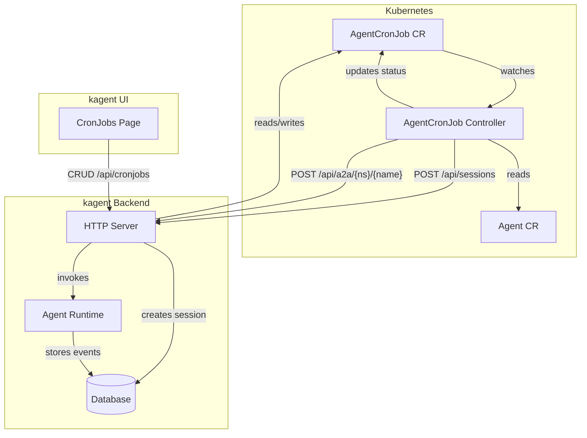
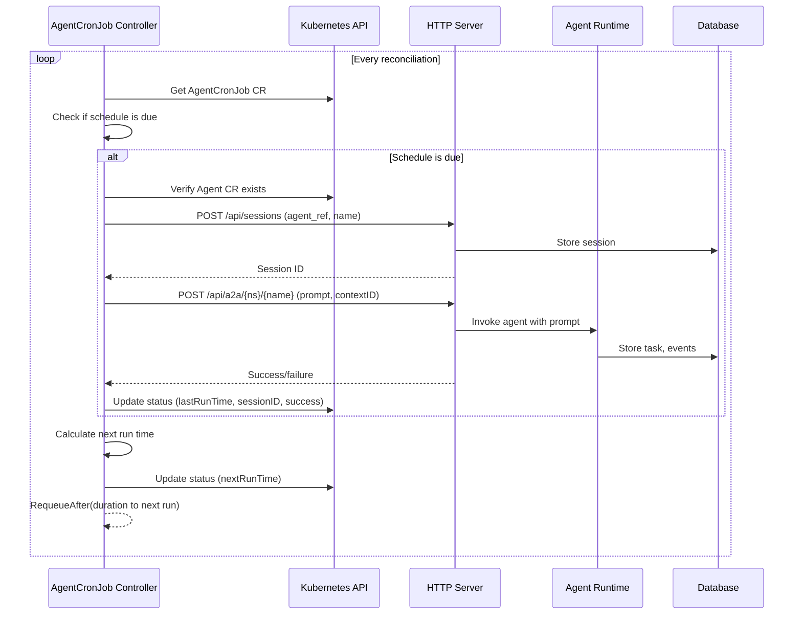

# AgentCronJob — Detailed Design

## Overview

AgentCronJob is a Kubernetes CRD that enables scheduled execution of AI agent prompts on a cron schedule. It references an existing `Agent` CR and sends a static prompt to it at specified intervals via the kagent HTTP server API. Each execution creates a new session, and results are stored using the existing session/task/event infrastructure.

This is a minimal first implementation: schedule + prompt + agent ref. Advanced CronJob semantics (concurrency policy, suspend, history limits) are deferred to future iterations.

---

## Detailed Requirements

1. **CRD:** `AgentCronJob` in `kagent.dev/v1alpha2`
2. **Spec fields (minimal):**
   - `schedule` — cron expression (standard 5-field format)
   - `prompt` — static string sent as user message
   - `agentRef` — reference to an existing Agent CR (namespace/name)
3. **Execution:** Controller calls kagent HTTP server API (same path as UI)
   - Creates a new session per execution
   - Sends prompt via A2A endpoint
4. **Output:** Stored in sessions (existing database models)
5. **Status:** Last run time, success/failure, next scheduled run, last session ID
6. **Error handling:** Set status to failed, retry on next scheduled tick (no immediate requeue)
7. **HTTP server:** Exposes CRUD endpoints for AgentCronJob (`/api/cronjobs`)
8. **UI:** Existing placeholder page at `/cronjobs` to be populated with CRUD operations

---

## Architecture Overview



### Execution Flow



---

## Components and Interfaces

### 1. CRD Type Definition

**File:** `go/api/v1alpha2/agentcronjob_types.go`

```go
// +kubebuilder:object:root=true
// +kubebuilder:subresource:status
// +kubebuilder:storageversion
// +kubebuilder:printcolumn:name="Schedule",type="string",JSONPath=".spec.schedule"
// +kubebuilder:printcolumn:name="Agent",type="string",JSONPath=".spec.agentRef"
// +kubebuilder:printcolumn:name="LastRun",type="date",JSONPath=".status.lastRunTime"
// +kubebuilder:printcolumn:name="NextRun",type="date",JSONPath=".status.nextRunTime"
// +kubebuilder:printcolumn:name="LastResult",type="string",JSONPath=".status.lastRunResult"
type AgentCronJob struct {
    metav1.TypeMeta   `json:",inline"`
    metav1.ObjectMeta `json:"metadata,omitempty"`
    Spec              AgentCronJobSpec   `json:"spec,omitempty"`
    Status            AgentCronJobStatus `json:"status,omitempty"`
}

type AgentCronJobSpec struct {
    // Schedule in standard cron format (5-field: minute hour day month weekday)
    // +kubebuilder:validation:MinLength=1
    Schedule string `json:"schedule"`

    // Prompt is the static user message sent to the agent on each run
    // +kubebuilder:validation:MinLength=1
    Prompt string `json:"prompt"`

    // AgentRef is a reference to the Agent CR (format: "namespace/name" or just "name" for same namespace)
    // +kubebuilder:validation:MinLength=1
    AgentRef string `json:"agentRef"`
}

type AgentCronJobStatus struct {
    ObservedGeneration int64              `json:"observedGeneration,omitempty"`
    Conditions         []metav1.Condition `json:"conditions,omitempty"`

    // LastRunTime is the timestamp of the most recent execution
    // +optional
    LastRunTime *metav1.Time `json:"lastRunTime,omitempty"`

    // NextRunTime is the calculated timestamp of the next execution
    // +optional
    NextRunTime *metav1.Time `json:"nextRunTime,omitempty"`

    // LastRunResult is the result of the most recent execution: "Success" or "Failed"
    // +optional
    LastRunResult string `json:"lastRunResult,omitempty"`

    // LastRunMessage contains error details when LastRunResult is "Failed"
    // +optional
    LastRunMessage string `json:"lastRunMessage,omitempty"`

    // LastSessionID is the session ID created by the most recent execution
    // +optional
    LastSessionID string `json:"lastSessionID,omitempty"`
}

// +kubebuilder:object:root=true
type AgentCronJobList struct {
    metav1.TypeMeta `json:",inline"`
    metav1.ListMeta `json:"metadata,omitempty"`
    Items           []AgentCronJob `json:"items"`
}
```

### 2. Controller

**File:** `go/internal/controller/agentcronjob_controller.go`

**Scheduling approach:** Use `RequeueAfter` with the duration until the next scheduled run. On each reconciliation:
1. Parse the cron schedule
2. Check if current time >= next run time
3. If due: execute the prompt, update status
4. Calculate next run time from cron schedule
5. Return `RequeueAfter(nextRunTime - now)`

**Why RequeueAfter over an in-memory cron library:**
- Simpler — no additional dependency
- Survives controller restarts (schedule recalculated from CRD)
- Consistent with K8s controller patterns
- Adequate precision for cron-scale scheduling (minute granularity)

**Dependencies:**
- `github.com/robfig/cron/v3` — for parsing cron expressions and calculating next run times (standard Go cron library, widely used)
- K8s client for reading Agent CRs
- HTTP client for calling kagent API

**RBAC markers:**
```go
// +kubebuilder:rbac:groups=kagent.dev,resources=agentcronjobs,verbs=get;list;watch;create;update;patch;delete
// +kubebuilder:rbac:groups=kagent.dev,resources=agentcronjobs/status,verbs=get;update;patch
// +kubebuilder:rbac:groups=kagent.dev,resources=agentcronjobs/finalizers,verbs=update
// +kubebuilder:rbac:groups=kagent.dev,resources=agents,verbs=get;list;watch
```

### 3. HTTP Server Endpoints

**File:** `go/internal/httpserver/handlers/cronjobs.go`

CRUD endpoints that proxy to Kubernetes API (same pattern as agents):

| Method | Path | Description |
|--------|------|-------------|
| GET | `/api/cronjobs` | List all AgentCronJobs |
| GET | `/api/cronjobs/{namespace}/{name}` | Get single AgentCronJob |
| POST | `/api/cronjobs` | Create AgentCronJob |
| PUT | `/api/cronjobs/{namespace}/{name}` | Update AgentCronJob |
| DELETE | `/api/cronjobs/{namespace}/{name}` | Delete AgentCronJob |

Request/response format follows existing patterns:
```go
type StandardResponse[T any] struct {
    Error   bool   `json:"error"`
    Data    T      `json:"data,omitempty"`
    Message string `json:"message,omitempty"`
}
```

### 4. UI Components

**Files:**
- `ui/src/app/cronjobs/page.tsx` — list page (replace placeholder)
- `ui/src/app/cronjobs/new/page.tsx` — create/edit form
- `ui/src/app/actions/cronjobs.ts` — server actions
- `ui/src/types/index.ts` — type additions

**TypeScript types:**
```typescript
export interface AgentCronJob {
  metadata: ResourceMetadata;
  spec: AgentCronJobSpec;
  status?: AgentCronJobStatus;
}

export interface AgentCronJobSpec {
  schedule: string;
  prompt: string;
  agentRef: string;
}

export interface AgentCronJobStatus {
  lastRunTime?: string;
  nextRunTime?: string;
  lastRunResult?: string;
  lastRunMessage?: string;
  lastSessionID?: string;
}
```

**UI pattern:** Follow Models page pattern — table with expandable rows showing prompt text and status details. Columns: Name, Schedule, Agent, Last Run, Next Run, Status, Actions (edit/delete).

---

## Data Models

No new database models required. The execution flow reuses existing models:

- **Session** — one created per cron execution, named `"cronjob-{cronjob-name}-{timestamp}"`
- **Task** — created by A2A invocation, linked to session
- **Event** — agent messages stored as events in session

The CRD status itself tracks execution metadata (last run, session ID, etc.) — this lives in Kubernetes, not the database.

---

## Error Handling

| Scenario | Behavior |
|----------|----------|
| Agent CR not found | Set status `Failed`, message "Agent not found", wait for next tick |
| HTTP server unreachable | Set status `Failed`, message with error, wait for next tick |
| A2A invocation fails | Set status `Failed`, message with error, session may be partially created |
| Invalid cron expression | Set condition `Accepted=False`, do not schedule |
| Controller restart | Recalculate next run from cron schedule + last run time; do NOT retroactively run missed executions |

**Status condition types:**
- `Accepted` — cron expression is valid and agent ref is resolvable
- `Ready` — controller is actively scheduling runs

---

## Acceptance Criteria

### AC1: CRD Creation
- **Given** a valid AgentCronJob manifest with schedule, prompt, and agentRef
- **When** applied to the cluster
- **Then** the CRD is created, status shows `Accepted=True`, and `nextRunTime` is populated

### AC2: Scheduled Execution
- **Given** an AgentCronJob with schedule `"*/5 * * * *"` and a valid agent ref
- **When** the scheduled time arrives
- **Then** a new session is created, the prompt is sent to the agent, and status updates with `lastRunTime`, `lastSessionID`, and `lastRunResult=Success`

### AC3: Failed Execution
- **Given** an AgentCronJob referencing a non-existent agent
- **When** the scheduled time arrives
- **Then** status shows `lastRunResult=Failed` with error message, and the next execution still fires on schedule

### AC4: CRUD via HTTP API
- **Given** the HTTP server is running
- **When** a client sends GET/POST/PUT/DELETE to `/api/cronjobs`
- **Then** the corresponding AgentCronJob CR is listed/created/updated/deleted in Kubernetes

### AC5: UI CRUD
- **Given** the UI is loaded
- **When** user navigates to `/cronjobs`
- **Then** they can list, create, edit, and delete AgentCronJobs, and see status (last run, next run, result)

### AC6: Session Visibility
- **Given** a cron job has executed successfully
- **When** user clicks the session link in the cron job status
- **Then** they can view the full agent conversation from that execution

### AC7: Controller Restart Recovery
- **Given** an AgentCronJob was scheduled and the controller restarts
- **When** the controller comes back up
- **Then** it recalculates the next run time without retroactively executing missed runs

---

## Testing Strategy

### Unit Tests
- Cron expression parsing and next-run calculation
- Reconciliation logic (schedule due, not due, error cases)
- HTTP handler request/response serialization
- Status update logic

### Integration Tests
- Controller reconciliation with mock HTTP client
- HTTP server CRUD endpoints with test K8s API

### E2E Tests
- Create AgentCronJob → verify status populated
- Wait for execution → verify session created with prompt
- Delete AgentCronJob → verify cleanup
- Invalid agent ref → verify failed status

---

## Appendices

### A. Technology Choices

| Choice | Rationale |
|--------|-----------|
| `robfig/cron/v3` | Standard Go cron library, well-tested, supports 5-field cron expressions |
| `RequeueAfter` scheduling | No extra dependency beyond cron parser, survives restarts, K8s-native pattern |
| HTTP API for execution | Reuses existing session/A2A infrastructure, same code path as UI |
| No new DB models | Sessions/tasks/events already exist, cron metadata lives in CRD status |

### B. Alternative Approaches Considered

1. **Kubernetes CronJob spawning pods** — rejected: heavyweight, each run would need a container image, doesn't reuse existing agent runtime
2. **In-memory cron scheduler (goroutine)** — rejected: doesn't survive restarts without persistence, adds complexity vs RequeueAfter
3. **Database-backed scheduler** — rejected: duplicates state that belongs in the CRD, adds migration burden
4. **Direct agent runtime invocation** — rejected: bypasses session tracking, inconsistent with UI flow

### C. Research References

- CRD patterns: `go/api/v1alpha2/agent_types.go`
- Controller registration: `go/pkg/app/app.go`
- Shared reconciler: `go/internal/controller/reconciler/reconciler.go`
- HTTP handlers: `go/internal/httpserver/handlers/sessions.go`
- A2A protocol: `go/internal/httpserver/handlers/a2a.go`
- Database models: `go/pkg/database/models.go`
- UI placeholder: `ui/src/app/cronjobs/page.tsx`
- UI CRUD pattern: `ui/src/app/models/page.tsx`

### D. Future Enhancements (Out of Scope)
- Concurrency policy (Allow/Forbid/Replace)
- Suspend/resume
- History limits (max sessions to retain)
- Prompt templating with variables (date, namespace, etc.)
- Execution timeout
- Webhook notifications on completion/failure
