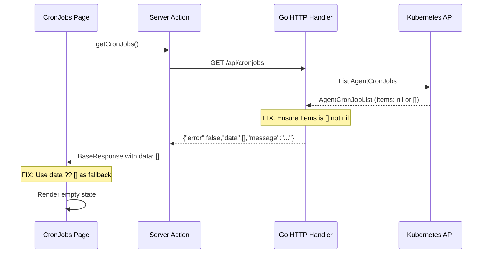

# Design: Fix CronJobs Empty Data UI Error

## Overview

When no CronJobs exist in the cluster, the CronJobs list page shows an error state instead of the empty state. This is caused by a two-layer bug: the Go backend omits the `data` field from the JSON response when the slice is nil (due to `omitempty`), and the UI treats a missing `data` field as an error. The fix applies to both layers, scoped to the CronJobs feature only.

## Detailed Requirements

1. Fix the backend `HandleListCronJobs` handler to always return a non-nil slice so `data` is present in the JSON response
2. Fix the UI `CronJobsPage` to treat missing/undefined `data` as an empty array instead of throwing an error
3. Keep the existing empty state UI unchanged (Clock icon + "No cron jobs found. Create one to get started.")
4. No changes to `StandardResponse` type or other endpoints

## Architecture Overview



## Components and Interfaces

### Backend Change

**File:** `go/core/internal/httpserver/handlers/cronjobs.go`
**Function:** `HandleListCronJobs` (line 28)

Current code (line 43):
```go
data := api.NewResponse(cronJobList.Items, "Successfully listed AgentCronJobs", false)
```

Fixed code:
```go
items := cronJobList.Items
if items == nil {
    items = []v1alpha2.AgentCronJob{}
}
data := api.NewResponse(items, "Successfully listed AgentCronJobs", false)
```

This ensures the JSON response always includes `"data": []` instead of omitting the field.

### Frontend Change

**File:** `ui/src/app/cronjobs/page.tsx`
**Function:** `fetchCronJobs` (line 49)

Current code (lines 52-56):
```typescript
const response = await getCronJobs();
if (response.error || !response.data) {
    throw new Error(response.error || "Failed to fetch cron jobs");
}
setCronJobs(response.data);
```

Fixed code:
```typescript
const response = await getCronJobs();
if (response.error) {
    throw new Error(response.error || "Failed to fetch cron jobs");
}
setCronJobs(response.data ?? []);
```

The `!response.data` check is removed from the error condition. The nullish coalescing operator (`??`) ensures `cronJobs` state is always an array.

## Data Models

No changes to data models. Existing types are sufficient:

- **Go:** `StandardResponse[[]v1alpha2.AgentCronJob]` — unchanged
- **TS:** `BaseResponse<AgentCronJob[]>` — unchanged, `data` is already optional

## Error Handling

- **Backend:** If K8s API fails, existing error handling returns 500 (unchanged)
- **UI:** `response.error` (string from server action catch) still triggers error state
- **UI:** Network/timeout errors still caught by the try-catch block
- Only the "missing data = error" false positive is eliminated

## Acceptance Criteria

**Given** no AgentCronJob resources exist in the cluster
**When** the user navigates to the /cronjobs page
**Then** the page displays the empty state (Clock icon + "No cron jobs found. Create one to get started.")

**Given** no AgentCronJob resources exist in the cluster
**When** the backend GET /api/cronjobs endpoint is called
**Then** the response body contains `"data": []` (not null, not omitted)

**Given** the backend returns a valid error response
**When** the user navigates to the /cronjobs page
**Then** the ErrorState component renders with the error message (unchanged behavior)

**Given** one or more AgentCronJob resources exist
**When** the user navigates to the /cronjobs page
**Then** the CronJobs are listed normally (unchanged behavior)

## Testing Strategy

### Backend
- Unit test for `HandleListCronJobs` with empty K8s response: verify JSON output contains `"data":[]`
- Unit test for `HandleListCronJobs` with populated response: verify existing behavior unchanged

### Frontend
- Manual test: navigate to /cronjobs with no CronJobs in cluster, verify empty state renders
- Manual test: create a CronJob, verify list renders correctly
- Existing stub page test (`ui/src/app/__tests__/stub-pages.test.tsx`) should continue to pass

## Appendices

### Technology Choices
No new dependencies. Uses existing Go stdlib and TypeScript language features.

### Research Findings
See `research/root-cause-analysis.md` for full investigation including:
- Go nil slice JSON marshaling behavior with `omitempty`
- All affected UI pages sharing the same pattern (out of scope for this fix)

### Alternative Approaches Considered
1. **Remove `omitempty` from `StandardResponse.Data`** — rejected; too broad, may affect other endpoints
2. **UI-only fix** — rejected; leaves backend returning semantically incorrect response
3. **Fix all affected pages** — rejected; out of scope, can be done as follow-up
