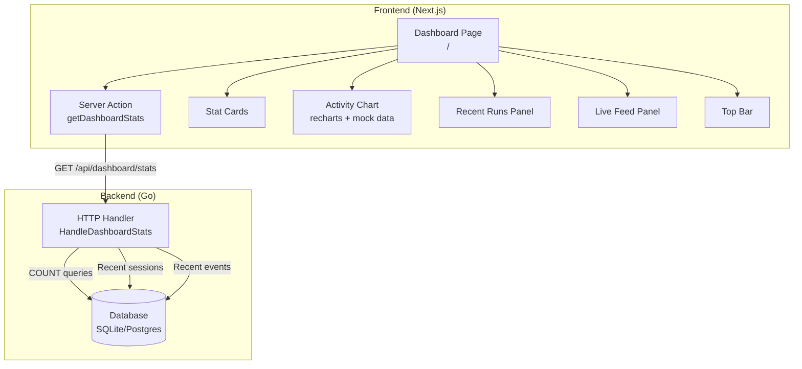

# Dashboard Page — Detailed Design

## Overview

Add a Dashboard page to kagent as the landing page at `/`, replacing the current AgentList home page. The dashboard provides a high-level overview of the KAgent cluster: resource counts, agent activity chart, recent runs, and a live event feed. It includes a small backend stats endpoint and a recharts-based activity chart with mock data (to be wired to Prometheus/Temporal later).

## Detailed Requirements

1. **Dashboard replaces `/`** — the current AgentList at `/` is removed (it already exists at `/agents`)
2. **Backend stats endpoint** — `GET /api/dashboard/stats` returns resource counts, recent sessions, and recent events via DB COUNT queries
3. **7 stat cards** — My Agents, Workflows, Cron Jobs, Models, Tools, MCP Servers, Git Repos (static, not clickable)
4. **Activity chart** — recharts combined line+bar chart with mock data; real data from Prometheus/Temporal later
5. **Recent Runs panel** — list of recent sessions from DB
6. **Live Feed panel** — pseudo-feed of recent session events from DB (not truly live/streaming)
7. **Top bar** — namespace selector, "Stream Connected" badge, logout button
8. **Data on page load only** — no auto-refresh or polling

## Architecture Overview



## Components and Interfaces

### 1. Backend: Dashboard Stats Endpoint

**Route:** `GET /api/dashboard/stats`

**Handler location:** `go/core/internal/httpserver/handlers/dashboard.go`

**Response type** (add to `go/api/httpapi/types.go`):

```go
type DashboardStatsResponse struct {
    Counts       DashboardCounts   `json:"counts"`
    RecentRuns   []RecentRun       `json:"recentRuns"`
    RecentEvents []RecentEvent     `json:"recentEvents"`
}

type DashboardCounts struct {
    Agents     int `json:"agents"`
    Workflows  int `json:"workflows"`
    CronJobs   int `json:"cronJobs"`
    Models     int `json:"models"`
    Tools      int `json:"tools"`
    MCPServers int `json:"mcpServers"`
    GitRepos   int `json:"gitRepos"`
}

type RecentRun struct {
    SessionID   string `json:"sessionId"`
    SessionName string `json:"sessionName"`
    AgentName   string `json:"agentName"`
    CreatedAt   string `json:"createdAt"`
    UpdatedAt   string `json:"updatedAt"`
}

type RecentEvent struct {
    ID        uint   `json:"id"`
    SessionID string `json:"sessionId"`
    Summary   string `json:"summary"`
    CreatedAt string `json:"createdAt"`
}
```

**Database queries:**
- Counts: `SELECT COUNT(*) FROM agents`, `SELECT COUNT(*) FROM tool_servers`, etc.
- For K8s-only resources (agents, workflows, cron jobs, models): use existing K8s list handlers internally or the DB agent table + K8s API
- Recent runs: `SELECT * FROM sessions WHERE user_id = ? ORDER BY updated_at DESC LIMIT 10`
- Recent events: `SELECT * FROM events ORDER BY created_at DESC LIMIT 20`

**DB Client additions** (add to `go/api/database/client.go` interface):

```go
// Dashboard stats
CountSessions(userID string) (int64, error)
RecentSessions(userID string, limit int) ([]Session, error)
RecentEvents(limit int) ([]Event, error)
```

**Note on K8s resources:** Agents, Workflows, CronJobs, Models, MCPServers are K8s CRs. Their counts come from the existing K8s list logic already used by other handlers (e.g., `HandleListAgents`). The handler will call these internally and count the results.

Tools and ToolServers are DB-backed, so counts come from DB queries.

### 2. Frontend: Server Action

**File:** `ui/src/app/actions/dashboard.ts`

```typescript
export async function getDashboardStats(): Promise<DashboardStatsResponse> {
    return fetchApi("/api/dashboard/stats");
}
```

### 3. Frontend: TypeScript Types

**Add to `ui/src/types/index.ts`:**

```typescript
interface DashboardCounts {
    agents: number;
    workflows: number;
    cronJobs: number;
    models: number;
    tools: number;
    mcpServers: number;
    gitRepos: number;
}

interface RecentRun {
    sessionId: string;
    sessionName: string;
    agentName: string;
    createdAt: string;
    updatedAt: string;
}

interface RecentEvent {
    id: number;
    sessionId: string;
    summary: string;
    createdAt: string;
}

interface DashboardStatsResponse {
    counts: DashboardCounts;
    recentRuns: RecentRun[];
    recentEvents: RecentEvent[];
}
```

### 4. Frontend: Dashboard Page Component

**File:** `ui/src/app/page.tsx` (replaces current AgentList)

```
DashboardPage
  DashboardTopBar
    NamespaceSelector (duplicate from sidebar for quick access)
    StreamStatusBadge ("Stream Connected" green dot + wifi icon)
    LogoutButton
  PageHeader ("Dashboard" / "Overview of your KAgent cluster")
  StatsRow
    StatCard x7 (icon + label + count)
  ActivityChart (recharts, mock data)
  BottomRow (grid cols-2)
    RecentRunsPanel (left)
    LiveFeedPanel (right)
```

### 5. Frontend: StatCard Component

**File:** `ui/src/components/dashboard/StatCard.tsx`

Uses Shadcn Card primitives. Displays:
- Lucide icon (matches resource type)
- Uppercase label (e.g., "MY AGENTS")
- Count number (large text)

```
┌──────────────┐
│ [icon] LABEL │
│      3       │
└──────────────┘
```

**Props:**
```typescript
interface StatCardProps {
    icon: LucideIcon;
    label: string;
    count: number;
}
```

**Layout:** 7 cards in a responsive row:
- Desktop: `grid grid-cols-7 gap-4`
- Tablet: `grid grid-cols-4 gap-4` (wraps to 2 rows)
- Mobile: `grid grid-cols-2 gap-4`

### 6. Frontend: ActivityChart Component

**File:** `ui/src/components/dashboard/ActivityChart.tsx`

**Dependencies:** `recharts` (new dependency to install)

**Structure:**
- Card wrapper with title "Agent Activity" and subtitle
- Time range toggle tabs: Avg | P95 | 1h | **24hr** (active) | 7d — non-functional for now (mock data doesn't change)
- Summary stats row: Total runs, Avg duration, Failed runs, Failure rate
- Combined chart using recharts `ComposedChart`:
  - `Line` — avg run duration (blue, `--chart-1`)
  - `Bar` — agents installed (teal, `--chart-2`)
  - `Bar` — failed buckets (red/destructive, `--chart-3`)
- X-axis: time labels (hourly buckets)
- Legend at bottom

**Mock data:** Generate 24 hourly data points with realistic-looking values. Export as a constant so it's easy to swap for real Prometheus data later.

```typescript
interface ActivityDataPoint {
    time: string;          // "9p", "12a", "3a", etc.
    avgDuration: number;   // seconds
    agentRuns: number;     // count
    failedRuns: number;    // count
}

const MOCK_ACTIVITY_DATA: ActivityDataPoint[] = [/* 24 data points */];
```

### 7. Frontend: RecentRunsPanel Component

**File:** `ui/src/components/dashboard/RecentRunsPanel.tsx`

- Card with header "Recent Runs" + "View all" link (points to `/agents`)
- List of recent sessions from `DashboardStatsResponse.recentRuns`
- Each row shows: agent name, session name (or ID), relative timestamp ("2m ago")
- Empty state: "No recent runs"
- Max 10 items, scrollable if needed

### 8. Frontend: LiveFeedPanel Component

**File:** `ui/src/components/dashboard/LiveFeedPanel.tsx`

- Card with header "Live Feed" + green dot indicator + event count
- List of recent events from `DashboardStatsResponse.recentEvents`
- Each row shows: summary text, relative timestamp
- Empty state: "No events"
- Max 20 items, scrollable

### 9. Frontend: DashboardTopBar Component

**File:** `ui/src/components/dashboard/DashboardTopBar.tsx`

- Flex row with justify-between
- Left: Namespace selector dropdown (reuse existing `NamespaceSelector` component)
- Right: "Stream Connected" badge (green dot + Wifi icon + text) + Logout button (LogOut icon)
- The stream badge is visual-only for now (always shows "Connected")

## Data Models

### Backend Response (single endpoint)

```json
{
    "counts": {
        "agents": 3,
        "workflows": 0,
        "cronJobs": 3,
        "models": 4,
        "tools": 3,
        "mcpServers": 2,
        "gitRepos": 0
    },
    "recentRuns": [
        {
            "sessionId": "abc-123",
            "sessionName": "Debug production issue",
            "agentName": "k8s-helper",
            "createdAt": "2026-03-06T10:30:00Z",
            "updatedAt": "2026-03-06T10:35:00Z"
        }
    ],
    "recentEvents": [
        {
            "id": 42,
            "sessionId": "abc-123",
            "summary": "Agent k8s-helper started",
            "createdAt": "2026-03-06T10:30:00Z"
        }
    ]
}
```

### Icon Mapping for Stat Cards

| Card | Icon (Lucide) | Label |
|------|--------------|-------|
| Agents | `Bot` | MY AGENTS |
| Workflows | `GitBranch` | WORKFLOWS |
| Cron Jobs | `Clock` | CRON JOBS |
| Models | `Brain` | MODELS |
| Tools | `Wrench` | TOOLS |
| MCP Servers | `Server` | MCP SERVERS |
| Git Repos | `GitFork` | GIT REPOS |

These match the icons already used in `AppSidebarNav.tsx` NAV_SECTIONS.

## Error Handling

- **Stats fetch failure:** Show error state with retry button (reuse existing `ErrorState` pattern)
- **Partial data:** If some K8s list calls fail (e.g., workflows CRD not installed), return 0 for that count and continue
- **Loading state:** Show skeleton cards and chart placeholder while data loads (reuse `LoadingState` pattern)

## Acceptance Criteria

### Stats Endpoint
- Given a user requests `GET /api/dashboard/stats`, when the request is authenticated, then return counts for all 7 resource types, up to 10 recent sessions, and up to 20 recent events
- Given the workflows CRD is not installed, when stats are requested, then workflows count returns 0 (no error)

### Dashboard Page
- Given the user navigates to `/`, then the Dashboard page renders (not AgentList)
- Given the dashboard loads, then 7 stat cards display with correct counts from the stats endpoint
- Given the dashboard loads, then the Activity Chart renders with mock data using recharts
- Given the dashboard loads, then Recent Runs shows up to 10 recent sessions with agent name and relative timestamp
- Given the dashboard loads, then Live Feed shows up to 20 recent events with summary and relative timestamp
- Given the stats endpoint is unreachable, then an error state with retry button is shown

### Top Bar
- Given the dashboard renders, then the top bar shows namespace selector, "Stream Connected" badge, and logout button
- Given the user changes namespace in the top bar selector, then the dashboard data refreshes for the selected namespace

### Responsive Layout
- Given a desktop viewport (>1024px), then stat cards render in a single row of 7
- Given a tablet viewport (768-1024px), then stat cards wrap to 2 rows
- Given a mobile viewport (<768px), then stat cards render in 2-column grid

## Testing Strategy

### Go Backend
- **Unit tests** for `HandleDashboardStats` handler:
  - Mock DB client returning known counts
  - Verify response shape and status codes
  - Test with missing/errored K8s resources (graceful degradation)
- **Unit tests** for new DB client methods:
  - `CountSessions`, `RecentSessions`, `RecentEvents`

### Frontend
- **Component tests** (Jest/React Testing Library):
  - StatCard renders icon, label, count
  - StatsRow renders 7 cards with correct data
  - RecentRunsPanel renders session list and empty state
  - LiveFeedPanel renders event list and empty state
  - DashboardPage integrates all components
- **Cypress E2E** (if needed):
  - Navigate to `/`, verify dashboard renders
  - Verify stat cards show numeric counts

## Appendices

### Technology Choices
- **recharts** — most popular React charting library, works well with Shadcn/UI and Tailwind, supports ComposedChart for mixed line+bar
- **Existing Shadcn Card** — reused for stat cards, panels, and chart wrapper
- **Existing patterns** — LoadingState, ErrorState, NamespaceSelector reused from current codebase

### Files to Create
| File | Type | Purpose |
|------|------|---------|
| `go/core/internal/httpserver/handlers/dashboard.go` | Go | Stats handler |
| `go/core/internal/httpserver/handlers/dashboard_test.go` | Go | Handler tests |
| `go/api/httpapi/types.go` (edit) | Go | Add response types |
| `go/api/database/client.go` (edit) | Go | Add count/recent methods |
| `go/core/internal/database/` (edit) | Go | Implement new DB methods |
| `go/core/internal/httpserver/server.go` (edit) | Go | Register route |
| `ui/src/app/page.tsx` (edit) | TS | Replace AgentList with Dashboard |
| `ui/src/app/actions/dashboard.ts` | TS | Server action |
| `ui/src/types/index.ts` (edit) | TS | Add dashboard types |
| `ui/src/components/dashboard/StatCard.tsx` | TS | Stat card component |
| `ui/src/components/dashboard/StatsRow.tsx` | TS | 7-card grid |
| `ui/src/components/dashboard/ActivityChart.tsx` | TS | Recharts chart |
| `ui/src/components/dashboard/RecentRunsPanel.tsx` | TS | Recent runs list |
| `ui/src/components/dashboard/LiveFeedPanel.tsx` | TS | Event feed list |
| `ui/src/components/dashboard/DashboardTopBar.tsx` | TS | Top bar with controls |

### Alternative Approaches Considered
- **Client-side aggregation** — fetching all list endpoints and counting in the browser. Rejected: inefficient, fetches full payloads just for counts.
- **Omit activity chart** — simpler initial version. Rejected: user wants chart UI ready with mock data for Prometheus integration later.
- **SSE live feed** — real streaming for the feed panel. Deferred: no backend event bus exists. Pseudo-feed from recent DB events is sufficient for now.

### Future Enhancements (Out of Scope)
- Wire activity chart to Prometheus/Temporal metrics
- Real-time live feed via SSE
- Clickable stat cards linking to resource pages
- Auto-refresh / polling
- Run duration and success/failure tracking in Task model
