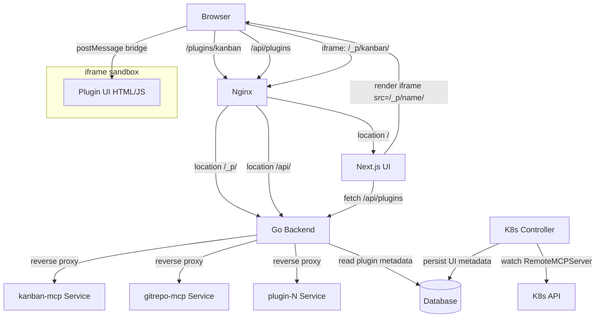
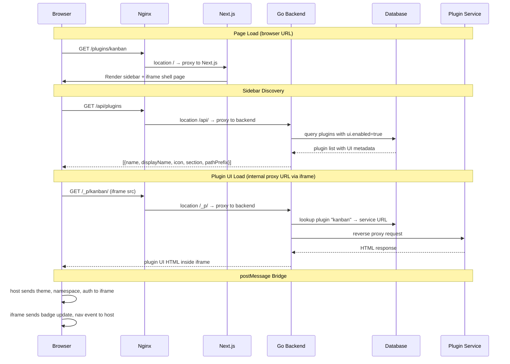

# Design: Dynamic MCP UI Routing for Plugins

## Overview

Replace the hardcoded nginx proxy rules and static Next.js routes for MCP plugin UIs with a fully dynamic system. MCP tool servers declare UI metadata in their RemoteMCPServer CRD. The Go backend discovers these declarations, persists them to the database, and serves as a reverse proxy at `/plugins/{name}/`. The Next.js UI renders plugin UIs in sandboxed iframes with a postMessage bridge for theme sync, resize, navigation, namespace context, auth forwarding, and badge updates. The existing kanban integration migrates to this new system as proof-of-concept.

---

## Detailed Requirements

*(Consolidated from requirements.md)*

### Architecture Decisions
- **Proxy**: Go reverse proxy handles `/plugins/{name}/` routing dynamically (not nginx per-plugin)
- **Metadata**: Extend RemoteMCPServer CRD with optional `ui` section
- **UI URL**: Derived from existing `spec.url` (strip MCP path to get base URL)
- **Sidebar**: Configurable `ui.section` field, default "PLUGINS"
- **Rendering**: iframe with postMessage bridge (CSS/JS isolation, MCP Apps-aligned)
- **Migration**: Existing kanban moves to new plugin system
- **Path**: `/plugins/{name}/` top-level (one-time nginx `location /plugins/` addition)
- **Discovery API**: New `/api/plugins` endpoint

### postMessage Bridge (all v1)
1. Theme sync (light/dark + CSS variables)
2. Resize/height (iframe auto-fills or reports content height)
3. Navigation events (plugin triggers host navigation)
4. Namespace context (host sends active namespace)
5. Auth token forwarding (host passes auth context)
6. Title/badge updates (plugin updates sidebar badge dynamically)

---

## Architecture Overview

**Key routing principle:** Browser URLs (`/plugins/{name}`) go to Next.js for the shell page with sidebar. Internal proxy URLs (`/_p/{name}/`) go to Go backend for reverse-proxying to upstream plugin services. This separation prevents nginx routing conflicts.



### Request Flow



---

## Components and Interfaces

### 1. CRD Extension: RemoteMCPServerSpec.UI

**File:** `go/api/v1alpha2/remotemcpserver_types.go`

```go
// PluginUISpec defines optional UI metadata for MCP servers that provide a web interface.
type PluginUISpec struct {
    // Enabled indicates this MCP server provides a web UI.
    // +optional
    // +kubebuilder:default=false
    Enabled bool `json:"enabled,omitempty"`

    // PathPrefix is the URL path segment used for routing: /plugins/{pathPrefix}/
    // Must be a valid URL path segment (lowercase alphanumeric + hyphens).
    // Defaults to the RemoteMCPServer name if not specified.
    // +optional
    // +kubebuilder:validation:Pattern=`^[a-z0-9][a-z0-9-]*[a-z0-9]$`
    // +kubebuilder:validation:MaxLength=63
    PathPrefix string `json:"pathPrefix,omitempty"`

    // DisplayName is the human-readable name shown in the sidebar.
    // Defaults to the RemoteMCPServer name if not specified.
    // +optional
    DisplayName string `json:"displayName,omitempty"`

    // Icon is a lucide-react icon name (e.g., "kanban", "git-fork", "database").
    // +optional
    // +kubebuilder:default="puzzle"
    Icon string `json:"icon,omitempty"`

    // Section is the sidebar section where this plugin appears.
    // +optional
    // +kubebuilder:default="PLUGINS"
    // +kubebuilder:validation:Enum=OVERVIEW;AGENTS;RESOURCES;ADMIN;PLUGINS
    Section string `json:"section,omitempty"`
}

type RemoteMCPServerSpec struct {
    // ... existing fields ...

    // UI defines optional web UI metadata for this MCP server.
    // When ui.enabled is true, the server's UI is accessible at /plugins/{ui.pathPrefix}/
    // +optional
    UI *PluginUISpec `json:"ui,omitempty"`
}
```

**Example CRD:**
```yaml
apiVersion: kagent.dev/v1alpha2
kind: RemoteMCPServer
metadata:
  name: kanban-mcp
  namespace: kagent
spec:
  description: Kanban task board MCP server
  protocol: STREAMABLE_HTTP
  url: http://kanban-mcp.kagent.svc.cluster.local:8080/mcp
  ui:
    enabled: true
    pathPrefix: "kanban"
    displayName: "Kanban Board"
    icon: "kanban"
    section: "AGENTS"
```

### 2. Database Model: Plugin

**File:** `go/api/database/models.go`

```go
// Plugin represents an MCP server that provides a web UI.
// Populated by the controller from RemoteMCPServer CRDs with ui.enabled=true.
type Plugin struct {
    CreatedAt   time.Time      `gorm:"autoCreateTime" json:"created_at"`
    UpdatedAt   time.Time      `gorm:"autoUpdateTime" json:"updated_at"`
    DeletedAt   gorm.DeletedAt `gorm:"index" json:"deleted_at"`

    // Name is the RemoteMCPServer ref (namespace/name format)
    Name        string `gorm:"primaryKey;not null" json:"name"`
    // PathPrefix is the URL routing segment
    PathPrefix  string `gorm:"uniqueIndex;not null" json:"path_prefix"`
    // DisplayName for sidebar
    DisplayName string `json:"display_name"`
    // Icon is the lucide-react icon name
    Icon        string `json:"icon"`
    // Section is the sidebar section
    Section     string `json:"section"`
    // UpstreamURL is the base URL to proxy to (derived from spec.url)
    UpstreamURL string `json:"upstream_url"`
}

func (Plugin) TableName() string { return "plugin" }
```

### 3. Database Client Interface Extension

**File:** `go/api/database/client.go`

Add to `Client` interface:

```go
// Plugin methods
StorePlugin(plugin *Plugin) (*Plugin, error)
DeletePlugin(name string) error
GetPluginByPathPrefix(pathPrefix string) (*Plugin, error)
ListPlugins() ([]Plugin, error)
```

### 4. Controller: Reconciler Extension

**File:** `go/core/internal/controller/reconciler/reconciler.go`

Extend `ReconcileKagentRemoteMCPServer()` to handle UI metadata:

```go
// After existing tool server upsert (line ~430), add:
if err := a.reconcilePluginUI(ctx, server); err != nil {
    log.Error(err, "failed to reconcile plugin UI", "server", serverRef)
    // Non-fatal: plugin UI failure should not block tool discovery
}
```

```go
func (a *kagentReconciler) reconcilePluginUI(
    ctx context.Context,
    server *v1alpha2.RemoteMCPServer,
) error {
    serverRef := fmt.Sprintf("%s/%s", server.Namespace, server.Name)

    // If UI not enabled, ensure plugin record is deleted
    if server.Spec.UI == nil || !server.Spec.UI.Enabled {
        return a.dbClient.DeletePlugin(serverRef)
    }

    ui := server.Spec.UI

    // Derive upstream URL from spec.url (strip path to get base)
    upstreamURL, err := deriveBaseURL(server.Spec.URL)
    if err != nil {
        return fmt.Errorf("failed to derive upstream URL: %w", err)
    }

    // Derive defaults
    pathPrefix := ui.PathPrefix
    if pathPrefix == "" {
        pathPrefix = server.Name
    }
    displayName := ui.DisplayName
    if displayName == "" {
        displayName = server.Name
    }
    icon := ui.Icon
    if icon == "" {
        icon = "puzzle"
    }
    section := ui.Section
    if section == "" {
        section = "PLUGINS"
    }

    plugin := &database.Plugin{
        Name:        serverRef,
        PathPrefix:  pathPrefix,
        DisplayName: displayName,
        Icon:        icon,
        Section:     section,
        UpstreamURL: upstreamURL,
    }

    _, err = a.dbClient.StorePlugin(plugin)
    return err
}

// deriveBaseURL strips the path from a URL to get the base (scheme + host).
// e.g., "http://kanban-mcp.kagent.svc:8080/mcp" → "http://kanban-mcp.kagent.svc:8080"
func deriveBaseURL(rawURL string) (string, error) {
    u, err := url.Parse(rawURL)
    if err != nil {
        return "", err
    }
    u.Path = ""
    u.RawQuery = ""
    u.Fragment = ""
    return u.String(), nil
}
```

On deletion (when CR is not found), add plugin cleanup alongside existing tool server deletion:

```go
// Existing: delete tool server and tools
// Add: delete plugin
_ = a.dbClient.DeletePlugin(serverRef)
```

### 5. HTTP Handler: PluginsHandler

**File:** `go/core/internal/httpserver/handlers/plugins.go` (new)

```go
package handlers

// PluginsHandler handles plugin-related requests
type PluginsHandler struct {
    *Base
}

func NewPluginsHandler(base *Base) *PluginsHandler {
    return &PluginsHandler{Base: base}
}

// HandleListPlugins handles GET /api/plugins — returns all plugins with UI metadata
func (h *PluginsHandler) HandleListPlugins(w ErrorResponseWriter, r *http.Request) {
    plugins, err := h.DatabaseService.ListPlugins()
    if err != nil {
        w.RespondWithError(errors.NewInternalServerError("Failed to list plugins", err))
        return
    }

    resp := make([]PluginResponse, len(plugins))
    for i, p := range plugins {
        resp[i] = PluginResponse{
            Name:        p.Name,
            PathPrefix:  p.PathPrefix,
            DisplayName: p.DisplayName,
            Icon:        p.Icon,
            Section:     p.Section,
        }
    }

    data := api.NewResponse(resp, "Successfully listed plugins", false)
    RespondWithJSON(w, http.StatusOK, data)
}

type PluginResponse struct {
    Name        string `json:"name"`
    PathPrefix  string `json:"pathPrefix"`
    DisplayName string `json:"displayName"`
    Icon        string `json:"icon"`
    Section     string `json:"section"`
}
```

### 6. HTTP Handler: Plugin Reverse Proxy

**File:** `go/core/internal/httpserver/handlers/pluginproxy.go` (new)

```go
package handlers

// PluginProxyHandler handles /plugins/{name}/ reverse proxy requests
type PluginProxyHandler struct {
    *Base
    // Cache of pathPrefix → *httputil.ReverseProxy to avoid recreating per-request
    proxies sync.Map
}

func NewPluginProxyHandler(base *Base) *PluginProxyHandler {
    return &PluginProxyHandler{Base: base}
}

// HandleProxy handles all requests to /_p/{name}/{path...}
func (h *PluginProxyHandler) HandleProxy(w http.ResponseWriter, r *http.Request) {
    pathPrefix := mux.Vars(r)["name"]
    if pathPrefix == "" {
        http.Error(w, "plugin name required", http.StatusBadRequest)
        return
    }

    plugin, err := h.DatabaseService.GetPluginByPathPrefix(pathPrefix)
    if err != nil {
        http.Error(w, "plugin not found", http.StatusNotFound)
        return
    }

    proxy := h.getOrCreateProxy(plugin)

    // Strip the /_p/{name} prefix before forwarding
    originalPath := r.URL.Path
    prefix := "/_p/" + pathPrefix
    r.URL.Path = strings.TrimPrefix(originalPath, prefix)
    if r.URL.Path == "" {
        r.URL.Path = "/"
    }

    proxy.ServeHTTP(w, r)
}

func (h *PluginProxyHandler) getOrCreateProxy(plugin *database.Plugin) *httputil.ReverseProxy {
    if cached, ok := h.proxies.Load(plugin.PathPrefix); ok {
        return cached.(*httputil.ReverseProxy)
    }

    target, _ := url.Parse(plugin.UpstreamURL)
    proxy := &httputil.ReverseProxy{
        Director: func(req *http.Request) {
            req.URL.Scheme = target.Scheme
            req.URL.Host = target.Host
            req.Header.Set("X-Forwarded-Host", req.Host)
            req.Header.Set("X-Plugin-Name", plugin.PathPrefix)
        },
        // Flush immediately for SSE support
        FlushInterval: -1,
    }

    h.proxies.Store(plugin.PathPrefix, proxy)
    return proxy
}

// InvalidateCache removes a cached proxy (called when plugin is updated/deleted)
func (h *PluginProxyHandler) InvalidateCache(pathPrefix string) {
    h.proxies.Delete(pathPrefix)
}
```

### 7. Route Registration

**File:** `go/core/internal/httpserver/server.go`

Add to path constants:

```go
const (
    // ... existing ...
    APIPathPlugins     = "/api/plugins"
    PluginsProxyPath   = "/_p/{name}"
)
```

Add to `setupRoutes()`:

```go
// Plugin discovery API
s.router.HandleFunc(APIPathPlugins,
    adaptHandler(s.handlers.Plugins.HandleListPlugins)).Methods(http.MethodGet)

// Plugin reverse proxy at /_p/{name} (internal path, NOT /plugins/)
// Browser URLs /plugins/{name} go to Next.js via location / catch-all
// Uses raw http.HandlerFunc, not adaptHandler, because it proxies directly
s.router.PathPrefix("/_p/{name}").HandlerFunc(
    s.handlers.PluginProxy.HandleProxy)
```

### 8. Nginx: Routing Fix — Separate Browser and Proxy Paths

**File:** `ui/conf/nginx.conf`

**Critical:** Browser URL `/plugins/{name}` must reach Next.js (for sidebar + iframe shell).
Internal proxy URL `/_p/{name}/` must reach Go backend (for iframe content).

Replace the hardcoded `/kanban-mcp/` block with `/_p/` (NOT `/plugins/`):

```nginx
# Internal plugin proxy — iframe content loads via /_p/{name}/
# Browser URLs /plugins/{name} fall through to location / (Next.js)
location /_p/ {
    proxy_pass http://kagent_backend/_p/;
    proxy_http_version 1.1;
    proxy_set_header Upgrade $http_upgrade;
    proxy_set_header Connection $connection_upgrade;
    proxy_set_header Host $host;
    proxy_set_header X-Forwarded-Host $host;
    proxy_set_header X-Forwarded-Proto $scheme;
    proxy_set_header X-Forwarded-For $proxy_add_x_forwarded_for;
    proxy_cache_bypass $http_upgrade;
    proxy_read_timeout 300s;
    proxy_send_timeout 300s;
    proxy_buffering off;
}
```

Remove the hardcoded `/kanban-mcp/` location block.
Remove any existing `location /plugins/` block (it would intercept browser URLs).

### 9. Next.js: Dynamic Plugin Page

**File:** `ui/src/app/plugins/[name]/[[...path]]/page.tsx` (new)

```tsx
"use client";

import { useParams } from "next/navigation";
import { useEffect, useRef, useState } from "react";
import { useTheme } from "next-themes";
import { useNamespace } from "@/lib/namespace-context";

// postMessage bridge protocol
interface PluginMessage {
  type: string;
  payload: unknown;
}

interface BadgeUpdate {
  count?: number;
  label?: string;
}

export default function PluginPage() {
  const { name } = useParams<{ name: string }>();
  const { theme, resolvedTheme } = useTheme();
  const { namespace } = useNamespace();
  const iframeRef = useRef<HTMLIFrameElement>(null);
  const [title, setTitle] = useState<string>("");

  // Build iframe src — uses /_p/ internal proxy path (NOT /plugins/)
  // /plugins/{name} = browser URL (Next.js page with sidebar)
  // /_p/{name}/     = internal proxy URL (Go backend → upstream service)
  const path = useParams<{ path?: string[] }>().path;
  const subPath = path ? "/" + path.join("/") : "/";
  const iframeSrc = `/_p/${name}${subPath}`;

  const [loading, setLoading] = useState(true);
  const [error, setError] = useState(false);

  // Send context to iframe on changes
  useEffect(() => {
    const iframe = iframeRef.current;
    if (!iframe?.contentWindow) return;

    const msg: PluginMessage = {
      type: "kagent:context",
      payload: {
        theme: resolvedTheme,
        namespace,
        // auth token placeholder — populated when auth is implemented
        authToken: null,
      },
    };
    iframe.contentWindow.postMessage(msg, "*");
  }, [resolvedTheme, namespace]);

  // Listen for messages from iframe
  useEffect(() => {
    const handler = (event: MessageEvent<PluginMessage>) => {
      if (!event.data?.type?.startsWith("kagent:")) return;

      switch (event.data.type) {
        case "kagent:navigate": {
          const { href } = event.data.payload as { href: string };
          window.location.href = href;
          break;
        }
        case "kagent:resize": {
          const { height } = event.data.payload as { height: number };
          if (iframeRef.current && height > 0) {
            iframeRef.current.style.height = `${height}px`;
          }
          break;
        }
        case "kagent:badge": {
          // Dispatch custom event for sidebar to pick up
          const badge = event.data.payload as BadgeUpdate;
          window.dispatchEvent(
            new CustomEvent("kagent:plugin-badge", {
              detail: { plugin: name, ...badge },
            })
          );
          break;
        }
        case "kagent:title": {
          const { title: newTitle } = event.data.payload as { title: string };
          setTitle(newTitle);
          break;
        }
        case "kagent:ready": {
          // Plugin loaded — send initial context
          iframeRef.current?.contentWindow?.postMessage(
            {
              type: "kagent:context",
              payload: {
                theme: resolvedTheme,
                namespace,
                authToken: null,
              },
            } satisfies PluginMessage,
            "*"
          );
          break;
        }
      }
    };

    window.addEventListener("message", handler);
    return () => window.removeEventListener("message", handler);
  }, [name, resolvedTheme, namespace]);

  return (
    <div className="flex h-full flex-col">
      {title && (
        <div className="flex h-10 items-center border-b px-3">
          <h1 className="text-sm font-semibold">{title}</h1>
        </div>
      )}
      {loading && (
        <div className="flex flex-1 items-center justify-center">
          <Loader2 className="h-6 w-6 animate-spin text-muted-foreground" />
          <span className="ml-2 text-sm text-muted-foreground">Loading plugin...</span>
        </div>
      )}
      {error && (
        <div className="flex flex-1 flex-col items-center justify-center gap-2">
          <AlertCircle className="h-8 w-8 text-destructive" />
          <p className="text-sm text-muted-foreground">Plugin unavailable</p>
          <button onClick={() => { setError(false); setLoading(true); }} className="text-xs underline">
            Retry
          </button>
        </div>
      )}
      <iframe
        ref={iframeRef}
        src={iframeSrc}
        className={cn("flex-1 border-0", (loading || error) && "hidden")}
        sandbox="allow-scripts allow-same-origin allow-forms allow-popups"
        title={`Plugin: ${name}`}
        onLoad={() => setLoading(false)}
        onError={() => { setLoading(false); setError(true); }}
      />
    </div>
  );
}
```

### 10. Sidebar: Dynamic Plugin Navigation

**File:** `ui/src/components/sidebars/AppSidebarNav.tsx` (modified)

```tsx
"use client";

import { useEffect, useState } from "react";
import Link from "next/link";
import { usePathname } from "next/navigation";
import * as LucideIcons from "lucide-react";
import type { LucideIcon } from "lucide-react";
import {
  SidebarGroup, SidebarGroupLabel, SidebarMenu,
  SidebarMenuItem, SidebarMenuButton, SidebarMenuBadge,
} from "@/components/ui/sidebar";

// ... existing static NAV_SECTIONS ...

interface PluginNav {
  name: string;
  pathPrefix: string;
  displayName: string;
  icon: string;
  section: string;
}

interface PluginBadge {
  count?: number;
  label?: string;
}

function getIconByName(name: string): LucideIcon {
  // Map lucide icon name (kebab-case) to component
  const pascalCase = name
    .split("-")
    .map((s) => s.charAt(0).toUpperCase() + s.slice(1))
    .join("");
  return (LucideIcons as Record<string, LucideIcon>)[pascalCase] ?? LucideIcons.Puzzle;
}

export function AppSidebarNav() {
  const pathname = usePathname();
  const [plugins, setPlugins] = useState<PluginNav[]>([]);
  const [badges, setBadges] = useState<Record<string, PluginBadge>>({});

  // Fetch plugins on mount
  useEffect(() => {
    fetch("/api/plugins")
      .then((r) => r.json())
      .then((res) => setPlugins(res.data ?? []))
      .catch(() => {});
  }, []);

  // Listen for badge updates from plugin iframes
  useEffect(() => {
    const handler = (e: Event) => {
      const { plugin, count, label } = (e as CustomEvent).detail;
      setBadges((prev) => ({ ...prev, [plugin]: { count, label } }));
    };
    window.addEventListener("kagent:plugin-badge", handler);
    return () => window.removeEventListener("kagent:plugin-badge", handler);
  }, []);

  // Merge plugins into sections
  const sections = NAV_SECTIONS.map((section) => {
    const pluginItems = plugins
      .filter((p) => p.section === section.label)
      .map((p) => ({
        label: p.displayName,
        href: `/plugins/${p.pathPrefix}`,
        icon: getIconByName(p.icon),
        badge: badges[p.pathPrefix],
      }));
    return {
      ...section,
      items: [...section.items.map((i) => ({ ...i, badge: undefined as PluginBadge | undefined })), ...pluginItems],
    };
  });

  // Add PLUGINS section for plugins that specify section="PLUGINS"
  const pluginsSection = plugins.filter((p) => p.section === "PLUGINS");
  if (pluginsSection.length > 0) {
    sections.push({
      label: "PLUGINS",
      items: pluginsSection.map((p) => ({
        label: p.displayName,
        href: `/plugins/${p.pathPrefix}`,
        icon: getIconByName(p.icon),
        badge: badges[p.pathPrefix],
      })),
    });
  }

  return (
    <>
      {sections.map((section) => {
        if (section.items.length === 0) return null;
        const sectionId = `nav-section-${section.label.toLowerCase()}`;
        return (
          <SidebarGroup key={section.label} role="group" aria-labelledby={sectionId}>
            <SidebarGroupLabel id={sectionId}>{section.label}</SidebarGroupLabel>
            <SidebarMenu>
              {section.items.map((item) => {
                const isActive = pathname === item.href || pathname.startsWith(item.href + "/");
                return (
                  <SidebarMenuItem key={item.href}>
                    <SidebarMenuButton
                      asChild
                      isActive={isActive}
                      aria-current={isActive ? "page" : undefined}
                    >
                      <Link href={item.href}>
                        <item.icon />
                        <span>{item.label}</span>
                      </Link>
                    </SidebarMenuButton>
                    {item.badge?.count != null && (
                      <SidebarMenuBadge>{item.badge.count}</SidebarMenuBadge>
                    )}
                  </SidebarMenuItem>
                );
              })}
            </SidebarMenu>
          </SidebarGroup>
        );
      })}
    </>
  );
}
```

### 11. postMessage Bridge Protocol

The bridge uses a `kagent:` prefix for all messages to avoid collision with other postMessage users.

**Host → Plugin (from Next.js page to iframe):**

| Message Type | Payload | When Sent |
|---|---|---|
| `kagent:context` | `{ theme: "light"\|"dark", namespace: string, authToken: string\|null }` | On load, on theme/namespace/auth change |

**Plugin → Host (from iframe to parent):**

| Message Type | Payload | When Sent |
|---|---|---|
| `kagent:ready` | `{}` | Plugin loaded, requests initial context |
| `kagent:navigate` | `{ href: string }` | Plugin wants to navigate host |
| `kagent:resize` | `{ height: number }` | Plugin content height changed |
| `kagent:badge` | `{ count?: number, label?: string }` | Plugin updates sidebar badge |
| `kagent:title` | `{ title: string }` | Plugin sets page title |

**Plugin SDK snippet** (for plugin developers to include):

```javascript
// kagent-plugin-bridge.js — lightweight bridge for plugin UIs
const kagent = {
  _ready: false,
  _listeners: {},

  // Call on plugin load
  connect() {
    window.addEventListener("message", (event) => {
      if (event.data?.type === "kagent:context") {
        const { theme, namespace, authToken } = event.data.payload;
        this._emit("context", { theme, namespace, authToken });
      }
    });
    window.parent.postMessage({ type: "kagent:ready", payload: {} }, "*");
    this._ready = true;
  },

  // Listen for context updates
  onContext(fn) { this._on("context", fn); },

  // Send navigation request
  navigate(href) {
    window.parent.postMessage({ type: "kagent:navigate", payload: { href } }, "*");
  },

  // Update sidebar badge
  setBadge(count, label) {
    window.parent.postMessage({ type: "kagent:badge", payload: { count, label } }, "*");
  },

  // Set page title
  setTitle(title) {
    window.parent.postMessage({ type: "kagent:title", payload: { title } }, "*");
  },

  // Report content height for auto-resize
  reportHeight(height) {
    window.parent.postMessage({ type: "kagent:resize", payload: { height: height ?? document.body.scrollHeight } }, "*");
  },

  _on(event, fn) { (this._listeners[event] ??= []).push(fn); },
  _emit(event, data) { (this._listeners[event] ?? []).forEach(fn => fn(data)); },
};
```

### 12. Kanban Migration

**Changes:**

| Component | Action |
|---|---|
| `ui/conf/nginx.conf` | Remove `location /kanban-mcp/` block |
| `ui/src/app/kanban/page.tsx` | Delete file |
| `ui/src/components/sidebars/AppSidebarNav.tsx` | Remove static Kanban nav item |
| `helm/tools/kanban-mcp/templates/remotemcpserver.yaml` | Add `ui` section |
| kanban-mcp embedded UI (`index.html`) | Add `kagent-plugin-bridge.js` integration |

**Updated Helm RemoteMCPServer:**
```yaml
apiVersion: kagent.dev/v1alpha2
kind: RemoteMCPServer
metadata:
  name: {{ include "kanban-mcp.fullname" . }}
  namespace: {{ .Release.Namespace }}
spec:
  description: Kanban task board MCP server
  protocol: STREAMABLE_HTTP
  url: {{ include "kanban-mcp.serverUrl" . }}
  ui:
    enabled: true
    pathPrefix: "kanban"
    displayName: "Kanban Board"
    icon: "kanban"
    section: "AGENTS"
```

---

## Data Models

### New: Plugin table

| Column | Type | Constraints | Description |
|---|---|---|---|
| name | string | PK, not null | RemoteMCPServer ref (namespace/name) |
| path_prefix | string | unique index, not null | URL routing segment |
| display_name | string | | Sidebar display name |
| icon | string | | lucide-react icon name |
| section | string | | Sidebar section |
| upstream_url | string | | Base URL to proxy to |
| created_at | timestamp | auto | |
| updated_at | timestamp | auto | |
| deleted_at | timestamp | soft delete index | |

### Modified: RemoteMCPServerSpec (CRD)

New optional field `ui` of type `PluginUISpec` (see Component 1 above).

---

## Error Handling

- **Plugin not found**: Go proxy returns 404 if pathPrefix not in database. Next.js plugin page shows "Plugin unavailable" fallback with retry button.
- **Plugin service down**: Go proxy returns 502 Bad Gateway. iframe `onError` fires. Host shows "Plugin unavailable" fallback UI with retry button.
- **Sidebar fetch failure**: `/api/plugins` error shows inline error indicator with retry option (not silent `.catch(() => {})`).
- **Loading states**: Sidebar shows loading indicator while fetching plugins. Plugin page shows loading skeleton while iframe loads.
- **CRD without ui section**: No Plugin record created. No impact on existing tool server functionality.
- **Duplicate pathPrefix**: Database unique index rejects. Controller logs error, continues reconciling other fields. CRD status should reflect the conflict.
- **Stale proxy cache**: Cache invalidated on plugin delete/update via controller webhook or TTL-based eviction.
- **postMessage from unknown origin**: Bridge validates `event.data.type` prefix; ignores non-`kagent:` messages.
- **Hard refresh on /plugins/{name}**: Works correctly because nginx routes to Next.js (via `location /` catch-all). Internal proxy at `/_p/` is separate.

---

## Acceptance Criteria

```gherkin
Feature: Dynamic MCP UI Routing for Plugins

  # --- API Pipeline (existing) ---

  Scenario: Plugin UI auto-discovered from CRD
    Given a RemoteMCPServer CRD "kanban-mcp" with ui.enabled=true and ui.pathPrefix="kanban"
    When the controller reconciles
    Then a Plugin record exists in the database with pathPrefix="kanban"
    And GET /api/plugins returns an entry with pathPrefix="kanban"

  Scenario: Plugin UI accessible via internal proxy
    Given a Plugin record with pathPrefix="kanban" and upstreamURL="http://kanban-mcp:8080"
    When the iframe loads /_p/kanban/
    Then the Go backend reverse-proxies the request to http://kanban-mcp:8080/
    And the iframe receives the kanban-mcp HTML response

  Scenario: Plugin removal cleans up
    Given a RemoteMCPServer CRD is deleted
    When the controller reconciles
    Then the Plugin record is deleted from the database
    And the /api/plugins endpoint no longer returns it
    And /_p/{name}/ returns 404

  Scenario: SSE works through reverse proxy
    Given I open /_p/kanban/events via the Go reverse proxy
    Then I receive SSE events streamed from the kanban-mcp service
    And the proxy does not buffer responses

  # --- Routing Fix (Q10) ---

  Scenario: Browser URL and proxy URL are separate paths
    Given nginx config has location /_p/ pointing to Go backend
    And location / pointing to Next.js (catch-all)
    When the browser navigates to /plugins/kanban
    Then nginx routes to Next.js (not Go backend)
    And Next.js renders the plugin page with sidebar and iframe

  Scenario: Hard refresh on plugin page preserves sidebar
    Given a user is on /plugins/kanban and presses F5
    Then the page reloads with the full Next.js layout (sidebar visible)
    And the iframe reloads from /_p/kanban/

  Scenario: Direct URL access works
    Given a user pastes /plugins/kanban into the browser address bar
    Then the page loads with sidebar and iframe (same as client-side navigation)

  # --- Browser UI (Q11, Q12) ---

  Scenario: Sidebar shows dynamic plugin nav item
    Given the /api/plugins endpoint returns [{pathPrefix:"kanban", displayName:"Kanban Board", icon:"kanban", section:"AGENTS"}]
    When the sidebar renders
    Then "Kanban Board" appears under the AGENTS section with the kanban icon
    And clicking it navigates to /plugins/kanban

  Scenario: Sidebar shows loading state while fetching plugins
    Given the /api/plugins request is in-flight
    Then the sidebar shows a loading indicator in the PLUGINS area

  Scenario: Sidebar shows error state on API failure
    Given the /api/plugins request fails with 500
    Then the sidebar shows an error indicator with retry option
    And clicking retry re-fetches /api/plugins

  Scenario: Plugin rendered in iframe with sidebar shell
    Given I navigate to /plugins/kanban
    Then the kagent sidebar remains visible
    And the plugin UI loads inside an iframe with sandbox="allow-scripts allow-same-origin allow-forms allow-popups"
    And the iframe src is /_p/kanban/ (internal proxy, not /plugins/)

  Scenario: Plugin page shows loading skeleton
    Given I navigate to /plugins/kanban
    Then a loading indicator is shown while the iframe loads
    And it disappears when the iframe content is ready

  Scenario: Plugin page shows error on upstream failure
    Given the upstream plugin service is not running
    When I navigate to /plugins/kanban
    Then the page shows "Plugin unavailable" with a retry button
    And clicking retry reloads the iframe

  Scenario: Theme sync via postMessage
    Given a plugin is loaded in an iframe
    When the host theme changes to "dark"
    Then the iframe receives a kagent:context message with theme="dark"

  Scenario: Namespace context forwarded
    Given a plugin is loaded and the user changes namespace to "production"
    Then the iframe receives a kagent:context message with namespace="production"

  Scenario: Badge update from plugin
    Given a plugin sends kagent:badge with {count: 5}
    Then the sidebar shows a badge "5" next to the plugin nav item

  Scenario: Navigation from plugin
    Given a plugin sends kagent:navigate with {href: "/agents"}
    Then the host navigates to /agents

  Scenario: Sidebar updates on plugin removal
    Given the sidebar shows "Kanban Board" from /api/plugins
    When the RemoteMCPServer CRD is deleted and controller reconciles
    And the sidebar re-fetches /api/plugins
    Then "Kanban Board" no longer appears in the sidebar

  # --- Migration ---

  Scenario: Kanban migrated to plugin system
    Given the kanban-mcp Helm chart deploys with ui metadata in RemoteMCPServer
    Then /_p/kanban/ serves the kanban board (via Go proxy)
    And /plugins/kanban loads the Next.js page with sidebar and iframe
    And no hardcoded /kanban-mcp/ nginx route exists
    And no ui/src/app/kanban/page.tsx file exists
```

---

## Testing Strategy

### Unit tests (existing + new)

- `deriveBaseURL()` correctly strips paths from various URL formats
- `PluginsHandler.HandleListPlugins()` returns correct JSON from mocked DB
- `PluginProxyHandler` routes to correct upstream, strips `/_p/` prefix, handles 404
- Sidebar merges static nav items with dynamic plugins correctly
- Sidebar shows loading state during fetch, error state on failure
- Plugin page constructs iframe src with `/_p/` prefix (not `/plugins/`)
- Plugin page shows loading skeleton, error fallback, retry behavior
- postMessage handler processes each message type

### Integration tests (existing + new)

- Controller creates/deletes Plugin records when CRD ui field changes
- Go reverse proxy forwards requests and SSE streams to actual HTTP server
- Nginx `/_p/` location correctly proxies to Go backend
- Nginx `/plugins/` requests fall through to Next.js (not Go backend)

### API E2E tests (existing — Go httptest)

- Create RemoteMCPServer with UI → poll `/api/plugins` until entry appears
- Verify `/api/plugins` returns correct metadata shape
- Verify `/_p/{name}/` returns proxied response (non-404)
- Delete CRD → verify disappears from `/api/plugins` and `/_p/` returns 404

### Browser E2E tests (NEW — Playwright)

**Location:** `ui/e2e/plugin-routing.spec.ts`

**Prerequisites:**
- Kind cluster with kagent deployed
- Mock plugin service deployed (simple HTTP server returning test HTML with `kagent-plugin-bridge.js`)
- RemoteMCPServer CRD with `ui` section applied

**Test scenarios:**

1. **Sidebar plugin discovery**
   - Navigate to `/`
   - Wait for sidebar to load
   - Assert plugin nav item appears in correct section
   - Assert plugin icon renders

2. **Plugin navigation (client-side)**
   - Click plugin nav item in sidebar
   - Assert URL changes to `/plugins/{name}`
   - Assert sidebar remains visible
   - Assert iframe element exists with `src=/_p/{name}/`
   - Assert iframe loads content (not blank)

3. **Plugin navigation (hard refresh)**
   - Navigate directly to `/plugins/{name}` via `page.goto()`
   - Assert sidebar renders with plugin nav item
   - Assert iframe loads content

4. **Plugin loading states**
   - Mock slow upstream (delay response)
   - Navigate to `/plugins/{name}`
   - Assert loading skeleton visible
   - Wait for iframe load
   - Assert loading skeleton hidden, iframe visible

5. **Plugin error state**
   - Configure upstream to return 502
   - Navigate to `/plugins/{name}`
   - Assert "Plugin unavailable" message visible
   - Assert retry button exists

6. **Theme sync via postMessage**
   - Navigate to `/plugins/{name}`
   - Wait for iframe to load
   - Toggle theme to dark
   - Assert iframe receives `kagent:context` message with `theme: "dark"` (verified by mock plugin writing to DOM)

7. **Badge update from plugin**
   - Navigate to `/plugins/{name}`
   - Wait for iframe to load
   - Trigger badge update from mock plugin (postMessage `kagent:badge` with `{count: 3}`)
   - Assert sidebar badge shows "3" next to plugin nav item

**Mock plugin service:** A minimal HTTP server serving:
```html
<!DOCTYPE html>
<html>
<body>
  <div id="plugin-content">Mock Plugin Loaded</div>
  <div id="theme">unknown</div>
  <script src="/kagent-plugin-bridge.js"></script>
  <script>
    kagent.connect();
    kagent.onContext(({ theme }) => {
      document.getElementById('theme').textContent = theme;
    });
    kagent.setBadge(3);
  </script>
</body>
</html>
```

### API verification script (CI integration)

**Location:** `scripts/check-plugins-api.sh` (existing, enhanced)

Enhancements:
- Add `--wait` flag for polling mode (use after helm install in CI)
- Add proxy endpoint verification (`/_p/{name}/` returns non-404)
- Integrate into CI pipeline as post-deploy smoke test
- Exit codes: 0 = pass, 1 = validation failed, 2 = missing dependency

---

## Appendix A: Technology Choices

| Concern | Choice | Rationale |
|---|---|---|
| Reverse proxy | `net/http/httputil.ReverseProxy` | Go stdlib, no new dependency |
| Internal proxy path | `/_p/{name}/` | Avoids collision with browser URL `/plugins/{name}` |
| iframe sandbox | `allow-scripts allow-same-origin allow-forms allow-popups` | Minimum permissions for functional plugin UI |
| Bridge protocol | postMessage with `kagent:` prefix | Standards-based, aligns with MCP Apps pattern |
| Icon resolution | Dynamic lucide-react import by name | Icons already in codebase, tree-shaking handles unused |
| Plugin discovery | `/api/plugins` endpoint + DB query | Decouples sidebar from K8s API, fast reads from DB |
| Proxy caching | `sync.Map` keyed by pathPrefix | Simple, sufficient for expected plugin count (<100) |
| Browser E2E testing | Playwright | Industry standard, supports iframe inspection, postMessage verification |

## Appendix B: MCP Apps Extension Compatibility

The MCP Apps extension spec (https://apps.extensions.modelcontextprotocol.io) defines `ui://` resources for inline tool UIs in chat clients. kagent's plugin UI system is complementary:

| Aspect | MCP Apps | kagent Plugins |
|---|---|---|
| Scope | Per-tool-invocation inline UI | Full-page dashboard/app |
| Rendering | iframe in chat message | iframe in sidebar shell |
| Communication | PostMessageTransport | postMessage with `kagent:` prefix |
| Discovery | `_meta.ui.resourceUri` on tools | `spec.ui` on RemoteMCPServer CRD |
| Lifecycle | Ephemeral (per LLM call) | Persistent (always available) |

Future: kagent could support MCP Apps inline UIs in chat views alongside full-page plugin UIs. The CRD `ui` section does not conflict with tool-level `_meta.ui` declarations.

## Appendix C: Alternative Approaches Considered

**Nginx dynamic config generation** — Rejected (Q1): requires sidecar/init container, config regen + reload cycle, more moving parts.

**Annotations instead of CRD extension** — Rejected (Q2): no kubebuilder validation, less discoverable, no IDE support.

**Direct proxy without iframe** — Rejected (Q5): CSS/JS conflicts between plugin and kagent UI.

**Separate PluginUI CRD** — Rejected (Q2): overkill for alpha, adds CRD surface area.

**Keep kanban hardcoded** — Rejected (Q6): two patterns is confusing, new system needs a real proof-of-concept.

**Nginx `/plugins/` for both browser and proxy** — Rejected (Q10): causes routing conflict — browser URL and iframe proxy URL collide at nginx level. Hard refresh breaks (raw plugin HTML without sidebar). Fix: separate paths `/_p/` (proxy) vs `/plugins/` (browser).
