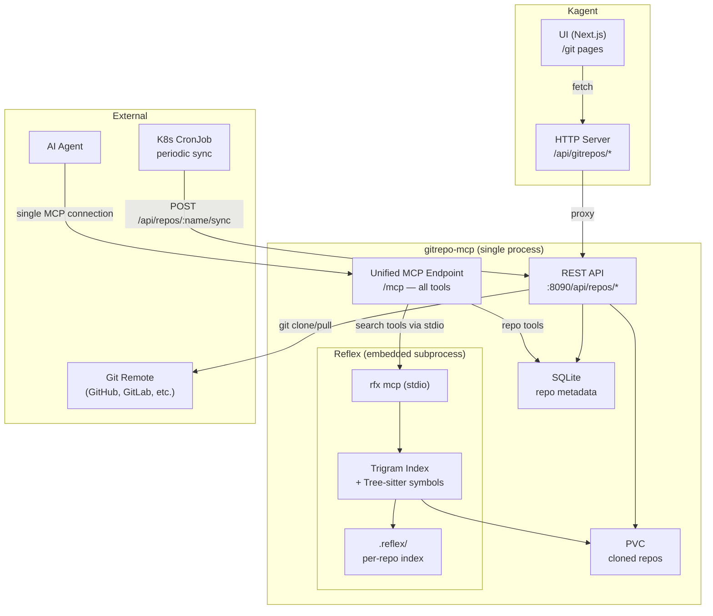

# Design: Git Repos API + UI

## Overview

Add git repository management and code search to kagent via a standalone Go MCP server (`gitrepo-mcp`) and kagent API/UI integration. Users register git repos through the kagent UI; the MCP server clones repos and delegates all search to an embedded Reflex subprocess. Reflex provides full-text search, symbol search, regex search, AST pattern search, and dependency analysis — all proxied through a single `/mcp` endpoint. No embedding pipeline — search is trigram + Tree-sitter based.

## Detailed Requirements

### Functional Requirements

**Repo Management:**
- Register a git repo by URL and branch (auth via Helm chart credentials)
- List registered repos with status (cloning/cloned/indexing/indexed/error, last synced, file count)
- Remove a repo and its Reflex index
- Trigger manual sync (git pull) and re-index
- Periodic sync via external CronJob

**Code Search (all via Reflex):**
- Full-text search — trigram-indexed, finds all occurrences
- Symbol search — Tree-sitter parsed, finds definitions (functions, classes, methods)
- Regex search — trigram-optimized pattern matching
- AST pattern search — Tree-sitter S-expression patterns
- Dependency analysis — imports, reverse deps, circular deps, hotspots, orphaned files
- `rfx index` triggered automatically after clone/sync
- Incremental indexing via blake3 content hashing (only changed files)

**Out of scope (v1):**
- `rfx ask` (LLM-based natural language → code search) — future
- Embedding/semantic search — future
- FalkorDB code graph — future

**Kagent Integration:**
- Kagent HTTP server proxies MCP server REST API
- UI pages: list repos, add/remove, sync/re-index, search
- Replace existing `/git` "Coming soon" stub

### Non-Functional Requirements
- MCP server is stateless except for SQLite DB + PVC
- Reflex binary (`rfx`) must be present in container image
- No GPU, no ONNX, no embedding model required
- Search latency: <1s for repos under 10K files

## Architecture Overview



## Components and Interfaces

### Component 1: gitrepo-mcp CLI (`go/cmd/gitrepo-mcp/`)

Cobra CLI with subcommands:

```
gitrepo-mcp serve --port 8090 --data-dir /data    # REST API + MCP server
gitrepo-mcp add <name> --url <url> --branch main  # CLI repo management
gitrepo-mcp list
gitrepo-mcp remove <name>
gitrepo-mcp sync <name>
```

**Internal packages:**

```
go/cmd/gitrepo-mcp/
├── main.go                    # Cobra root command
├── cmd/
│   ├── serve.go               # REST + MCP server
│   ├── add.go                 # Add repo
│   ├── list.go                # List repos
│   ├── remove.go              # Remove repo
│   └── sync.go                # Git pull + trigger rfx index
└── internal/
    ├── server/
    │   ├── rest.go            # REST API handlers (gorilla/mux)
    │   └── mcp.go             # Unified MCP server (native + Reflex proxy)
    ├── repo/
    │   ├── manager.go         # Clone, pull, remove git repos
    │   └── models.go          # Repo metadata types
    ├── reflex/
    │   ├── proxy.go           # Spawn `rfx mcp` subprocess, proxy MCP tool calls via stdio
    │   ├── indexer.go         # Trigger `rfx index` after clone/sync
    │   └── lifecycle.go       # Start/stop/health check Reflex subprocess
    └── storage/
        ├── db.go              # SQLite setup + migrations
        ├── repos.go           # Repo CRUD
        └── models.go          # GORM models
```

### Component 2: REST API

Base path: `/api/repos`

| Method | Path | Description |
|--------|------|-------------|
| GET | `/api/repos` | List all repos |
| POST | `/api/repos` | Add a new repo |
| GET | `/api/repos/{name}` | Get repo details + status |
| DELETE | `/api/repos/{name}` | Remove repo + Reflex index |
| POST | `/api/repos/{name}/sync` | Trigger git pull + re-index |
| POST | `/api/repos/{name}/index` | Trigger Reflex re-index |

**Add repo request:**
```json
{
  "name": "kagent",
  "url": "https://github.com/kagent-dev/kagent.git",
  "branch": "main"
}
```

**Add repo response:**
```json
{
  "name": "kagent",
  "url": "https://github.com/kagent-dev/kagent.git",
  "branch": "main",
  "status": "cloning",
  "createdAt": "2026-02-27T10:00:00Z"
}
```

**List repos response:**
```json
{
  "repos": [
    {
      "name": "kagent",
      "url": "https://github.com/kagent-dev/kagent.git",
      "branch": "main",
      "status": "indexed",
      "lastSynced": "2026-02-27T12:00:00Z",
      "lastIndexed": "2026-02-27T12:01:00Z",
      "fileCount": 342,
      "error": null
    }
  ]
}
```

### Component 3: Unified MCP Tools (single `/mcp` endpoint)

All tools served from one MCP endpoint. gitrepo-mcp handles repo lifecycle natively and proxies all search/analysis tools to the embedded `rfx mcp` subprocess via stdio.

**Native tools (repo lifecycle):**

| Tool | Description | Parameters |
|------|-------------|------------|
| `add_repo` | Register and clone a git repo | `name`, `url`, `branch` |
| `list_repos` | List registered repos with status | — |
| `remove_repo` | Remove repo and index | `name` |
| `sync_repo` | Pull latest + re-index | `name` |

**Proxied Reflex tools (search + analysis):**

| Tool | Description |
|------|-------------|
| `search_code` | Full-text or symbol search |
| `search_regex` | Regex pattern matching |
| `search_ast` | AST pattern matching via Tree-sitter |
| `list_locations` | Fast file+line discovery |
| `count_occurrences` | Quick statistics |
| `index_project` | Trigger Reflex reindexing |
| `get_dependencies` | File imports |
| `get_dependents` | Reverse dependency lookup |
| `get_transitive_deps` | Transitive dependencies |
| `find_hotspots` | Most-imported files |
| `find_circular` | Circular dependency detection |
| `find_unused` | Orphaned files |
| `analyze_summary` | Dependency analysis summary |

**Routing:** gitrepo-mcp maintains a routing table — native tool names dispatch to Go handlers, Reflex tool names dispatch to the subprocess. No prefix needed, names don't collide.

**Proxy mechanism:**
```
Agent → MCP request (tool: search_code)
  → gitrepo-mcp routing table → Reflex tool
  → forwards to `rfx mcp` subprocess via stdio (JSON-RPC)
  → reads response from subprocess stdout
  → returns to agent as MCP response
```

### Component 4: Kagent Proxy Handlers (`go/internal/httpserver/handlers/gitrepos.go`)

```go
type GitReposHandler struct {
    *Base
    GitRepoMCPURL string // e.g., "http://gitrepo-mcp:8090"
}
```

Proxy pattern: kagent handler receives request → forwards to gitrepo-mcp REST API → returns response. No kagent DB involvement.

**Routes added to kagent HTTP server:**

| Method | Kagent Path | Proxied To |
|--------|-------------|------------|
| GET | `/api/gitrepos` | `GET /api/repos` |
| POST | `/api/gitrepos` | `POST /api/repos` |
| GET | `/api/gitrepos/{name}` | `GET /api/repos/{name}` |
| DELETE | `/api/gitrepos/{name}` | `DELETE /api/repos/{name}` |
| POST | `/api/gitrepos/{name}/sync` | `POST /api/repos/{name}/sync` |
| POST | `/api/gitrepos/{name}/index` | `POST /api/repos/{name}/index` |

### Component 5: Kagent UI (`ui/src/app/git/`)

**Pages:**

```
ui/src/app/git/
├── page.tsx              # List repos page (replace "Coming soon")
└── new/page.tsx          # Add repo form
```

**Server actions:** `ui/src/app/actions/gitrepos.ts`

```typescript
"use server";
export async function getGitRepos(): Promise<BaseResponse<GitRepo[]>>
export async function addGitRepo(data: AddGitRepoRequest): Promise<BaseResponse<GitRepo>>
export async function removeGitRepo(name: string): Promise<BaseResponse<void>>
export async function syncGitRepo(name: string): Promise<BaseResponse<GitRepo>>
export async function indexGitRepo(name: string): Promise<BaseResponse<GitRepo>>
```

**Types:** added to `ui/src/types/index.ts`

```typescript
interface GitRepo {
  name: string;
  url: string;
  branch: string;
  status: "cloning" | "cloned" | "indexing" | "indexed" | "error";
  lastSynced?: string;
  lastIndexed?: string;
  fileCount: number;
  error?: string;
}
```

**UI features:**
- List page: table with expandable rows, status badges, action buttons (sync, re-index, delete)
- Add page: form with name, URL, branch fields
- Search delegated to agents via MCP tools (not a UI search bar in v1)
- Follows AgentCronJob UI patterns (Shadcn/UI, toast notifications, error/loading states)

## Data Models

### SQLite Schema (gitrepo-mcp)

```sql
-- Repo metadata only — search index is managed by Reflex (.reflex/ per repo)
CREATE TABLE repos (
    name TEXT PRIMARY KEY,
    url TEXT NOT NULL,
    branch TEXT NOT NULL DEFAULT 'main',
    status TEXT NOT NULL DEFAULT 'cloning',
    local_path TEXT NOT NULL,
    last_synced TIMESTAMP,
    last_indexed TIMESTAMP,
    file_count INTEGER DEFAULT 0,
    error TEXT,
    created_at TIMESTAMP DEFAULT CURRENT_TIMESTAMP,
    updated_at TIMESTAMP DEFAULT CURRENT_TIMESTAMP
);
```

### Reflex Index (per repo, managed by Reflex)
```
<data-dir>/repos/<name>/.reflex/
  meta.db          # SQLite: file metadata, stats, blake3 hashes
  trigrams.bin     # Inverted index (memory-mapped)
  content.bin      # Full file contents (memory-mapped)
  config.toml      # Index settings
```

## Error Handling

| Error Case | Handling |
|------------|----------|
| Git clone fails (auth, network) | Set repo status to "error", store error message, return 500 |
| Reflex binary not found | Log warning at startup, omit Reflex tools from MCP tool list, repo management still works |
| Reflex subprocess crashes | Log error, mark Reflex tools as unavailable, attempt restart with backoff |
| Reflex stdio timeout | Return MCP error to agent after 30s timeout, log warning |
| Repo not found | Return 404 |
| CronJob sync during indexing | Queue sync, skip if already in progress (mutex) |
| Corrupt SQLite DB | Log error, offer reset via CLI command |

## Acceptance Criteria

**Repo Management:**
- Given a valid git URL, when I call `POST /api/repos`, then the repo is cloned to PVC and status shows "cloning" → "cloned"
- Given a registered repo, when I call `DELETE /api/repos/{name}`, then the repo directory and Reflex index are removed
- Given a registered repo, when I call `POST /api/repos/{name}/sync`, then git pull is executed and Reflex re-indexes

**Search (via Reflex MCP tools):**
- Given an indexed repo, when agent calls `search_code` with a text query, then matching occurrences are returned with file + line
- Given an indexed repo, when agent calls `search_code --symbols`, then only symbol definitions are returned
- Given an indexed repo, when agent calls `search_ast` with a Tree-sitter pattern, then matching AST nodes are returned
- Given an indexed repo, when agent calls `get_dependencies`, then file import graph is returned

**Reflex Integration:**
- Given Reflex is not installed, when gitrepo-mcp starts, then Reflex tools are omitted and repo management still works
- Given the MCP tool list, then both native tools (`add_repo`, etc.) and Reflex tools (`search_code`, `find_circular`, etc.) appear in a single list
- Given a cloned repo, then `rfx index` is triggered automatically and `.reflex/` directory is created

**Kagent UI:**
- Given the `/git` page, when loaded, then registered repos are listed with status and actions
- Given the add form, when submitted with valid data, then a new repo appears in the list

**Kagent UI (browser acceptance — Cypress):**
- Given a browser at `/git` with no backend, then the error state renders with a clear message
- Given a browser at `/git` with mocked repos, then repos display correct status badges and file counts
- Given the add form at `/git/new`, when submitted, then the browser redirects to `/git`
- Given a repo row, when sync/re-index/delete is clicked, then appropriate action fires with feedback

**Kagent Proxy:**
- Given kagent HTTP server, when `/api/gitrepos/*` is called, then the request is proxied to gitrepo-mcp and response returned

## Testing Strategy

### Unit Tests
- **Repo manager:** Clone, pull, remove operations (mock git CLI)
- **Reflex proxy:** Tool list merging, tool call forwarding, timeout handling
- **Reflex lifecycle:** Start/stop/restart/health check
- **REST handlers:** Request parsing, validation, response format
- **Kagent proxy handlers:** Forward correctly (mock downstream)

### Integration Tests
- **Clone + index flow:** Add repo → `rfx index` auto-triggered → `.reflex/` created → `search_code` returns results
- **Sync + re-index:** Modify file → sync → Reflex re-indexes changed files only
- **Reflex unavailable:** Start gitrepo-mcp without `rfx` binary → native tools work, Reflex tools absent

### Browser Acceptance Tests (Cypress)
- **Location:** `ui/cypress/e2e/git-repos.cy.ts`
- **Mock-based suites (7):** page load, error state, list rendering, add form, repo actions (sync/index/delete), loading states
- **Live integration suite (1):** full flow against real gitrepo-mcp — tagged `@live`, manual only
- **Stable selectors:** `data-test` attributes on key UI elements

### E2E Tests
- **Full stack:** kagent UI → kagent proxy → gitrepo-mcp → clone → Reflex index → search
- **Helm deployment:** Deploy via Helm chart, verify service connectivity

## Appendices

### A. Technology Choices

| Component | Choice | Rationale |
|-----------|--------|-----------|
| Language | Go | Matches kagent ecosystem, good for CLI + server |
| CLI framework | Cobra | Standard in kagent (same as kagent CLI) |
| HTTP router | gorilla/mux | Same as kagent HTTP server |
| Code search | Reflex (reflex-search) | Embedded subprocess, trigram + Tree-sitter + deps, built-in MCP, 14+ languages |
| Repo metadata | SQLite (GORM) | Simple, portable, same as kagent |
| Git operations | go-git or shell out | Pure Go git client or git CLI |

### B. Research Findings Summary
- **API patterns:** gorilla/mux, handler factory with Base struct, ErrorResponseWriter (research/01)
- **DB patterns:** GORM generic helpers, Clause pattern, upsert-first (research/02)
- **UI patterns:** AgentCronJob as reference — list page, create/edit form, server actions (research/03)
- **Existing git:** Greenfield — only a "Coming soon" stub exists (research/04)
- **CRD flow:** Not needed — this is a proxy pattern, no CRD/controller (research/05)
- **Local embeddings:** EmbeddingGemma-300M — deferred to future version (research/06)
- **LLM CLI design:** Named collections pattern — deferred to future version (research/07)
- **ast-grep:** Superseded by Reflex (research/08)
- **Reflex:** Replaces ast-grep + provides all search capabilities for v1 (research/09)

### C. Alternative Approaches Considered

**Embedding/semantic search (EmbeddingGemma-300M + ONNX):** Deferred — adds significant complexity (ONNX Runtime, model file, chunking pipeline, vector storage). Reflex's trigram + symbol search covers v1 use cases.

**ast-grep for structural search:** Rejected — Reflex provides a superset (full-text + symbol + AST + deps + MCP). See research/09.

**Reflex as separate MCP server:** Rejected — embedding inside gitrepo-mcp gives agents a single MCP connection. Simpler deployment.

**`rfx ask` (LLM-based natural language search):** Deferred — requires external LLM API. Keep v1 simple with direct search tools.

**CRD-backed repos:** Rejected — MCP server owns data, kagent just proxies.

### D. Future Extensions (Out of Scope for v1)
- Embedding/semantic search (EmbeddingGemma-300M, cosine similarity)
- `rfx ask` — natural language → code search via LLM
- FalkorDB code graph (AST → nodes/edges, Cypher, GraphRAG)
- Multi-branch indexing
- Webhook-triggered sync (GitHub/GitLab webhooks)
- UI search bar (search via agents + MCP tools in v1)
