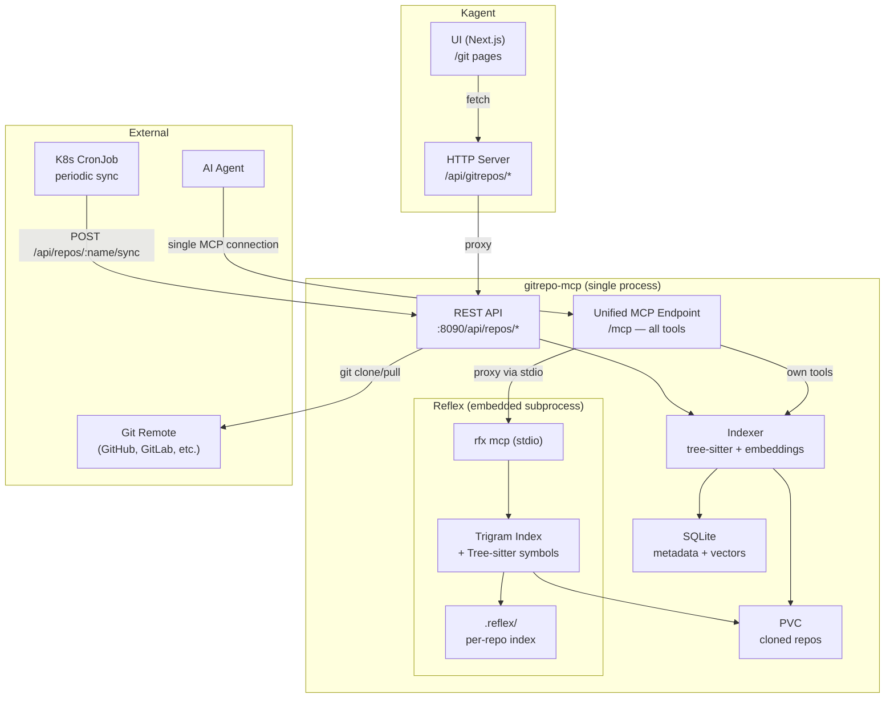

# Design: Git Repos API + UI

## Overview

Add git repository semantic search capabilities to kagent via a standalone Go MCP server (`gitrepo-mcp`) and kagent API/UI integration. Users register git repos through the kagent UI; the MCP server clones, indexes (tree-sitter chunking + EmbeddingGemma-300M embeddings), and exposes semantic search as MCP tools. Reflex (`reflex-search`) is embedded as a subprocess — its MCP tools are proxied through the same `/mcp` endpoint, giving agents a unified tool surface for semantic search, structural code search, and dependency analysis.

## Detailed Requirements

### Functional Requirements

**Repo Management:**
- Register a git repo by URL and branch (auth via Helm chart credentials)
- List registered repos with status (indexed/indexing/error, last synced, file/chunk counts)
- Remove a repo and its embeddings
- Trigger manual sync (git pull) and re-index
- Periodic sync via external CronJob

**Semantic Search:**
- Index repo files using tree-sitter function/block-level chunking for code (.go, .py, .js, .ts, .java, .groovy, .rs), heading-based chunking for .md, document-level for .yaml/.toml
- Embed chunks using EmbeddingGemma-300M (local CPU, ONNX Runtime)
- Store embeddings in SQLite as float32 BLOBs
- Brute-force cosine similarity search
- Return: chunk content + N surrounding context lines + file path + line range + score
- Content-hash deduplication (skip unchanged files on re-index)

**Structural Search + Dependency Analysis (Reflex — embedded):**
- Reflex (`reflex-search`) runs as a subprocess inside gitrepo-mcp
- gitrepo-mcp spawns `rfx mcp` via stdio, proxies Reflex MCP tools through its own `/mcp` endpoint
- Agents see one unified MCP server with all tools (repo mgmt + semantic + structural + deps)
- `rfx index <repo-path>` triggered automatically after clone/sync
- Provides full-text, symbol, regex, and AST pattern search
- Adds dependency analysis (imports, circular deps, hotspots, orphaned files)

**Kagent Integration:**
- Kagent HTTP server proxies MCP server REST API
- UI pages: list repos, add/remove, sync/re-index, search
- Replace existing `/git` "Coming soon" stub

### Non-Functional Requirements
- MCP server is stateless except for SQLite DB + PVC
- Embedding runs on CPU only (no GPU dependency)
- Reflex binary (`rfx`) must be present in container image (embedded subprocess)
- Search latency: <1s for repos under 50K chunks

## Architecture Overview



## Components and Interfaces

### Component 1: gitrepo-mcp CLI (`go/cmd/gitrepo-mcp/`)

Cobra CLI with subcommands:

```
gitrepo-mcp serve --port 8090 --data-dir /data    # REST API + MCP server
gitrepo-mcp add <name> --url <url> --branch main  # CLI repo management
gitrepo-mcp list
gitrepo-mcp remove <name>
gitrepo-mcp sync <name>
gitrepo-mcp index <name>
gitrepo-mcp search <name> -c "query" --limit 10
```

**Internal packages:**

```
go/cmd/gitrepo-mcp/
├── main.go                    # Cobra root command
├── cmd/
│   ├── serve.go               # REST + MCP server
│   ├── add.go                 # Add repo
│   ├── list.go                # List repos
│   ├── remove.go              # Remove repo
│   ├── sync.go                # Git pull
│   ├── index.go               # Index repo
│   └── search.go              # Search
└── internal/
    ├── server/
    │   ├── rest.go            # REST API handlers (gorilla/mux)
    │   └── mcp.go             # MCP protocol handlers
    ├── repo/
    │   ├── manager.go         # Clone, pull, remove git repos
    │   └── models.go          # Repo metadata types
    ├── indexer/
    │   ├── indexer.go         # Orchestrates chunking + embedding
    │   ├── chunker.go         # Tree-sitter code chunking
    │   ├── chunker_md.go      # Markdown heading-based chunking
    │   ├── chunker_config.go  # YAML/TOML document-level chunking
    │   └── context.go         # Surrounding context extraction
    ├── embedder/
    │   ├── embedder.go        # EmbeddingModel interface
    │   ├── gemma.go           # EmbeddingGemma-300M via ONNX Runtime
    │   └── batch.go           # Batch processing with dedup
    ├── search/
    │   └── semantic.go        # Brute-force cosine similarity
    ├── reflex/
    │   ├── proxy.go           # Spawn `rfx mcp` subprocess, proxy MCP tool calls via stdio
    │   ├── indexer.go         # Trigger `rfx index` after clone/sync
    │   └── lifecycle.go       # Start/stop/health check Reflex subprocess
    └── storage/
        ├── db.go              # SQLite setup + migrations
        ├── repos.go           # Repo CRUD
        ├── embeddings.go      # Embedding CRUD + vector ops
        └── models.go          # GORM models
```

### Component 2: REST API

Base path: `/api/repos`

| Method | Path | Description |
|--------|------|-------------|
| GET | `/api/repos` | List all repos |
| POST | `/api/repos` | Add a new repo |
| GET | `/api/repos/{name}` | Get repo details + status |
| DELETE | `/api/repos/{name}` | Remove repo + embeddings |
| POST | `/api/repos/{name}/sync` | Trigger git pull |
| POST | `/api/repos/{name}/index` | Trigger re-index |
| POST | `/api/repos/{name}/search` | Semantic search within repo |
| POST | `/api/search` | Semantic search across all repos |

**Add repo request:**
```json
{
  "name": "kagent",
  "url": "https://github.com/kagent-dev/kagent.git",
  "branch": "main"
}
```

**Add repo response:**
```json
{
  "name": "kagent",
  "url": "https://github.com/kagent-dev/kagent.git",
  "branch": "main",
  "status": "cloning",
  "createdAt": "2026-02-27T10:00:00Z"
}
```

**List repos response:**
```json
{
  "repos": [
    {
      "name": "kagent",
      "url": "https://github.com/kagent-dev/kagent.git",
      "branch": "main",
      "status": "indexed",
      "lastSynced": "2026-02-27T12:00:00Z",
      "lastIndexed": "2026-02-27T12:01:00Z",
      "fileCount": 342,
      "chunkCount": 4521,
      "error": null
    }
  ]
}
```

**Search request:**
```json
{
  "query": "where do we set up auth?",
  "limit": 10,
  "contextLines": 3
}
```

**Search response:**
```json
{
  "results": [
    {
      "repo": "kagent",
      "filePath": "go/internal/httpserver/auth/authn.go",
      "lineStart": 45,
      "lineEnd": 72,
      "score": 0.832,
      "chunkType": "function",
      "chunkName": "Authenticate",
      "content": "func (a *Authenticator) Authenticate(ctx context.Context, ...",
      "context": {
        "before": ["// Authenticator handles request authentication", ""],
        "after": ["", "// validateToken checks token validity"]
      }
    }
  ]
}
```

### Component 3: Unified MCP Tools (single `/mcp` endpoint)

All tools are served from one MCP endpoint. gitrepo-mcp handles its own tools natively and proxies Reflex tools to the embedded `rfx mcp` subprocess via stdio.

**Native tools (repo lifecycle + semantic search):**

| Tool | Description | Parameters |
|------|-------------|------------|
| `add_repo` | Register and clone a git repo | `name`, `url`, `branch` |
| `list_repos` | List registered repos with status | — |
| `remove_repo` | Remove repo and embeddings | `name` |
| `sync_repo` | Pull latest changes | `name` |
| `semantic_search` | Embedding-based similarity search | `query`, `repo?`, `limit?`, `contextLines?` |

**Proxied Reflex tools (structural search + dependency analysis):**

| Tool | Description |
|------|-------------|
| `search_code` | Full-text or symbol search |
| `search_regex` | Regex pattern matching |
| `search_ast` | AST pattern matching via Tree-sitter |
| `list_locations` | Fast file+line discovery |
| `count_occurrences` | Quick statistics |
| `index_project` | Trigger Reflex reindexing |
| `get_dependencies` | File imports |
| `get_dependents` | Reverse dependency lookup |
| `get_transitive_deps` | Transitive dependencies |
| `find_hotspots` | Most-imported files |
| `find_circular` | Circular dependency detection |
| `find_unused` | Orphaned files |
| `analyze_summary` | Dependency analysis summary |

**No prefix needed.** Native and Reflex tool names don't collide — native embedding search is `semantic_search`, Reflex text search is `search_code`. gitrepo-mcp maintains a routing table: native tool names route to Go handlers, Reflex tool names route to the subprocess.

**Proxy mechanism:**
```
Agent → MCP request (tool: search_code)
  → gitrepo-mcp looks up routing table → Reflex tool
  → forwards to `rfx mcp` subprocess via stdio (JSON-RPC)
  → reads response from subprocess stdout
  → returns to agent as MCP response
```

### Component 4: Kagent Proxy Handlers (`go/internal/httpserver/handlers/gitrepos.go`)

```go
type GitReposHandler struct {
    *Base
    GitRepoMCPURL string // e.g., "http://gitrepo-mcp:8090"
}
```

Proxy pattern: kagent handler receives request → forwards to gitrepo-mcp REST API → returns response. No kagent DB involvement.

**Routes added to kagent HTTP server:**

| Method | Kagent Path | Proxied To |
|--------|-------------|------------|
| GET | `/api/gitrepos` | `GET /api/repos` |
| POST | `/api/gitrepos` | `POST /api/repos` |
| GET | `/api/gitrepos/{name}` | `GET /api/repos/{name}` |
| DELETE | `/api/gitrepos/{name}` | `DELETE /api/repos/{name}` |
| POST | `/api/gitrepos/{name}/sync` | `POST /api/repos/{name}/sync` |
| POST | `/api/gitrepos/{name}/index` | `POST /api/repos/{name}/index` |
| POST | `/api/gitrepos/{name}/search` | `POST /api/repos/{name}/search` |
| POST | `/api/gitrepos/search` | `POST /api/search` |

### Component 5: Kagent UI (`ui/src/app/git/`)

**Pages:**

```
ui/src/app/git/
├── page.tsx              # List repos page (replace "Coming soon")
└── new/page.tsx          # Add repo form
```

**Server actions:** `ui/src/app/actions/gitrepos.ts`

```typescript
"use server";
export async function getGitRepos(): Promise<BaseResponse<GitRepo[]>>
export async function addGitRepo(data: AddGitRepoRequest): Promise<BaseResponse<GitRepo>>
export async function removeGitRepo(name: string): Promise<BaseResponse<void>>
export async function syncGitRepo(name: string): Promise<BaseResponse<GitRepo>>
export async function indexGitRepo(name: string): Promise<BaseResponse<GitRepo>>
export async function searchGitRepos(query: SearchRequest): Promise<BaseResponse<SearchResult[]>>
```

**Types:** added to `ui/src/types/index.ts`

```typescript
interface GitRepo {
  name: string;
  url: string;
  branch: string;
  status: "cloning" | "cloned" | "indexing" | "indexed" | "error";
  lastSynced?: string;
  lastIndexed?: string;
  fileCount: number;
  chunkCount: number;
  error?: string;
}

interface SearchResult {
  repo: string;
  filePath: string;
  lineStart: number;
  lineEnd: number;
  score: number;
  chunkType: string;
  chunkName: string;
  content: string;
  context: { before: string[]; after: string[] };
}
```

**UI features:**
- List page: table with expandable rows, status badges, action buttons (sync, re-index, delete)
- Add page: form with name, URL, branch fields
- Search bar on list page for cross-repo semantic search
- Search results displayed inline with syntax highlighting
- Follows AgentCronJob UI patterns (Shadcn/UI, toast notifications, error/loading states)

## Data Models

### SQLite Schema (gitrepo-mcp)

```sql
-- Repo metadata
CREATE TABLE repos (
    name TEXT PRIMARY KEY,
    url TEXT NOT NULL,
    branch TEXT NOT NULL DEFAULT 'main',
    status TEXT NOT NULL DEFAULT 'cloning',
    local_path TEXT NOT NULL,
    last_synced TIMESTAMP,
    last_indexed TIMESTAMP,
    file_count INTEGER DEFAULT 0,
    chunk_count INTEGER DEFAULT 0,
    error TEXT,
    created_at TIMESTAMP DEFAULT CURRENT_TIMESTAMP,
    updated_at TIMESTAMP DEFAULT CURRENT_TIMESTAMP
);

-- Embedding collections (one per repo)
CREATE TABLE collections (
    id INTEGER PRIMARY KEY AUTOINCREMENT,
    repo_name TEXT NOT NULL REFERENCES repos(name) ON DELETE CASCADE,
    model TEXT NOT NULL,
    dimensions INTEGER NOT NULL,
    UNIQUE(repo_name)
);

-- Code chunks with embeddings
CREATE TABLE chunks (
    id INTEGER PRIMARY KEY AUTOINCREMENT,
    collection_id INTEGER NOT NULL REFERENCES collections(id) ON DELETE CASCADE,
    file_path TEXT NOT NULL,
    line_start INTEGER NOT NULL,
    line_end INTEGER NOT NULL,
    chunk_type TEXT NOT NULL,         -- "function", "method", "class", "heading", "document"
    chunk_name TEXT,                  -- function/class/heading name
    content TEXT NOT NULL,
    content_hash TEXT NOT NULL,       -- SHA256 for deduplication
    embedding BLOB NOT NULL,          -- little-endian float32 array
    metadata TEXT,                    -- JSON: language, signature, etc.
    created_at TIMESTAMP DEFAULT CURRENT_TIMESTAMP
);

CREATE INDEX idx_chunks_collection ON chunks(collection_id);
CREATE INDEX idx_chunks_file ON chunks(collection_id, file_path);
CREATE INDEX idx_chunks_hash ON chunks(collection_id, content_hash);
```

### Embedding Format
- Little-endian IEEE 754 float32 array
- EmbeddingGemma-300M: 768 dimensions = 3,072 bytes per chunk
- Truncatable to 384 dims (1,536 bytes) via Matryoshka if storage is a concern

## Error Handling

| Error Case | Handling |
|------------|----------|
| Git clone fails (auth, network) | Set repo status to "error", store error message, return 500 |
| File too large to embed | Skip with warning in logs, don't block indexing |
| ONNX Runtime fails to load | Fail fast at startup with clear error message |
| Reflex binary not found | Log warning at startup, omit Reflex tools from MCP tool list, skip `rfx index` after clone/sync |
| Reflex subprocess crashes | Log error, mark Reflex tools as unavailable, attempt restart with backoff |
| Reflex stdio timeout | Return MCP error to agent after 30s timeout, log warning |
| Repo not found | Return 404 |
| Search on un-indexed repo | Return 400 with message "repo not yet indexed" |
| CronJob sync during indexing | Queue sync, skip if already in progress (mutex) |
| Corrupt SQLite DB | Log error, offer reset via CLI command |

## Acceptance Criteria

**Repo Management:**
- Given a valid git URL, when I call `POST /api/repos`, then the repo is cloned to PVC and status shows "cloning" → "cloned"
- Given a registered repo, when I call `DELETE /api/repos/{name}`, then the repo directory and all embeddings are removed
- Given a registered repo, when I call `POST /api/repos/{name}/sync`, then git pull is executed and status updated

**Indexing:**
- Given a cloned repo, when I call `POST /api/repos/{name}/index`, then all matching files are chunked via tree-sitter and embedded
- Given a previously indexed repo with unchanged files, when I re-index, then unchanged chunks are skipped (content-hash dedup)
- Given a .go file with 3 functions, when indexed, then 3 separate chunks are created with correct line ranges

**Semantic Search:**
- Given an indexed repo, when I search "authentication middleware", then results include files related to auth with score > 0
- Given search results, then each result includes content, context lines, file path, line range, and score
- Given a search with `limit: 5`, then at most 5 results are returned, sorted by score descending

**Structural Search (Reflex — embedded):**
- Given a cloned repo, when agent calls `search_code` with a symbol query, then matching definitions are returned via the same MCP connection
- Given a cloned repo, when agent calls `search_ast` with a tree-sitter pattern, then matching AST nodes are returned
- Given a cloned repo, when agent calls `get_dependencies`, then file import graph is returned
- Given Reflex is not installed, when gitrepo-mcp starts, then Reflex tools are omitted from the tool list and semantic search still works
- Given the MCP tool list, then both native tools (`add_repo`, `semantic_search`, etc.) and proxied Reflex tools (`search_code`, `find_circular`, etc.) appear in a single list

**Kagent UI:**
- Given the `/git` page, when loaded, then registered repos are listed with status, counts, and actions
- Given the add form, when submitted with valid data, then a new repo appears in the list
- Given the search bar, when a query is submitted, then results are displayed with file paths and scores

**Kagent UI (browser acceptance — Cypress):**
- Given a browser at `/git` with no backend, then the error state renders with a clear message and a "Return to Home" link
- Given a browser at `/git` with mocked repos, then both indexed and errored repos display correct status badges, file/chunk counts, and expandable details
- Given the add form at `/git/new`, when name and URL are filled and submitted, then the browser redirects to `/git` and the new repo is visible
- Given a repo row with action buttons, when sync/re-index is clicked, then the button shows a spinner, a success toast appears, and the list refreshes
- Given the delete button, when clicked, then a confirmation dialog appears; confirming it removes the repo and shows a success toast
- Given the search bar, when a query is entered and Enter pressed, then search results render with file paths, scores, code content, and context lines; pressing X clears results
- Given a live deployment (@live tag), when a small public repo is added, indexed, searched, and deleted, then each operation succeeds in the browser without errors

**Kagent Proxy:**
- Given kagent HTTP server, when `/api/gitrepos/*` is called, then the request is proxied to gitrepo-mcp and response returned

## Testing Strategy

### Unit Tests
- **Chunker tests:** Verify tree-sitter produces correct chunks for Go, Python, JS/TS, Java, Rust, Groovy files
- **Markdown chunker:** Verify heading-based splitting
- **Embedding mock:** Test batch processing, dedup logic, BLOB encoding/decoding
- **Cosine similarity:** Test correctness of similarity calculation
- **REST handlers:** Test request parsing, validation, response format
- **Proxy handlers:** Test kagent proxy forwards correctly (mock downstream)

### Integration Tests
- **Clone + index + search flow:** Add repo → index → search → verify results
- **Re-index dedup:** Index → modify one file → re-index → verify only changed chunks updated
- **Reflex embedded proxy:** Clone repo → `rfx index` auto-triggered → call `search_code` via unified MCP → verify results
- **Reflex unavailable:** Start gitrepo-mcp without `rfx` binary → verify native tools work, `*` tools absent from list

### Browser Acceptance Tests (Cypress)
- **Location:** `ui/cypress/e2e/git-repos.cy.ts`
- **Mock-based suites (7):** page load, error state, list rendering, add form, repo actions (sync/index/delete), search, loading states — run in CI with no backend
- **Live integration suite (1):** full flow against real gitrepo-mcp — tagged `@live`, manual only
- **Approach:** mock backend HTTP responses via Cypress intercepts or a lightweight mock server (server actions run server-side, so browser-level intercepts may not suffice)
- **Stable selectors:** `data-test` attributes on key UI elements for resilient tests

### E2E Tests
- **Full stack:** kagent UI → kagent proxy → gitrepo-mcp → clone → index → search
- **Helm deployment:** Deploy via Helm chart, verify service connectivity

## Appendices

### A. Technology Choices

| Component | Choice | Rationale |
|-----------|--------|-----------|
| Language | Go | Matches kagent ecosystem, good for CLI + server |
| CLI framework | Cobra | Standard in kagent (same as kagent CLI) |
| HTTP router | gorilla/mux | Same as kagent HTTP server |
| Embedding model | EmbeddingGemma-300M | Local CPU, 300M params, 768 dims, <200MB RAM |
| ONNX Runtime | yalue/onnxruntime_go | Most mature Go ONNX binding |
| Tree-sitter | smacker/go-tree-sitter | Native Go bindings for AST parsing |
| Vector storage | SQLite + float32 BLOBs | Simple, portable, sufficient for <50K chunks |
| Structural search | Reflex (reflex-search) | Embedded subprocess, full-text + symbol + AST + deps, MCP via stdio proxy, 14+ languages |
| Git operations | go-git or shell out | Pure Go git client or git CLI |

### B. Research Findings Summary
- **API patterns:** gorilla/mux, handler factory with Base struct, ErrorResponseWriter (research/01)
- **DB patterns:** GORM generic helpers, Clause pattern, upsert-first (research/02)
- **UI patterns:** AgentCronJob as reference — list page, create/edit form, server actions (research/03)
- **Existing git:** Greenfield — only a "Coming soon" stub exists (research/04)
- **CRD flow:** Not needed — this is a proxy pattern, no CRD/controller (research/05)
- **Local embeddings:** EmbeddingGemma-300M via ONNX Runtime best fit (research/06)
- **LLM CLI design:** Named collections, content-hash dedup, glob discovery, BLOB vectors (research/07)
- **ast-grep:** AST-based structural search — superseded by Reflex (research/08)
- **Reflex:** Local-first code search with trigram index + Tree-sitter + dependency analysis + built-in MCP server — replaces ast-grep (research/09)

### C. Alternative Approaches Considered

**CRD-backed repos:** Rejected — MCP server owns data, kagent just proxies.

**DB-only in kagent:** Rejected — cleaner separation with standalone MCP server.

**External vector DB (Qdrant, pgvector):** Rejected — SQLite BLOBs sufficient for per-repo scale, avoids external dependency.

**OpenAI embeddings:** Rejected — user requires local CPU embeddings, no API dependency.

**Naive file chunking:** Rejected — tree-sitter function-level chunking provides much better search quality.

**Reflex as separate MCP server:** Rejected — embedding inside gitrepo-mcp gives agents a single MCP connection with all tools (repo mgmt + semantic + structural + deps). Simpler deployment, no multi-server coordination.

**ast-grep for structural search:** Rejected — Reflex provides a superset (full-text + symbol + AST + deps + MCP), ast-grep only does AST patterns and has no MCP server. See research/09.

### D. Future Extensions (Out of Scope)
- FalkorDB code graph (AST → nodes/edges, Cypher, GraphRAG)
- Multi-branch indexing
- Webhook-triggered sync (GitHub/GitLab webhooks)
- GPU-accelerated embeddings
- sqlite-vec for approximate nearest neighbor (when scale demands it)
