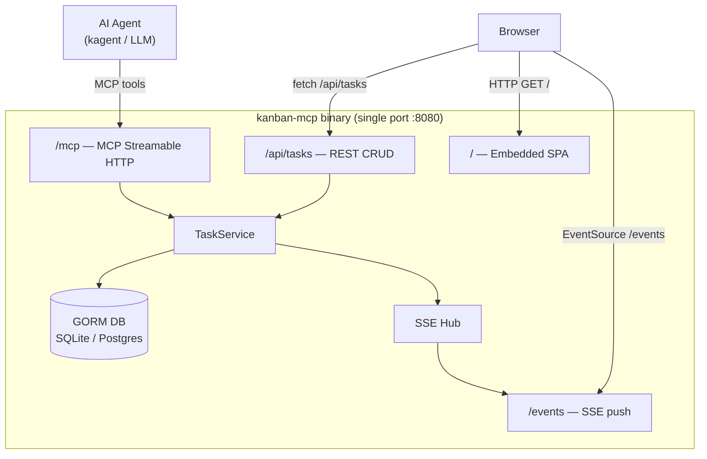
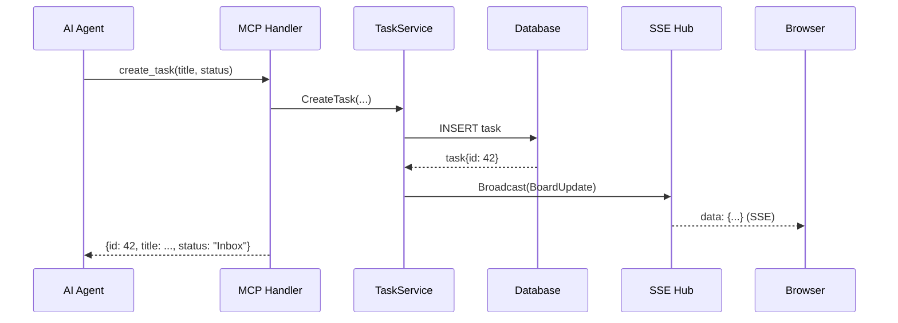

# Design: MCP Kanban Server

**Version:** 1.2
**Status:** Draft
**Project directory:** `specs/mcp-kanban-server/`

---

## Overview

A self-contained Go binary that combines:

1. **MCP Server** — exposes task management tools via the Model Context Protocol for AI agent consumption
2. **REST API** — CRUD endpoints for task management usable by the UI or external clients
3. **SSE endpoint** — real-time push of board state changes to connected browsers
4. **Embedded SPA** — single-page HTML+JS Kanban board served directly from the binary

All four surfaces share a single HTTP port and a single GORM-managed database (SQLite default, Postgres for production). The server is deployed as a standalone binary or packaged as a Helm chart for Kubernetes.

The **Human-in-the-Loop** (`user_input_needed`) flag on tasks enables AI agent workflows to pause and signal that human intervention is required before proceeding.

---

## Detailed Requirements

| # | Requirement |
|---|-------------|
| R1 | Implement an MCP server using `github.com/modelcontextprotocol/go-sdk` |
| R2 | Persist tasks in a GORM-managed database with switchable SQLite / Postgres backend |
| R3 | Tasks must have a status field constrained to the ordered enum: `Inbox → Plan → Develop → Testing → CodeReview → Release → Done` |
| R4 | Each task must carry a boolean `user_input_needed` flag (Human-in-the-Loop signal) |
| R10 | Tasks can be assigned to a named assignee (free-form string; no user management required) |
| R11 | Tasks can have subtasks (self-referential parent-child relationship); subtasks have their own independent status |
| R12 | Subtasks must be visibly rendered on the parent task card in the Kanban UI (at minimum: subtask title + status), without requiring navigation to a separate view |
| R13 | Tasks can carry zero or more labels (free-form strings) to model priorities, groups, teams, or custom tags |
| R5 | Serve a single-page Kanban UI embedded in the binary, showing tasks grouped by status in real-time |
| R6 | Real-time updates delivered via SSE (Server-Sent Events); browser auto-reconnects |
| R7 | All four surfaces (MCP, REST, SSE, UI) served on one configurable port |
| R8 | Configuration via CLI flags and/or environment variables |
| R9 | MCP transport: `stdio` (default, for subprocess usage) or `http` (for remote usage) |
| R14 | Top-level tasks can have zero or more attachments; subtasks cannot have attachments |
| R15 | Attachments have two types: `file` (filename + content stored as TEXT in DB) or `link` (url + optional title) |
| R16 | MCP tools for attachments: `add_attachment` and `delete_attachment` only; attachments returned inline with `get_task` and `get_board` |
| R17 | Deleting a task cascades to all its attachments (same pattern as subtask cascade) |
| R18 | UI card view shows paperclip icon + attachment count; detail view (click card) shows full attachment list with markdown rendered inline, diffs as code blocks, and links as clickable URLs |

---

## Architecture Overview





---

## Components and Interfaces

### 1. Binary Entry Point (`cmd/kanban-mcp/main.go`)

- Parse flags / env vars
- Construct `Config`
- Initialize `TaskService`
- Launch HTTP server (or stdio MCP, based on transport flag)

### 2. TaskService (`internal/service/task_service.go`)

Central domain logic. All mutations go through here to ensure SSE broadcasts.

```go
type TaskService interface {
    ListTasks(ctx context.Context, filter TaskFilter) ([]*Task, error)
    GetTask(ctx context.Context, id uint) (*Task, error)
    CreateTask(ctx context.Context, req CreateTaskRequest) (*Task, error)
    CreateSubtask(ctx context.Context, parentID uint, req CreateTaskRequest) (*Task, error)
    UpdateTask(ctx context.Context, id uint, req UpdateTaskRequest) (*Task, error)
    MoveTask(ctx context.Context, id uint, status TaskStatus) (*Task, error)
    AssignTask(ctx context.Context, id uint, assignee string) (*Task, error)
    SetUserInputNeeded(ctx context.Context, id uint, needed bool) (*Task, error)
    DeleteTask(ctx context.Context, id uint) error

    // Attachment operations (top-level tasks only)
    AddAttachment(ctx context.Context, taskID uint, req CreateAttachmentRequest) (*Attachment, error)
    DeleteAttachment(ctx context.Context, id uint) error
}

// TaskFilter for ListTasks
type TaskFilter struct {
    Status   *TaskStatus // nil = all statuses
    Assignee *string     // nil = all assignees
    Label    *string     // nil = all labels; set to return tasks that include the given label
    ParentID *uint       // nil = top-level only; set to fetch subtasks of a parent
}
```

### 3. MCP Tools (`internal/mcp/tools.go`)

Registered on `mcp.NewServer(...)` via `mcp.AddTool[In, Out]()`:

| Tool | Input Fields | Output | Description |
|------|-------------|--------|-------------|
| `list_tasks` | `status?`, `assignee?`, `label?`, `parent_id?` | `[]Task` | List tasks; all filters optional. Default: top-level tasks only |
| `get_task` | `id` (int) | `Task` | Get single task by ID (includes subtasks) |
| `create_task` | `title`, `description?`, `status?`, `labels?` | `Task` | Create top-level task (default status: Inbox) |
| `create_subtask` | `parent_id`, `title`, `description?`, `status?`, `labels?` | `Task` | Create a subtask under an existing task |
| `assign_task` | `id`, `assignee` (string) | `Task` | Assign task to a named person/agent; empty string clears assignment |
| `move_task` | `id`, `status` | `Task` | Move task to given status |
| `update_task` | `id`, `title?`, `description?`, `labels?` | `Task` | Edit task fields; labels replace the existing label set when provided |
| `set_user_input_needed` | `id`, `needed` (bool) | `Task` | Set/clear Human-in-the-Loop flag |
| `delete_task` | `id` | `{success: bool}` | Delete task and all its subtasks and attachments |
| `get_board` | — | `Board` | Full board: top-level tasks grouped by status, each with subtasks and attachments inline |
| `add_attachment` | `task_id`, `type` (`file`\|`link`), `filename?`, `content?`, `url?`, `title?` | `Attachment` | Add a file or link attachment to a top-level task |
| `delete_attachment` | `id` | `{success: bool}` | Delete an attachment by ID |

### 4. REST API (`internal/api/handlers.go`)

| Method | Path | Description |
|--------|------|-------------|
| `GET` | `/api/tasks` | List top-level tasks (`?status=`, `?assignee=`, `?label=` filters) |
| `GET` | `/api/tasks/:id` | Get task (includes subtasks) |
| `POST` | `/api/tasks` | Create top-level task |
| `POST` | `/api/tasks/:id/subtasks` | Create subtask under task `:id` |
| `GET` | `/api/tasks/:id/subtasks` | List subtasks of task `:id` |
| `PUT` | `/api/tasks/:id` | Update task (title, description, status, assignee, labels, user_input_needed) |
| `DELETE` | `/api/tasks/:id` | Delete task and all its subtasks and attachments |
| `POST` | `/api/tasks/:id/attachments` | Add attachment to task `:id` (top-level only) |
| `DELETE` | `/api/attachments/:id` | Delete attachment by ID |
| `GET` | `/api/board` | Full board state |

### 5. SSE Hub (`internal/sse/hub.go`)

```go
type Hub struct {
    mu   sync.RWMutex
    subs map[chan Event]struct{}
}

type Event struct {
    Type string      `json:"type"` // "board_update" | "task_created" | "task_deleted"
    Data interface{} `json:"data"`
}
```

- `Subscribe() chan Event` — called when browser connects to `/events`
- `Unsubscribe(ch)` — called on disconnect
- `Broadcast(Event)` — called by TaskService after every mutation

### 6. Database (`internal/db/`)

```go
// manager.go — identical pattern to go/internal/database/manager.go
func NewManager(cfg Config) (*Manager, error)
func (m *Manager) AutoMigrate() error  // migrates Task and Attachment tables

// models.go
type Task struct {
    ID              uint          `gorm:"primaryKey"`
    Title           string        `gorm:"not null"`
    Description     string
    Status          TaskStatus    `gorm:"type:varchar(32);not null;default:'Inbox'"`
    Assignee        string        `gorm:"type:varchar(255)"`
    Labels          []string      `gorm:"serializer:json"`
    UserInputNeeded bool          `gorm:"default:false"`
    ParentID        *uint         `gorm:"index"`            // nil = top-level task
    Subtasks        []*Task       `gorm:"foreignKey:ParentID"`
    Attachments     []*Attachment `gorm:"foreignKey:TaskID"` // top-level tasks only
    CreatedAt       time.Time
    UpdatedAt       time.Time
}

type AttachmentType string

const (
    AttachmentTypeFile AttachmentType = "file"
    AttachmentTypeLink AttachmentType = "link"
)

type Attachment struct {
    ID        uint           `gorm:"primaryKey"`
    TaskID    uint           `gorm:"not null;index"`
    Type      AttachmentType `gorm:"type:varchar(16);not null"` // "file" or "link"
    Filename  string         `gorm:"type:varchar(255)"`         // for type=file (e.g. "DESIGN.md")
    Content   string         `gorm:"type:text"`                 // for type=file (full text content)
    URL       string         `gorm:"type:text"`                 // for type=link (external URL)
    Title     string         `gorm:"type:varchar(255)"`         // for type=link (optional display title)
    CreatedAt time.Time
    UpdatedAt time.Time
}
```

`delete_task` uses explicit deletion: `WHERE task_id = ?` for attachments, `WHERE parent_id = ?` for subtasks, then removes the parent task.

### 7. Embedded UI (`internal/ui/index.html`)

Single HTML file with inline CSS and vanilla JS:

- Columns: one `<div>` per status, rendered in workflow order
- Cards: title, ID, assignee badge (if set), label chips (if set), attachment icon + count (if >0), timestamps, `user_input_needed` badge (amber)
- Subtasks shown inline inside the parent card as an always-visible nested list (title + status pill per subtask), matching the board-at-a-glance UX in `ui-design.png`
- **Card detail view**: clicking a card opens a detail panel/modal showing:
  - Full task info (title, description, assignee, labels, status, subtasks)
  - Attachments list: file attachments rendered by type (markdown rendered inline, `.diff` files as syntax-highlighted code blocks), link attachments as clickable URLs with title
  - Close button to return to board view
- Add-task form at top of "Inbox" column
- Move buttons: `← Back` / `Next →` on each card (advances/retreats one status)
- Mark "User Input Needed" toggle button per card
- SSE listener: `new EventSource('/events')` re-renders board on `board_update`

---

## Data Models

### TaskStatus Enum

```go
type TaskStatus string

const (
    StatusInbox         TaskStatus = "Inbox"
    StatusPlan          TaskStatus = "Plan"
    StatusDevelop       TaskStatus = "Develop"
    StatusTesting       TaskStatus = "Testing"
    StatusCodeReview    TaskStatus = "CodeReview"
    StatusRelease       TaskStatus = "Release"
    StatusDone          TaskStatus = "Done"
)

// Ordered slice for workflow sequencing and UI column order
var StatusWorkflow = []TaskStatus{
    StatusInbox, StatusPlan, StatusDevelop, StatusTesting,
    StatusCodeReview, StatusRelease, StatusDone,
}

// ValidStatus returns true if s is a known status
func ValidStatus(s TaskStatus) bool { ... }
```

### Task (GORM model)

```go
type Task struct {
    ID              uint          `gorm:"primaryKey"                json:"id"`
    Title           string        `gorm:"not null"                  json:"title"`
    Description     string        `                                 json:"description,omitempty"`
    Status          TaskStatus    `gorm:"type:varchar(32);not null" json:"status"`
    Assignee        string        `gorm:"type:varchar(255)"         json:"assignee,omitempty"`
    Labels          []string      `gorm:"serializer:json"           json:"labels,omitempty"`
    UserInputNeeded bool          `gorm:"default:false"             json:"user_input_needed"`
    ParentID        *uint         `gorm:"index"                     json:"parent_id,omitempty"`
    Subtasks        []*Task       `gorm:"foreignKey:ParentID"       json:"subtasks,omitempty"`
    Attachments     []*Attachment `gorm:"foreignKey:TaskID"         json:"attachments,omitempty"`
    CreatedAt       time.Time     `                                 json:"created_at"`
    UpdatedAt       time.Time     `                                 json:"updated_at"`
}
```

### Attachment (GORM model)

```go
type Attachment struct {
    ID        uint           `gorm:"primaryKey"                  json:"id"`
    TaskID    uint           `gorm:"not null;index"              json:"task_id"`
    Type      AttachmentType `gorm:"type:varchar(16);not null"   json:"type"`              // "file" or "link"
    Filename  string         `gorm:"type:varchar(255)"           json:"filename,omitempty"` // type=file: e.g. "DESIGN.md", "CHANGES.diff"
    Content   string         `gorm:"type:text"                   json:"content,omitempty"`  // type=file: full text stored in DB
    URL       string         `gorm:"type:text"                   json:"url,omitempty"`      // type=link: external URL
    Title     string         `gorm:"type:varchar(255)"           json:"title,omitempty"`    // type=link: optional display title
    CreatedAt time.Time      `                                   json:"created_at"`
    UpdatedAt time.Time      `                                   json:"updated_at"`
}
```

**Subtask rules:**
- A subtask's `ParentID` points to a top-level task; nesting is limited to one level
- Subtasks have their own independent `Status` — they progress separately
- `get_task` and `get_board` always eager-load `Subtasks` and `Attachments`; `list_tasks` does not (performance)

**Attachment rules:**
- Only top-level tasks can have attachments; attempting to add an attachment to a subtask returns an error
- Type `file`: `filename` and `content` are required; `url` and `title` are ignored
- Type `link`: `url` is required; `title` is optional; `filename` and `content` are ignored
- Attachments are returned inline with `get_task` and `get_board` responses
- Deleting a task cascades to all its attachments

**Label rules:**
- Labels are free-form strings (e.g., `priority:high`, `team:platform`, `group:backend`)
- Labels are case-insensitive for filtering; original casing is preserved for display
- Duplicate labels on the same task are de-duplicated on write
- Label order is preserved as provided by the caller

### Board (API/MCP response — not persisted)

```go
type Board struct {
    Columns []Column `json:"columns"`
}

type Column struct {
    Status TaskStatus `json:"status"`
    Tasks  []*Task    `json:"tasks"` // top-level only; each Task.Subtasks and Task.Attachments populated
}
```

### SSE Event payload

```json
{
  "type": "board_update",
  "data": {
    "columns": [
      { "status": "Inbox",  "tasks": [...] },
      { "status": "Plan", "tasks": [...] }
    ]
  }
}
```

---

## Configuration

| Flag | Env Var | Default | Description |
|------|---------|---------|-------------|
| `--addr` | `KANBAN_ADDR` | `:8080` | HTTP listen address |
| `--transport` | `KANBAN_TRANSPORT` | `http` | MCP transport: `stdio` or `http` |
| `--db-type` | `KANBAN_DB_TYPE` | `sqlite` | `sqlite` or `postgres` |
| `--db-path` | `KANBAN_DB_PATH` | `./kanban.db` | SQLite file path |
| `--db-url` | `KANBAN_DB_URL` | — | Postgres DSN (required if `--db-type=postgres`) |
| `--log-level` | `KANBAN_LOG_LEVEL` | `info` | `debug`, `info`, `warn`, `error` |

---

## Error Handling

| Scenario | HTTP Status | MCP Behavior |
|----------|-------------|--------------|
| Task not found | 404 | `CallToolResult` with `isError: true`, message "task {id} not found" |
| Parent task not found (create_subtask) | 404 | 404 + "parent task {id} not found" |
| Subtask given as parent (nesting > 1 level) | 400 | 400 + "subtasks cannot have subtasks" |
| Invalid status value | 400 | 400 with list of valid statuses |
| DB unavailable | 503 | 500 + logged; MCP returns error result |
| Invalid JSON body | 400 | 400 + message |
| Attachment on subtask | 400 | 400 + "attachments can only be added to top-level tasks" |
| Attachment not found | 404 | 404 + "attachment {id} not found" |
| File attachment missing filename/content | 400 | 400 + "filename and content required for file attachments" |
| Link attachment missing url | 400 | 400 + "url required for link attachments" |
| Invalid attachment type | 400 | 400 + "type must be 'file' or 'link'" |
| SSE client disconnect | — | Hub.Unsubscribe called via `r.Context().Done()` |

Go error wrapping convention: `fmt.Errorf("move task %d: %w", id, err)`.

---

## Acceptance Criteria

### AC-1: Task Creation via MCP
```
Given: MCP server is running in HTTP mode
When: Agent calls create_task with title="Fix auth bug", status="Plan"
Then: Task is persisted with status="Plan", user_input_needed=false
And:  create_task returns {id: <uint>, title: "Fix auth bug", status: "Plan"}
And:  SSE clients receive a board_update event within 100ms
```

### AC-2: Task Workflow Movement
```
Given: A task exists with status="Develop"
When: Agent calls move_task with id=<id>, status="Testing"
Then: Task status is updated to "Testing" in the database
And:  move_task returns the updated task
And:  Calling move_task with status="INVALID" returns an error result listing valid statuses
```

### AC-3: Human-in-the-Loop Flag
```
Given: A task exists with user_input_needed=false
When: Agent calls set_user_input_needed with id=<id>, needed=true
Then: Task.user_input_needed is true in the database
And:  The UI renders a visual badge on the task card
And:  get_board returns the task with user_input_needed=true in the correct column
```

### AC-4: Real-time UI
```
Given: Browser is connected to /events (EventSource)
When: Any task mutation occurs (create/move/update/delete) via MCP or REST
Then: Browser receives a board_update SSE event
And:  UI re-renders the affected column(s) without a full page reload
```

### AC-5: Database Persistence
```
Given: Server starts with --db-type=sqlite --db-path=./kanban.db
When: Tasks are created and server is restarted
Then: All tasks are present after restart (persisted to disk)
```

### AC-6: Postgres Support
```
Given: Server starts with --db-type=postgres --db-url=<valid DSN>
When: Tasks are created, listed, moved, and deleted
Then: All operations succeed and data is in the Postgres database
```

### AC-7: stdio Transport
```
Given: Server starts with --transport=stdio
When: MCP client connects via stdin/stdout
Then: All MCP tools function identically to HTTP transport
```

### AC-9: Task Assignment
```
Given: A task exists with assignee=""
When: Agent calls assign_task with id=<id>, assignee="alice"
Then: Task.assignee is "alice" in the database
And:  assign_task returns the updated task with assignee="alice"
And:  Calling assign_task with assignee="" clears the assignment
And:  list_tasks with assignee="alice" returns only tasks assigned to alice
```

### AC-10: Subtask Creation
```
Given: A top-level task exists with id=5
When: Agent calls create_subtask with parent_id=5, title="Write unit tests", status="Develop"
Then: A new task is persisted with parent_id=5, status="Develop"
And:  create_subtask returns the new subtask with id set
And:  get_task(id=5) returns the parent task with subtasks=[{id: <new>, title: "Write unit tests"}]
And:  get_board includes the subtask nested under the parent card
And:  The Kanban UI displays the subtask directly on the parent card (title + status visible by default)
And:  Calling create_subtask with a non-existent parent_id returns an error
```

### AC-11: Subtask Cascade Delete
```
Given: A task with id=3 has 2 subtasks (id=10, id=11)
When: Agent calls delete_task with id=3
Then: Task id=3 is deleted from the database
And:  Subtasks id=10 and id=11 are also deleted
And:  get_task(id=3) returns a not-found error
```

### AC-12: Labels for Priority and Grouping
```
Given: A task exists with labels=[]
When: Agent calls update_task with id=<id>, labels=["priority:high", "group:platform"]
Then: Task.labels is persisted as ["priority:high", "group:platform"]
And:  list_tasks with label="priority:high" returns the task
And:  The Kanban UI renders both labels as chips on the task card
```

### AC-13: Add File Attachment
```
Given: A top-level task exists with id=7
When: Agent calls add_attachment with task_id=7, type="file", filename="DESIGN.md", content="# Design\n\nArchitecture overview..."
Then: Attachment is persisted with task_id=7, type="file", filename="DESIGN.md", content stored as TEXT
And:  add_attachment returns {id: <uint>, task_id: 7, type: "file", filename: "DESIGN.md", ...}
And:  get_task(id=7) returns the task with attachments=[{id: <new>, type: "file", filename: "DESIGN.md", ...}]
And:  SSE clients receive a board_update event
```

### AC-14: Add Link Attachment
```
Given: A top-level task exists with id=7
When: Agent calls add_attachment with task_id=7, type="link", url="https://claude.ai/session/abc123", title="Agent Session"
Then: Attachment is persisted with type="link", url and title stored
And:  add_attachment returns the attachment with url and title fields
And:  get_board includes the attachment count on the task
```

### AC-15: Delete Attachment
```
Given: A task with id=7 has an attachment with id=20
When: Agent calls delete_attachment with id=20
Then: Attachment id=20 is deleted from the database
And:  get_task(id=7) no longer includes attachment id=20
And:  SSE clients receive a board_update event
```

### AC-16: Attachment Cascade on Task Delete
```
Given: A task with id=7 has 3 attachments (id=20, id=21, id=22) and 1 subtask (id=8)
When: Agent calls delete_task with id=7
Then: Task id=7, subtask id=8, and all 3 attachments are deleted from the database
```

### AC-17: Attachment on Subtask Rejected
```
Given: A subtask exists with id=8 (parent_id=7)
When: Agent calls add_attachment with task_id=8, type="file", filename="notes.md", content="..."
Then: add_attachment returns an error: "attachments can only be added to top-level tasks"
```

### AC-18: Attachment UI — Card Icon and Detail View
```
Given: A task with id=7 has 2 file attachments and 1 link attachment
When: Browser renders the board
Then: Task card for id=7 shows a paperclip icon with count "3"
And:  Clicking the card opens a detail view showing all 3 attachments
And:  File attachments with .md extension are rendered as formatted markdown
And:  File attachments with .diff extension are rendered as code blocks
And:  Link attachments are rendered as clickable URLs with their title
```

### AC-8: Embedded UI Served
```
Given: Server is running
When: Browser GETs http://localhost:8080/
Then: A Kanban board HTML page is returned
And:  All 7 status columns are visible
And:  Existing tasks are displayed in their correct columns
And:  Parent cards with subtasks visibly render those subtasks inline on the card
```

---

## Testing Strategy

### Unit Tests
- `TaskService` — mock DB, test all methods including edge cases (not found, invalid status, nesting guard)
- `SSE Hub` — test subscribe/unsubscribe/broadcast with multiple concurrent subscribers
- `ValidStatus()` — table-driven, cover all valid and invalid values
- MCP tool handlers — mock `TaskService`, verify input/output shapes
- `assign_task` — test clear (empty string), set, list filter by assignee
- `create_subtask` — test valid parent, non-existent parent, subtask-as-parent rejection
- labels — test create/update with labels, deduplication, case-insensitive label filtering
- `AddAttachment` — test file type (filename+content required), link type (url required), subtask rejection
- `DeleteAttachment` — test valid delete, not-found error
- Attachment validation — missing filename for file type, missing url for link type, invalid type value

### Integration Tests
- Start server with `--db-type=sqlite --db-path=:memory:` (in-memory SQLite)
- Call MCP tools via in-process client (`mcp.NewInMemoryTransports()`)
- Verify REST API responses and SSE events in sequence
- Subtask cascade: create parent → create 2 subtasks → delete parent → verify all gone
- Label flow: create task with labels → filter by `?label=` / `list_tasks(label=...)` → update labels → verify UI payload includes updated labels
- Attachment flow: create task → add file attachment → add link attachment → verify get_task includes both → delete one → verify removed
- Attachment cascade: create task → add 2 attachments → delete task → verify attachments gone
- Attachment subtask guard: create subtask → attempt add_attachment → verify error

### E2E Tests (optional, Ginkgo)
- Start server binary as subprocess
- Full workflow: create (with labels) → assign → create subtasks → add attachments (file + link) → move through all statuses → set HITL flag → delete (verify cascade)
- SSE: verify board_update events received for each mutation

---

## Directory Structure

```
go/cmd/kanban-mcp/
├── main.go                    # Entry point, flag/env parsing, server start
└── internal/
    ├── config/
    │   └── config.go          # Config struct, flag/env binding
    ├── db/
    │   ├── models.go          # Task, Attachment, TaskStatus, AttachmentType, StatusWorkflow
    │   └── manager.go         # NewManager, AutoMigrate (SQLite/Postgres)
    ├── service/
    │   └── task_service.go    # TaskService interface + implementation
    ├── mcp/
    │   └── tools.go           # MCP server setup, tool handlers
    ├── api/
    │   └── handlers.go        # REST handlers
    ├── sse/
    │   └── hub.go             # SSE Hub
    └── ui/
        └── index.html         # Embedded single-page Kanban UI
```

---

## Appendices

### A. Technology Choices

| Concern | Choice | Rationale |
|---------|--------|-----------|
| MCP SDK | `github.com/modelcontextprotocol/go-sdk` | Already in go.mod v1.2.0; official SDK; same pattern as `go/internal/mcp/mcp_handler.go` |
| ORM | `gorm.io/gorm` | Already in go.mod; same pattern as database manager |
| SQLite driver | `github.com/glebarez/sqlite` | Already in go.mod; pure Go, no CGO required in containers |
| Postgres driver | `gorm.io/driver/postgres` | Already in go.mod v1.6.0 |
| Real-time | SSE (stdlib) | Zero new dependencies; board is server-to-client push only; browser auto-reconnects |
| UI | Vanilla HTML+JS | No build step; embedded in binary with `//go:embed`; no npm needed |
| HTTP router | `net/http` stdlib mux | Sufficient for the route set; no gorilla/mux dependency needed for this standalone binary |

**No new Go dependencies required.**

### B. Alternative Approaches Considered

**WebSocket instead of SSE:** Rejected. Kanban mutations are infrequent REST calls; only push is needed. SSE is simpler, proxy-friendly, and requires no new dependency.

**mark3labs/mcp-go instead of modelcontextprotocol/go-sdk:** Rejected. Kagent already uses the official SDK; consistency matters more than API simplicity.

**Multi-board support:** Deferred. Single board per server-instance simplifies the MCP tool surface (no `board_id` in every call). Multi-board can be added later.

**React/Vue UI:** Rejected. A no-build vanilla JS page is sufficient, keeps the binary self-contained, and avoids an npm build step in CI.

### C. Limitations

- No authentication on REST or MCP HTTP endpoints — intended for local/cluster-internal use behind a network boundary
- SSE does not support `Last-Event-ID` resume in v1 (full board snapshot on reconnect instead)
- Status transitions are unrestricted (any → any); workflow enforcement is left to the AI agent
