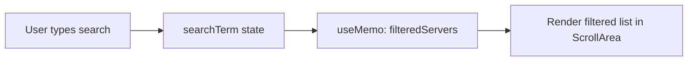

# Design: MCP Servers Page — Search & Stretch Layout

## Overview

Update the MCP Servers page (`/servers`) to match the Tools page UX by adding a search bar with client-side filtering and adopting a viewport-filling scroll layout. This is a single-file change to `ui/src/app/servers/page.tsx`.

## Detailed Requirements

1. **Search bar** — text input with search icon, filters servers by name and contained tool names/descriptions
2. **Stretch layout** — `ScrollArea` that fills available viewport height, matching Tools page
3. **Result count** — display "N server(s) found" below the search bar
4. **Auto-expand on search** — when a search term matches tools inside a server, auto-expand that server
5. **Search highlight** — highlight matching text in server names and tool names/descriptions (matching Tools page `highlightMatch` pattern)
6. **Preserve existing features** — expand/collapse, add server button, delete server via dropdown, "View Tools" link

## Architecture Overview

No architectural changes. This is a UI-only enhancement to a single page component.



## Components and Interfaces

### Modified: `ServersPage` component

**New state:**
```typescript
const [searchTerm, setSearchTerm] = useState<string>("");
```

**New derived state (useMemo):**
```typescript
const filteredServers = useMemo(() => {
  if (!searchTerm) return servers;
  const term = searchTerm.toLowerCase();
  return servers.filter(server => {
    const matchesRef = server.ref?.toLowerCase().includes(term);
    const matchesTools = server.discoveredTools?.some(tool =>
      tool.name?.toLowerCase().includes(term) ||
      tool.description?.toLowerCase().includes(term)
    );
    return matchesRef || matchesTools;
  });
}, [servers, searchTerm]);
```

**New helper:**
```typescript
const highlightMatch = (text: string | undefined | null, highlight: string) => {
  if (!text || !highlight) return text;
  const parts = text.split(new RegExp(`(${highlight})`, 'gi'));
  return parts.map((part, i) =>
    part.toLowerCase() === highlight.toLowerCase()
      ? <mark key={i} className="bg-yellow-200 px-0 py-0 rounded">{part}</mark>
      : part
  );
};
```

**Auto-expand logic:** When `searchTerm` changes and a server's tools match, auto-expand that server:
```typescript
useEffect(() => {
  if (!searchTerm) return;
  const term = searchTerm.toLowerCase();
  const toExpand = new Set<string>();
  servers.forEach(server => {
    if (server.discoveredTools?.some(tool =>
      tool.name?.toLowerCase().includes(term) ||
      tool.description?.toLowerCase().includes(term)
    )) {
      if (server.ref) toExpand.add(server.ref);
    }
  });
  if (toExpand.size > 0) {
    setExpandedServers(prev => new Set([...prev, ...toExpand]));
  }
}, [searchTerm, servers]);
```

### Layout Changes

**Before:**
```tsx
<div className="mt-12 mx-auto max-w-6xl px-6">
  ...
  <div className="space-y-4">
    {servers.map(...)}
  </div>
</div>
```

**After:**
```tsx
<div className="mt-12 mx-auto max-w-6xl px-6 pb-12">
  ...
  {/* Search bar */}
  <div className="relative flex-1 mb-4">
    <Search className="absolute left-3 top-3 h-4 w-4 text-muted-foreground" />
    <Input
      placeholder="Search servers by name or tool..."
      value={searchTerm}
      onChange={(e) => setSearchTerm(e.target.value)}
      className="pl-10"
    />
  </div>

  {/* Result count */}
  <div className="flex justify-end items-center mb-4">
    <div className="text-sm text-muted-foreground">
      {filteredServers.length} server{filteredServers.length !== 1 ? "s" : ""} found
    </div>
  </div>

  {/* Scrollable server list */}
  <ScrollArea className="h-[calc(100vh-350px)] pr-4 -mr-4">
    <div className="space-y-4">
      {filteredServers.map(...)}
    </div>
  </ScrollArea>
</div>
```

### Empty States

Two empty states needed:
1. **No servers at all** — existing "No MCP servers connected" UI (unchanged)
2. **No search results** — new state with "No servers match your search" message and "Clear search" button

```tsx
{filteredServers.length === 0 && servers.length > 0 && (
  <div className="flex flex-col items-center justify-center h-[300px] text-center p-4 border rounded-lg bg-secondary/5">
    <Server className="h-12 w-12 text-muted-foreground mb-4 opacity-20" />
    <h3 className="font-medium text-lg">No servers found</h3>
    <p className="text-muted-foreground mt-1 mb-4">
      Try adjusting your search to find servers.
    </p>
    <Button variant="outline" onClick={() => setSearchTerm("")}>
      Clear Search
    </Button>
  </div>
)}
```

## Data Models

No changes. Uses existing `ToolServerResponse` type.

## Error Handling

No new error handling needed. Search is client-side filtering of already-loaded data.

## Acceptance Criteria

- **Given** the Servers page loads with multiple servers, **when** the page renders, **then** a search input is visible above the server list
- **Given** servers are loaded, **when** the user types in the search bar, **then** the server list filters in real-time by server name and tool names/descriptions
- **Given** a search matches tools inside a collapsed server, **when** the filter runs, **then** that server auto-expands to show matching tools
- **Given** a search term is active, **when** results render, **then** matching text is highlighted in yellow
- **Given** a search term matches no servers, **when** the filter runs, **then** a "No servers found" empty state with "Clear Search" button is shown
- **Given** no search term, **when** the page renders, **then** all servers display and the count shows the total
- **Given** the server list is long, **when** the page renders, **then** the list is inside a ScrollArea that fills available viewport height
- **Given** search is active, **when** the user clicks "Add MCP Server", **then** the add dialog works normally

## Testing Strategy

- **Manual testing:** Verify search filters servers correctly, auto-expand works, highlight renders, empty states display, ScrollArea scrolls
- **No new unit tests required:** This is a presentational change with no new utility functions (highlightMatch is inline)

## Appendices

### Technology Choices
- Reuses existing shadcn/ui components: `Input`, `ScrollArea`, `Button`
- Follows the exact same search pattern as the Tools page
- No new dependencies

### Files Changed
- `ui/src/app/servers/page.tsx` — single file modification

### Alternative Approaches Considered
1. **Shared search component** — rejected: no existing pattern, over-engineering for 2 usages
2. **Category filter for servers** — rejected: servers don't have meaningful categories; `groupKind` is too technical
3. **Debounced search** — rejected: client-side filtering of a small list is instant, no need for debounce
