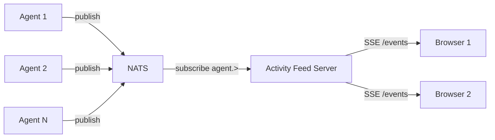

# Design: NATS Activity Feed

## Overview

A lightweight, read-only activity feed that shows what's happening in NATS in real time. It subscribes to agent event streams on NATS and presents them as a live chronological feed in the browser via SSE.

This is an **observability tool** — it doesn't modify agent behavior, it just makes agent activity visible.

## Detailed Requirements

1. **Read-only feed** — show NATS activity, don't produce any
2. **Real-time** — events appear as they happen, no polling delay
3. **All agents** — subscribe to `agent.>` wildcard to capture all agent activity
4. **Structured display** — show event type, agent name, session, timestamp, and payload preview
5. **Lightweight** — single binary with embedded UI, same pattern as kanban-mcp
6. **No persistence** — live stream only, no database needed

## Architecture Overview



**Data flow:**
1. Agents publish `StreamEvent` messages to `agent.{name}.{session}.stream` (existing behavior)
2. Activity feed server subscribes to `agent.>` wildcard on NATS
3. Each received NATS message is enriched with subject metadata (agent name, session ID parsed from subject)
4. Enriched events are broadcast to all connected SSE clients
5. Browser renders events as a scrolling live feed

## Components and Interfaces

### 1. NATS Subscriber

Connects to NATS and subscribes to `agent.>`. Parses each message into a `StreamEvent` and extracts agent/session from the NATS subject.

```go
// FeedEvent wraps a StreamEvent with subject metadata for the UI.
type FeedEvent struct {
    Agent     string                `json:"agent"`
    SessionID string                `json:"sessionId"`
    Subject   string                `json:"subject"`
    Event     streaming.StreamEvent `json:"event"`
}
```

Subject parsing from `agent.{agentName}.{sessionID}.stream`:
- Split by `.` → index 1 = agent name, index 2 = session ID

### 2. SSE Hub

Reuses the proven hub pattern from kanban-mcp. Differences:
- Event type is `"activity"` instead of `"board_update"`
- No snapshot on connect (activity is ephemeral) — or optionally a ring buffer of last N events
- Same non-blocking broadcast to slow subscribers

```go
type Hub struct {
    mu     sync.RWMutex
    subs   map[chan FeedEvent]struct{}
    ring   []FeedEvent // optional: last N events for new subscribers
}
```

### 3. HTTP Server

Minimal HTTP server with three endpoints:

| Method | Path | Description |
|--------|------|-------------|
| GET | `/` | Embedded SPA (single HTML file) |
| GET | `/events` | SSE stream of activity events |
| GET | `/healthz` | Health check |

### 4. Embedded SPA

Single HTML file (no build step), same pattern as kanban-mcp UI:
- Connects to `/events` SSE endpoint
- Renders events as a scrolling feed (newest at top)
- Color-coded by event type (token=gray, tool_start=blue, tool_end=green, error=red, approval=orange, completion=purple)
- Each entry shows: timestamp, agent name, event type badge, payload preview
- Auto-reconnects on SSE disconnect
- Optional: pause/resume button, event type filter checkboxes

## Data Models

### Existing (no changes needed)

**StreamEvent** (`go/adk/pkg/streaming/types.go`):
```go
type StreamEvent struct {
    Type      EventType `json:"type"`      // token, tool_start, tool_end, approval_request, completion, error
    Data      string    `json:"data"`      // JSON-encoded payload
    Timestamp int64     `json:"timestamp"` // Unix millis
}
```

### New

**FeedEvent** (activity feed envelope):
```go
type FeedEvent struct {
    Agent     string      `json:"agent"`
    SessionID string      `json:"sessionId"`
    Subject   string      `json:"subject"`
    Type      string      `json:"type"`      // from StreamEvent.Type
    Data      string      `json:"data"`      // from StreamEvent.Data
    Timestamp int64       `json:"timestamp"` // from StreamEvent.Timestamp
}
```

## Error Handling

| Scenario | Behavior |
|----------|----------|
| NATS connection lost | Log error, auto-reconnect (nats.go handles this) |
| NATS message parse failure | Log warning, skip message, continue |
| Slow SSE subscriber | Drop events (non-blocking send), same as kanban-mcp |
| SSE client disconnect | Clean up subscriber channel |
| No NATS messages | Feed is empty, UI shows "waiting for activity..." |

## Acceptance Criteria

**Given** agents are running and publishing to NATS
**When** a user opens the activity feed in a browser
**Then** they see a live stream of agent events (tool calls, tokens, completions, errors)

**Given** a new browser connects to the feed
**When** the SSE connection is established
**Then** the last N events from the ring buffer are sent as initial state

**Given** the NATS connection drops temporarily
**When** it reconnects
**Then** the feed resumes without user intervention

**Given** multiple agents are active simultaneously
**When** viewing the feed
**Then** events from all agents appear interleaved chronologically

**Given** no agents are active
**When** viewing the feed
**Then** the UI shows an empty state ("waiting for activity...")

## Testing Strategy

1. **Unit tests**: NATS subject parser, FeedEvent construction, ring buffer
2. **Integration test**: Embedded NATS server → subscriber → SSE hub → verify events arrive (same pattern as `go/adk/pkg/streaming/nats_test.go`)
3. **Manual test**: Deploy to Kind cluster, run an agent, open feed in browser

## Appendices

### A. Technology Choices

| Choice | Rationale |
|--------|-----------|
| Go binary | Matches kagent plugin pattern (kanban-mcp, temporal-mcp) |
| Embedded HTML (no build step) | Proven in kanban-mcp, simple deployment |
| SSE (not WebSocket) | Simpler, one-directional (read-only feed), proven in codebase |
| Ring buffer (not DB) | Ephemeral feed, no persistence requirement |
| `nats.go` client | Already a dependency in `go/adk` |

### B. Project Structure

```
go/plugins/nats-activity-feed/
├── main.go                    # Entry point: NATS connect, hub, HTTP server
├── Dockerfile
├── internal/
│   ├── config/config.go       # CLI flags + env vars (NATS_ADDR, ADDR, etc.)
│   ├── feed/
│   │   ├── subscriber.go      # NATS subscriber → FeedEvent
│   │   └── subscriber_test.go
│   ├── sse/
│   │   ├── hub.go             # SSE hub with ring buffer
│   │   └── hub_test.go
│   └── ui/
│       ├── embed.go           # //go:embed index.html
│       └── index.html         # SPA
```

### C. Configuration

| Flag | Env Var | Default | Description |
|------|---------|---------|-------------|
| `--nats-addr` | `NATS_ADDR` | `nats://localhost:4222` | NATS server address |
| `--addr` | `ACTIVITY_FEED_ADDR` | `:8090` | HTTP listen address |
| `--buffer-size` | `ACTIVITY_FEED_BUFFER` | `100` | Ring buffer size for new subscribers |
| `--subject` | `ACTIVITY_FEED_SUBJECT` | `agent.>` | NATS subject pattern to subscribe to |

### D. Alternative Approaches Considered

1. **Add endpoint to existing kagent core HTTP server** — rejected: keeps concerns separate, avoids coupling activity feed lifecycle to core
2. **WebSocket instead of SSE** — rejected: SSE is simpler for one-way stream, already proven in codebase
3. **Persist events to DB** — rejected: adds complexity, not needed for "what's happening now" use case; can be added later if needed
4. **React/Next.js UI** — rejected: single embedded HTML is simpler and matches kanban-mcp pattern
