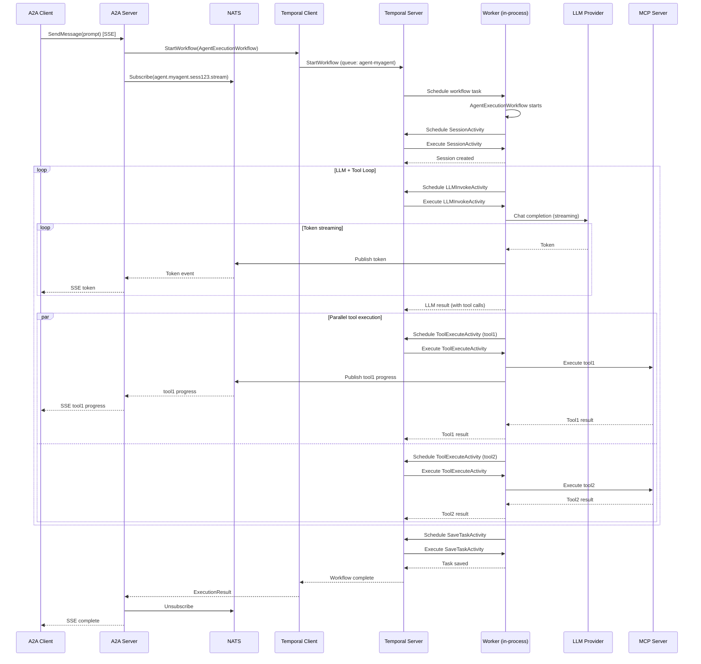
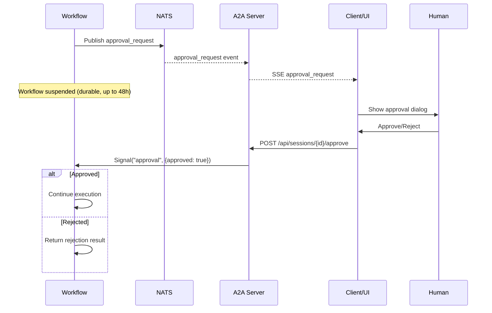
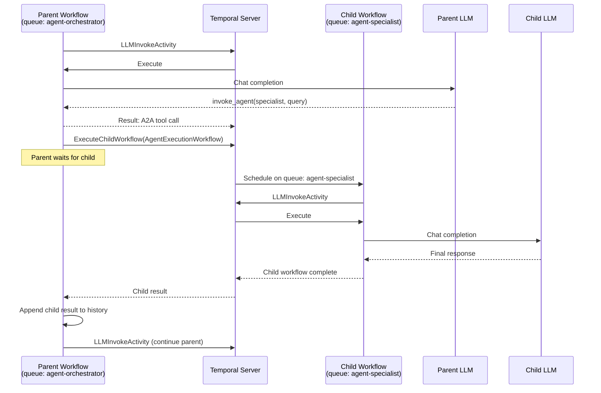

# Temporal Agent Workflow Executor -- Design Document

## Overview

Integrate Temporal as a durable workflow executor for kagent's Go ADK, replacing the current synchronous `Agent.Run()` call with Temporal workflows. This provides crash recovery, per-turn activity granularity with automatic retries, real-time streaming via NATS, HITL approval via Temporal signals, and multi-agent orchestration via child workflows.

**Scope:** Go ADK only. Python ADK out of scope.

## Detailed Requirements

1. Agent execution runs survive infrastructure failures (pod restarts, node failures)
2. Each LLM turn and each tool call is a separate Temporal activity (per-turn granularity) with configurable retry policies
3. HITL (Human-in-the-Loop) approval flows use Temporal signals -- required in initial implementation
4. Multi-agent orchestration (A2A) uses child workflows -- required in initial implementation
5. Integration controlled per-agent via CRD spec (`spec.temporal.enabled: true`), not global env var
6. Real-time streaming of LLM tokens and tool progress via NATS pub/sub side-channel
7. Self-hosted Temporal deployment via Helm; SQLite for dev, PostgreSQL for production (switchable via Helm values)
8. Per-agent Temporal task queues (`agent-{agentName}`) for isolation
9. Worker runs in-process alongside A2A server in the agent pod
10. 48-hour default workflow execution timeout, configurable per-agent in CRD spec
11. NATS embedded in kagent Helm chart, fire-and-forget pub/sub (no JetStream)
12. Temporal UI exposed as kagent MCP plugin (dynamic plugin system, sidebar navigation)
13. OpenTelemetry traces from Temporal integrate with existing kagent telemetry

## Architecture Overview

```
                    +-----------------+
                    |   A2A Client    |
                    +--------+--------+
                             |
                             v
                    +--------+--------+
                    | A2A Server      |  SSE
                    | + Temporal Worker|<-------+
                    | (Agent Pod)     |         |
                    +--------+--------+    +----+----+
                             |             | NATS    |
              +--------------+-------+     | (K8s)   |
              |                      |     +---------+
     [Temporal disabled]    [Temporal enabled]  ^
              |                      |          |
              v                      v          |
     +--------+--------+   +--------+--------+ |
     | Agent.Run()      |   | Temporal Client  | |
     | (synchronous)    |   | StartWorkflow()  | |
     +------------------+   +--------+--------+ |
                                     |          |
                                     v          |
                            +--------+--------+ |
                            | Temporal Server  | |
                            | (K8s self-hosted)| |
                            | SQLite/PostgreSQL| |
                            +--------+--------+ |
                                     |          |
                                     v          |
                            +--------+--------+ |
                            | Temporal Worker  | |
                            | (in-process)     | |
                            +--------+--------+ |
                                     |          |
                  +------------------+------------------+
                  |         |         |                  |
                  v         v         v                  v
           +------+--+ +---+-----+ +-+--------+ +------+------+
           |LLMInvoke| |ToolExec | |SaveTask  | |StreamPublish|
           |Activity | |Activity | |Activity  | |  (NATS)     |
           +---------+ +---------+ +----------+ +-------------+
```

### Infrastructure Components

```
K8s Cluster (kagent namespace)
  |
  +-- Temporal Server (self-hosted, temporal-helm)
  |     +-- Frontend Service (:7233 gRPC)
  |     +-- History / Matching / Worker services
  |     +-- PostgreSQL (prod) or SQLite (dev)
  |     +-- Temporal UI (:8080) --> proxied as MCP plugin
  |
  +-- NATS Server (embedded in kagent Helm chart)
  |     +-- Core pub/sub (no JetStream)
  |     +-- Subject pattern: agent.{name}.{sessionID}.stream
  |
  +-- Agent Pods (per-agent Deployment)
        +-- A2A Server (HTTP :8080)
        +-- Temporal Worker (in-process, per-agent task queue)
        +-- NATS Publisher (activity-level streaming)
        +-- NATS Subscriber (A2A server -> SSE to client)
```

## Components and Interfaces

### 1. Workflow: `AgentExecutionWorkflow`

**Location:** `go/adk/pkg/temporal/workflows.go`

Orchestrates a single agent execution run. Deterministic -- no direct I/O.

```go
func AgentExecutionWorkflow(ctx workflow.Context, req *ExecutionRequest) (*ExecutionResult, error)
```

**Input:**
```go
type ExecutionRequest struct {
    SessionID       string
    UserID          string
    AgentName       string
    Message         []byte // serialized A2A message
    Config          []byte // serialized AgentConfig
    NATSSubject     string // e.g., "agent.myagent.sess123.stream"
}
```

**Flow:**
```
1. Initialize session (activity)
2. Loop:
   a. Invoke LLM with conversation history (activity)
      - Activity publishes tokens to NATS subject in real-time
   b. If response contains tool calls:
      - Execute tools in parallel (each tool = separate activity)
      - Each activity publishes progress to NATS
      - Append tool results to history
      - Go to 2a
   c. If response contains A2A agent invocation:
      - Start child workflow (AgentExecutionWorkflow) on target agent's task queue
      - Wait for child completion
      - Append child result to history
      - Go to 2a
   d. If response requires HITL approval:
      - Publish approval request to NATS
      - Wait for Signal("approval", ApprovalDecision)
      - If approved, continue; else return rejection
   e. If terminal response, break
3. Save task (activity)
4. Return result
```

**Workflow timeout:** 48 hours default, configurable per-agent via `spec.temporal.workflowTimeout`.

### 2. Activities

**Location:** `go/adk/pkg/temporal/activities.go`

```go
// LLM chat completion -- single turn, streams tokens to NATS
func (a *Activities) LLMInvokeActivity(ctx context.Context, req *LLMRequest) (*LLMResponse, error)

// MCP tool execution -- individual tool call, publishes progress to NATS
func (a *Activities) ToolExecuteActivity(ctx context.Context, req *ToolRequest) (*ToolResponse, error)

// Session creation/retrieval
func (a *Activities) SessionActivity(ctx context.Context, req *SessionRequest) (*SessionResponse, error)

// Task persistence
func (a *Activities) SaveTaskActivity(ctx context.Context, task *TaskSaveRequest) error

// Event append to session
func (a *Activities) AppendEventActivity(ctx context.Context, req *AppendEventRequest) error
```

**Activity struct holds dependencies:**
```go
type Activities struct {
    agentFactory  func(config []byte) (*llmagent.Agent, error)
    sessionSvc    session.SessionService
    taskStore     taskstore.TaskStore
    mcpRegistry   *mcp.Registry
    natsConn      *nats.Conn
}
```

### 3. NATS Streaming

**Location:** `go/adk/pkg/streaming/nats.go`

```go
type StreamPublisher struct {
    conn *nats.Conn
}

// Publish LLM token to NATS subject
func (p *StreamPublisher) PublishToken(subject string, token *StreamEvent) error

// Publish tool progress to NATS subject
func (p *StreamPublisher) PublishToolProgress(subject string, event *StreamEvent) error

// Publish HITL approval request
func (p *StreamPublisher) PublishApprovalRequest(subject string, req *ApprovalRequest) error
```

```go
type StreamSubscriber struct {
    conn *nats.Conn
}

// Subscribe to agent stream events, forward to SSE writer
func (s *StreamSubscriber) Subscribe(subject string, handler func(*StreamEvent)) (*nats.Subscription, error)
```

**Subject naming:** `agent.{agentName}.{sessionID}.stream`

**Event types:**
```go
type StreamEvent struct {
    Type      string `json:"type"`      // "token", "tool_start", "tool_end", "approval_request", "error"
    Data      string `json:"data"`      // token text, tool name, error message
    Timestamp int64  `json:"timestamp"`
}
```

### 4. Worker

**Location:** `go/adk/pkg/temporal/worker.go`

```go
type WorkerConfig struct {
    TemporalAddr  string // e.g., "temporal-server:7233"
    Namespace     string // Temporal namespace
    TaskQueue     string // per-agent: "agent-{agentName}"
    NATSAddr      string // e.g., "nats://nats:4222"
}

func NewWorker(cfg WorkerConfig, activities *Activities) (worker.Worker, error)
```

Worker runs in-process with the A2A server. Per-agent task queue: `agent-{agentName}`.

### 5. Client Integration

**Location:** `go/adk/pkg/temporal/client.go`

```go
type Client struct {
    temporal  client.Client
    natsConn  *nats.Conn
}

func NewClient(cfg ClientConfig) (*Client, error)

// Start workflow and return immediately. Caller subscribes to NATS for streaming.
func (c *Client) ExecuteAgent(ctx context.Context, req *ExecutionRequest) (client.WorkflowRun, error)

// Send HITL approval signal to running workflow
func (c *Client) SignalApproval(ctx context.Context, workflowID string, decision *ApprovalDecision) error
```

### 6. A2A Server Integration

**Modified file:** `go/adk/pkg/a2a/executor.go`

```go
// Dispatch based on agent CRD spec
if agentConfig.Temporal != nil && agentConfig.Temporal.Enabled {
    // Start workflow
    run, err := temporalClient.ExecuteAgent(ctx, &ExecutionRequest{...})

    // Subscribe to NATS for streaming events
    sub, err := streamSubscriber.Subscribe(natsSubject, func(event *StreamEvent) {
        // Forward to A2A SSE response writer
        writeSSEEvent(w, event)
    })
    defer sub.Unsubscribe()

    // Wait for workflow completion
    var result ExecutionResult
    err = run.Get(ctx, &result)
} else {
    // Existing synchronous path
    events := agent.Run(ctx, message)
}
```

### 7. Child Workflows (A2A Multi-Agent)

When the LLM response contains an A2A agent invocation tool call, the workflow starts a child workflow:

```go
// In AgentExecutionWorkflow, when tool call is "invoke_agent"
childOpts := workflow.ChildWorkflowOptions{
    TaskQueue:            "agent-" + targetAgentName,
    WorkflowID:           parentSessionID + "-child-" + targetAgentName,
    ExecutionTimeout:     48 * time.Hour,
    ParentClosePolicy:    enums.PARENT_CLOSE_POLICY_TERMINATE,
}
childCtx := workflow.WithChildOptions(ctx, childOpts)

var childResult ExecutionResult
err := workflow.ExecuteChildWorkflow(childCtx, AgentExecutionWorkflow, &ExecutionRequest{
    SessionID: childSessionID,
    AgentName: targetAgentName,
    Message:   childMessage,
    NATSSubject: "agent." + targetAgentName + "." + childSessionID + ".stream",
}).Get(childCtx, &childResult)
```

### 8. HITL Signal Flow

```go
// In AgentExecutionWorkflow, when LLM response requires approval
publisher.PublishApprovalRequest(natsSubject, &ApprovalRequest{
    WorkflowID: workflow.GetInfo(ctx).WorkflowExecution.ID,
    Message:    approvalMessage,
})

// Block until signal received (durable -- survives pod restarts)
approvalCh := workflow.GetSignalChannel(ctx, "approval")
var decision ApprovalDecision
approvalCh.Receive(ctx, &decision)

if !decision.Approved {
    return &ExecutionResult{Status: "rejected", Reason: decision.Reason}, nil
}
// Continue execution...
```

**HTTP endpoint for sending signals:**
```
POST /api/sessions/{sessionID}/approve
Body: {"approved": true, "reason": "..."}
```

Handler calls `temporalClient.SignalApproval(ctx, sessionID, &decision)`.

### 9. Temporal UI as MCP Plugin

**Location:** `go/core/internal/httpserver/handlers/pluginproxy.go` (existing plugin proxy system)

Temporal UI is registered as a dynamic plugin:

```yaml
# Plugin registration (RemoteMCPServer or plugin config)
apiVersion: kagent.dev/v1alpha2
kind: RemoteMCPServer
metadata:
  name: temporal-ui
spec:
  plugin:
    name: "Temporal Workflows"
    icon: "workflow"
    path: "/temporal"
    badge:
      source: "temporal-active-workflows"
  transport:
    type: proxy
    proxy:
      targetURL: "http://temporal-ui:8080"
```

The kagent plugin proxy forwards `/temporal/*` requests to the Temporal UI service. Sidebar shows "Temporal Workflows" with active workflow count badge.

### 10. CRD Configuration

**Agent CRD extension** (`go/api/v1alpha2/agent_types.go`):

```go
type AgentSpec struct {
    // ... existing fields ...

    // Temporal configures durable workflow execution for this agent
    // +optional
    Temporal *TemporalSpec `json:"temporal,omitempty"`
}

type TemporalSpec struct {
    // Enabled controls whether this agent uses Temporal for execution
    // +optional
    Enabled bool `json:"enabled,omitempty"`

    // WorkflowTimeout is the maximum duration for a workflow execution
    // Default: 48h
    // +optional
    WorkflowTimeout *metav1.Duration `json:"workflowTimeout,omitempty"`

    // RetryPolicy configures activity retry behavior
    // +optional
    RetryPolicy *TemporalRetryPolicy `json:"retryPolicy,omitempty"`
}

type TemporalRetryPolicy struct {
    // MaxAttempts for LLM activities. Default: 5
    // +optional
    LLMMaxAttempts *int32 `json:"llmMaxAttempts,omitempty"`

    // MaxAttempts for tool activities. Default: 3
    // +optional
    ToolMaxAttempts *int32 `json:"toolMaxAttempts,omitempty"`
}
```

**AgentConfig extension** (`go/api/adk/types.go`):

```go
type AgentConfig struct {
    // ... existing fields ...
    Temporal *TemporalConfig `json:"temporal,omitempty"`
}

type TemporalConfig struct {
    Enabled         bool          `json:"enabled"`
    HostAddr        string        `json:"hostAddr"`
    Namespace       string        `json:"namespace"`
    TaskQueue       string        `json:"taskQueue"`       // "agent-{agentName}"
    NATSAddr        string        `json:"natsAddr"`
    WorkflowTimeout time.Duration `json:"workflowTimeout"` // default 48h
    LLMMaxAttempts  int           `json:"llmMaxAttempts"`   // default 5
    ToolMaxAttempts int           `json:"toolMaxAttempts"`  // default 3
}
```

### 11. Helm Configuration

```yaml
# helm/kagent/values.yaml
temporal:
  enabled: false
  server:
    host: temporal-server
    port: 7233
    namespace: kagent
    image: temporalio/auto-setup:latest
  persistence:
    driver: sqlite      # "sqlite" (dev) or "postgresql" (prod)
    postgresql:
      host: ""
      port: 5432
      database: temporal
      user: temporal
      password: ""
      existingSecret: ""
      existingSecretKey: ""
  ui:
    enabled: true
    port: 8080

nats:
  enabled: false        # auto-enabled when temporal.enabled=true
  port: 4222
  image: nats:2-alpine
```

**SQLite mode deployment (dev):**
The `temporalio/auto-setup` image does NOT support SQLite via env vars. SQLite mode uses the Temporal CLI dev server directly:
```yaml
command: ["temporal"]
args:
  - "server"
  - "start-dev"
  - "--headless"
  - "--ip"
  - "0.0.0.0"
  - "--port"
  - "7233"
  - "--db-filename"
  - "/temporal-data/temporal.db"
  - "--namespace"
  - "kagent"
```
Data stored on `emptyDir` volume at `/temporal-data/`. No env vars needed — all config via CLI args.

**PostgreSQL mode deployment (prod):**
Uses `temporalio/auto-setup` with env vars:
```yaml
env:
  - name: DB
    value: postgres12
  - name: DB_PORT
    value: "5432"
  - name: DBNAME
    value: temporal
  - name: TEMPORAL_ADDRESS
    value: "0.0.0.0:7233"
  - name: POSTGRES_SEEDS
    value: <host>
  - name: POSTGRES_USER
    value: temporal
  - name: POSTGRES_PWD
    value: <password>  # or from existingSecret
```
Note: env var names are `DB_PORT`/`DBNAME` (not `POSTGRES_PORT`/`POSTGRES_DB`) and `DB=postgres12` (not `postgres`).

## Data Models

### Workflow State (in-memory, replayed from history)

```go
type WorkflowState struct {
    SessionID           string
    ConversationHistory []Message
    ToolResults         map[string]string
    CurrentStep         string // "llm_invoke", "tool_execute", "hitl_wait", "child_workflow", "complete"
    Attempts            int
    ChildWorkflows      []string // child workflow IDs
}
```

### Temporal Persistence

Temporal manages its own event history in SQLite (dev) or PostgreSQL (prod). Dedicated database -- not shared with kagent. No changes to kagent's database schema. Session and Task persistence continue through existing `SessionService` and `TaskStore` interfaces (called as activities).

### NATS Messages

Fire-and-forget. No persistence. Temporal workflow history is the source of truth.

## Error Handling

| Error Source | Handling |
|-------------|----------|
| LLM timeout | Activity retry with backoff, max 5 attempts (configurable per-agent) |
| LLM rate limit | Activity retry with longer backoff |
| Tool execution failure | Activity retry, max 3 attempts (configurable); non-retryable errors fail workflow |
| NATS publish failure | Log and continue -- streaming is best-effort, workflow history is source of truth |
| Session service unavailable | Activity retry; workflow pauses until available |
| Temporal server down | Client-side retry; workflow state preserved in DB |
| Worker crash | Temporal replays workflow on restart (in-process worker restarts with pod) |
| Child workflow failure | Propagates to parent; parent can handle or fail |
| HITL timeout | Workflow waits up to workflow timeout (48h default) |
| Invalid config | Workflow fails immediately (non-retryable) |

**Retry policies per activity type:**

```go
llmRetry := &temporal.RetryPolicy{
    InitialInterval:    2 * time.Second,
    MaximumInterval:    2 * time.Minute,
    MaximumAttempts:    int32(config.LLMMaxAttempts), // default 5
    BackoffCoefficient: 2.0,
}

toolRetry := &temporal.RetryPolicy{
    InitialInterval:    1 * time.Second,
    MaximumInterval:    1 * time.Minute,
    MaximumAttempts:    int32(config.ToolMaxAttempts), // default 3
    BackoffCoefficient: 2.0,
}
```

## Acceptance Criteria

**Given** an agent CRD has `spec.temporal.enabled: true` and Temporal server is running,
**When** a user sends a message to that agent via A2A,
**Then** the execution runs as a Temporal workflow with per-turn LLM activities and per-call tool activities on task queue `agent-{agentName}`.

**Given** a workflow is running and the agent pod crashes,
**When** the pod restarts and the in-process worker reconnects,
**Then** the workflow resumes from the last completed activity without data loss.

**Given** an LLM call fails with a transient error,
**When** the retry policy allows retries,
**Then** the activity is retried with exponential backoff up to the configured maximum (default 5).

**Given** an agent CRD does NOT have `spec.temporal.enabled: true`,
**When** a user sends a message to that agent,
**Then** execution uses the existing synchronous `Agent.Run()` path unchanged.

**Given** a workflow is executing an LLM turn,
**When** tokens are generated,
**Then** tokens are published to NATS subject `agent.{name}.{sessionID}.stream` and forwarded to the client via SSE in real-time.

**Given** a workflow requires HITL approval,
**When** the user sends approval via `POST /api/sessions/{id}/approve`,
**Then** the workflow receives the approval signal and resumes execution.

**Given** agent A invokes agent B via A2A tool call,
**When** both agents have Temporal enabled,
**Then** agent B runs as a child workflow on task queue `agent-B`, linked to agent A's parent workflow.

**Given** Temporal is enabled in Helm values,
**When** `helm install` is run,
**Then** Temporal server, Temporal UI, and NATS are deployed in the kagent namespace.

**Given** Temporal UI is deployed,
**When** the user navigates to kagent UI sidebar,
**Then** "Temporal Workflows" appears as an MCP plugin with active workflow count badge.

**Given** the workflow execution timeout is set to 48h (or custom per-agent),
**When** a workflow exceeds the timeout,
**Then** the workflow is terminated by Temporal.

## Testing Strategy

1. **Unit tests** -- Workflow determinism tests using `go.temporal.io/sdk/testsuite`
2. **Activity tests** -- Mock LLM/MCP/NATS dependencies, test retry behavior and NATS publishing
3. **Integration tests** -- Local Temporal dev server (`temporalite`) + embedded NATS, end-to-end workflow with streaming
4. **HITL tests** -- Signal send/receive, timeout behavior
5. **Child workflow tests** -- Parent-child lifecycle, failure propagation
6. **E2E tests** -- Kind cluster with Temporal + NATS Helm charts, full CRD -> workflow -> streaming path

## Appendices

### A. Technology Choices

| Choice | Rationale |
|--------|-----------|
| Temporal (over Argo, Cadence, Dapr) | Mature Go SDK, in-process worker, native K8s, OTel, CNCF ecosystem |
| Self-hosted Temporal | Full control, SQLite for dev simplicity, PostgreSQL for prod |
| NATS for streaming (over Redis, Kafka) | CNCF-graduated, minimal footprint, Go-native, fire-and-forget fits use case |
| Per-agent task queues | Isolation -- one agent's backlog doesn't block others |
| In-process worker | Simpler deployment, no extra pods, natural lifecycle with agent pod |
| Per-agent CRD spec control | Mixed deployments, gradual adoption, per-agent tuning |

### B. Alternative Approaches Considered

1. **Argo Workflows** -- K8s-native but YAML-based, no in-process SDK, poor fit for tight agent loop
2. **Custom event sourcing** -- High effort, reinventing Temporal's core value
3. **Redis pub/sub for streaming** -- Adds non-CNCF dependency; NATS is lighter and CNCF-graduated
4. **Temporal Query for streaming** -- Adds polling latency; NATS pub/sub is truly real-time
5. **Global env var feature gate** -- Less flexible than per-agent CRD spec
6. **Shared task queue** -- Risk of head-of-line blocking between agents

### C. Research References

- [kagent-go-execution.md](research/kagent-go-execution.md) -- Current Go ADK execution model analysis
- [temporal-go-sdk.md](research/temporal-go-sdk.md) -- Temporal Go SDK patterns and K8s deployment
- [temporal-sqlite-startup.md](research/temporal-sqlite-startup.md) -- SQLite startup fix: `temporalio/auto-setup` does not support SQLite via env vars; must use `temporal server start-dev` CLI

### D. Mermaid: Full Execution Sequence with Streaming



### E. Mermaid: HITL Signal Flow



### F. Mermaid: Child Workflow (A2A Multi-Agent)


