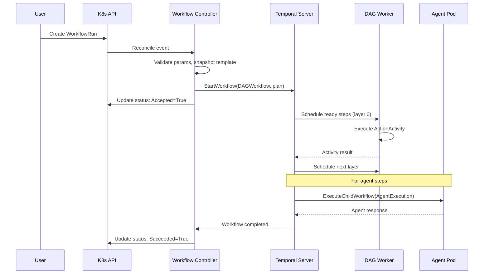

# Design: Temporal Declarative Workflow Builder & Executor

**Date:** 2026-03-10
**Status:** Draft
**Version:** 0.1

---

## Table of Contents

1. [Overview](#1-overview)
2. [Detailed Requirements](#2-detailed-requirements)
3. [Architecture Overview](#3-architecture-overview)
4. [Components and Interfaces](#4-components-and-interfaces)
5. [Data Models](#5-data-models)
6. [Workflow DSL Specification](#6-workflow-dsl-specification)
7. [Execution Engine](#7-execution-engine)
8. [Error Handling](#8-error-handling)
9. [Acceptance Criteria](#9-acceptance-criteria)
10. [Testing Strategy](#10-testing-strategy)
11. [Appendices](#11-appendices)

---

## 1. Overview

Kagent uses Kubernetes-native declarative APIs for agents and infrastructure, but workflow orchestration requires imperative Go code. Temporal provides durable execution with retries, timeouts, and replay, yet its development model is code-first.

This design introduces a **declarative workflow builder and executor** that lets users define workflows as YAML CRDs (`WorkflowTemplate` + `WorkflowRun`). Kagent compiles these definitions into Temporal workflow executions, bridging GitOps-friendly declarative authoring with Temporal's durable runtime.

### Design Principles

1. **Thin layer over Temporal** — expose Temporal concepts (activities, retries, timeouts, signals) rather than inventing new abstractions. Users should understand they are building Temporal workflows.
2. **Declare the graph, code the nodes** — the DSL declares DAG structure, dependencies, and policies. Step logic lives in registered activity handlers or kagent agents.
3. **Kubernetes-native** — CRDs, conditions-based status, controller reconciliation, label-based queries.
4. **No Turing-completeness** — no loops, variable mutation, or arbitrary conditionals in v1. Use `agent` steps as the escape hatch for complex logic.
5. **Schema versioning from day one** — `apiVersion: kagent.dev/v1alpha2`, all new fields optional with defaults.

### Scope

**In scope (v1):**
- WorkflowTemplate and WorkflowRun CRDs
- DAG execution with explicit `dependsOn` dependencies
- Two step types: `action` (Temporal activity) and `agent` (kagent Agent invocation)
- Per-step retry, timeout, and failure policies mapped to Temporal
- Typed parameters with defaults and validation
- Workflow context for inter-step data passing
- Controller, HTTP API, and minimal UI for run status
- Template snapshot at run creation for Temporal replay safety

**Out of scope (v1):**
- Visual workflow designer
- Loops, conditionals, switch/case
- Compensation/saga pattern (deferred to v2)
- Container image-based step execution (deferred — requires job runner infrastructure)
- Matrix/fan-out strategies

---

## 2. Detailed Requirements

### Functional Requirements

**FR-1: Workflow Definition**
Users define workflows as `WorkflowTemplate` CRDs containing a list of steps with typed parameters, dependency edges, and execution policies. Templates are mutable; runs snapshot the resolved spec at creation.

**FR-2: Workflow Execution**
Users create `WorkflowRun` CRDs referencing a template and providing parameter values. The controller validates parameters, snapshots the template, submits a Temporal workflow, and synchronizes status.

**FR-3: DAG Execution**
Steps execute as a DAG. Steps with no dependencies start immediately. Steps with `dependsOn` wait until all named dependencies succeed. Independent steps run in parallel automatically.

**FR-4: Step Types**
- `action` — invokes a registered Temporal activity by name. Inputs from workflow params and context. Output stored in context.
- `agent` — invokes a kagent Agent via child workflow. Renders a prompt template with context variables. Maps selected output fields to context keys.

**FR-5: Inter-Step Data Flow**
A workflow-scoped context (`map[string]json.RawMessage`) accumulates step outputs. Steps reference context values via `${{ context.stepName.field }}` expressions. Inputs reference workflow params via `${{ params.name }}`.

**FR-6: Retry and Timeout Policies**
Per-step policies map directly to Temporal's `RetryPolicy` and activity timeout fields. Workflow-level defaults apply when step-level policies are omitted.

**FR-7: Failure Modes**
Per-step `onFailure` policy: `stop` (default, fail-fast), `continue` (mark failed, continue DAG). Workflow-level failure is determined by whether any `stop`-mode step fails.

**FR-8: Run Status**
WorkflowRun status includes conditions (`Accepted`, `Running`, `Succeeded`), per-step status (`Pending`, `Running`, `Succeeded`, `Failed`, `Skipped`), and Temporal workflow metadata.

**FR-9: Run Retention**
Template-level history limits (`successfulRunsHistoryLimit`, `failedRunsHistoryLimit`). Run-level TTL (`ttlSecondsAfterFinished`). Controller garbage-collects expired runs.

**FR-10: Cancellation**
Deleting a WorkflowRun cancels the Temporal workflow via a finalizer. Cancellation propagates to all in-progress activities and child workflows.

### Non-Functional Requirements

**NFR-1:** Workflow validation (cycle detection, reference resolution, param checking) completes in < 100ms for templates with up to 100 steps.

**NFR-2:** Step count per template capped at 200 (Temporal history budget: ~600 events for 200 steps, well under 51,200 limit).

**NFR-3:** Context payload per step capped at 256KB. Steps producing larger outputs must use external storage and pass references.

**NFR-4:** Run status synchronized from Temporal to CRD status within 5 seconds of state change.

---

## 3. Architecture Overview

```
                          Kubernetes Cluster
 +------------------------------------------------------------------+
 |                                                                    |
 |   WorkflowTemplate CRD          WorkflowRun CRD                  |
 |        (user creates)              (user creates)                 |
 |              |                          |                          |
 |              v                          v                          |
 |   +----------------------------------------------------+          |
 |   |           Workflow Controller                       |          |
 |   |                                                    |          |
 |   |  1. Validate template (DAG, params, refs)          |          |
 |   |  2. On WorkflowRun: snapshot template              |          |
 |   |  3. Compile DAG -> Temporal execution plan          |          |
 |   |  4. Submit to Temporal via Client                   |          |
 |   |  5. Sync Temporal status -> CRD status              |          |
 |   |  6. Enforce retention (history limits, TTL)         |          |
 |   +----------------------------------------------------+          |
 |              |                                                     |
 |              v                                                     |
 |   +----------------------------------------------------+          |
 |   |         Temporal Server                             |          |
 |   |                                                    |          |
 |   |  DAGWorkflow (generic interpreter)                  |          |
 |   |    |-- ActionActivity (registered step handlers)    |          |
 |   |    |-- AgentChildWorkflow (kagent agent invocation)  |          |
 |   +----------------------------------------------------+          |
 |              |                    |                                 |
 |              v                    v                                 |
 |   +------------------+  +--------------------+                     |
 |   | Action Handlers  |  | Agent Pods         |                     |
 |   | (activity impls) |  | (existing kagent)  |                     |
 |   +------------------+  +--------------------+                     |
 |                                                                    |
 |   +----------------------------------------------------+          |
 |   |         HTTP API + UI                               |          |
 |   |  GET /api/workflow-templates                        |          |
 |   |  GET /api/workflow-runs                             |          |
 |   |  POST /api/workflow-runs (create run)               |          |
 |   |  GET /api/workflow-runs/:id/status (step graph)     |          |
 |   +----------------------------------------------------+          |
 +------------------------------------------------------------------+
```

### Component Interaction Flow



---

## 4. Components and Interfaces

### 4.1 CRD Types

Located in `go/api/v1alpha2/`.

#### WorkflowTemplate

```go
// +kubebuilder:object:root=true
// +kubebuilder:subresource:status
// +kubebuilder:storageversion
// +kubebuilder:printcolumn:name="Steps",type=integer,JSONPath=`.status.stepCount`
// +kubebuilder:printcolumn:name="Age",type=date,JSONPath=`.metadata.creationTimestamp`
type WorkflowTemplate struct {
    metav1.TypeMeta   `json:",inline"`
    metav1.ObjectMeta `json:"metadata,omitempty"`
    Spec              WorkflowTemplateSpec   `json:"spec,omitempty"`
    Status            WorkflowTemplateStatus `json:"status,omitempty"`
}

type WorkflowTemplateSpec struct {
    // Description of the workflow.
    // +optional
    Description string `json:"description,omitempty"`

    // Params declares input parameters.
    // +optional
    Params []ParamSpec `json:"params,omitempty"`

    // Steps defines the workflow DAG.
    // +kubebuilder:validation:MinItems=1
    // +kubebuilder:validation:MaxItems=200
    Steps []StepSpec `json:"steps"`

    // Defaults for step policies when not specified per-step.
    // +optional
    Defaults *StepPolicyDefaults `json:"defaults,omitempty"`

    // Retention controls run history cleanup.
    // +optional
    Retention *RetentionPolicy `json:"retention,omitempty"`
}

type WorkflowTemplateStatus struct {
    ObservedGeneration int64              `json:"observedGeneration,omitempty"`
    Conditions         []metav1.Condition `json:"conditions,omitempty"`
    // StepCount is the number of steps in the template.
    StepCount int32 `json:"stepCount,omitempty"`
    // Validated indicates the template passed DAG and reference validation.
    Validated bool `json:"validated,omitempty"`
}
```

#### WorkflowRun

```go
// +kubebuilder:object:root=true
// +kubebuilder:subresource:status
// +kubebuilder:storageversion
// +kubebuilder:printcolumn:name="Template",type=string,JSONPath=`.spec.workflowTemplateRef`
// +kubebuilder:printcolumn:name="Status",type=string,JSONPath=`.status.phase`
// +kubebuilder:printcolumn:name="Age",type=date,JSONPath=`.metadata.creationTimestamp`
type WorkflowRun struct {
    metav1.TypeMeta   `json:",inline"`
    metav1.ObjectMeta `json:"metadata,omitempty"`
    Spec              WorkflowRunSpec   `json:"spec,omitempty"`
    Status            WorkflowRunStatus `json:"status,omitempty"`
}

type WorkflowRunSpec struct {
    // WorkflowTemplateRef is the name of the WorkflowTemplate.
    // +kubebuilder:validation:Required
    WorkflowTemplateRef string `json:"workflowTemplateRef"`

    // Params provides values for template parameters.
    // +optional
    Params []Param `json:"params,omitempty"`

    // TTLSecondsAfterFinished controls automatic deletion.
    // +optional
    TTLSecondsAfterFinished *int32 `json:"ttlSecondsAfterFinished,omitempty"`
}

type WorkflowRunStatus struct {
    ObservedGeneration int64              `json:"observedGeneration,omitempty"`
    Conditions         []metav1.Condition `json:"conditions,omitempty"`

    // Phase is a derived summary for printer columns.
    // +kubebuilder:validation:Enum=Pending;Running;Succeeded;Failed;Cancelled
    Phase string `json:"phase,omitempty"`

    // ResolvedSpec is the snapshot of the template at run creation.
    // +optional
    ResolvedSpec *WorkflowTemplateSpec `json:"resolvedSpec,omitempty"`

    // TemplateGeneration tracks which generation of the template was used.
    TemplateGeneration int64 `json:"templateGeneration,omitempty"`

    // TemporalWorkflowID is the Temporal workflow execution ID.
    TemporalWorkflowID string `json:"temporalWorkflowID,omitempty"`

    // StartTime is when the Temporal workflow started.
    // +optional
    StartTime *metav1.Time `json:"startTime,omitempty"`

    // CompletionTime is when the workflow finished.
    // +optional
    CompletionTime *metav1.Time `json:"completionTime,omitempty"`

    // Steps tracks per-step execution status.
    // +optional
    Steps []StepStatus `json:"steps,omitempty"`
}

type StepStatus struct {
    Name           string       `json:"name"`
    Phase          StepPhase    `json:"phase"`
    StartTime      *metav1.Time `json:"startTime,omitempty"`
    CompletionTime *metav1.Time `json:"completionTime,omitempty"`
    Message        string       `json:"message,omitempty"`
    Retries        int32        `json:"retries,omitempty"`
    // For agent steps: the child workflow session ID.
    SessionID string `json:"sessionID,omitempty"`
}

type StepPhase string
const (
    StepPhasePending   StepPhase = "Pending"
    StepPhaseRunning   StepPhase = "Running"
    StepPhaseSucceeded StepPhase = "Succeeded"
    StepPhaseFailed    StepPhase = "Failed"
    StepPhaseSkipped   StepPhase = "Skipped"
)
```

### 4.2 Step and Policy Types

```go
type StepSpec struct {
    // Name uniquely identifies this step within the workflow.
    // +kubebuilder:validation:Required
    // +kubebuilder:validation:Pattern=`^[a-z][a-z0-9-]*$`
    Name string `json:"name"`

    // Type is the step execution mode.
    // +kubebuilder:validation:Enum=action;agent
    Type StepType `json:"type"`

    // Action is the registered activity name (for type=action).
    // +optional
    Action string `json:"action,omitempty"`

    // AgentRef is the kagent Agent name (for type=agent).
    // +optional
    AgentRef string `json:"agentRef,omitempty"`

    // Prompt is a template rendered before agent invocation (for type=agent).
    // Supports ${{ params.* }} and ${{ context.* }} interpolation.
    // +optional
    Prompt string `json:"prompt,omitempty"`

    // With provides input key-value pairs for the step.
    // Values support ${{ }} expression interpolation.
    // +optional
    With map[string]string `json:"with,omitempty"`

    // DependsOn lists step names that must succeed before this step runs.
    // +optional
    DependsOn []string `json:"dependsOn,omitempty"`

    // Output configures how step results are stored in context.
    // +optional
    Output *StepOutput `json:"output,omitempty"`

    // Policy overrides workflow-level defaults for this step.
    // +optional
    Policy *StepPolicy `json:"policy,omitempty"`

    // OnFailure determines behavior when this step fails.
    // +kubebuilder:validation:Enum=stop;continue
    // +kubebuilder:default=stop
    // +optional
    OnFailure string `json:"onFailure,omitempty"`
}

type StepOutput struct {
    // As stores the full step result at context.<alias>.
    // Defaults to step name if omitted.
    // +optional
    As string `json:"as,omitempty"`

    // Keys maps selected output fields to top-level context keys.
    // +optional
    Keys map[string]string `json:"keys,omitempty"`
}

type StepPolicy struct {
    Retry   *RetryPolicy   `json:"retry,omitempty"`
    Timeout *TimeoutPolicy `json:"timeout,omitempty"`
}

// RetryPolicy maps directly to Temporal's temporal.RetryPolicy.
type RetryPolicy struct {
    // +kubebuilder:default=3
    MaxAttempts int32 `json:"maxAttempts,omitempty"`
    // +kubebuilder:default="1s"
    InitialInterval metav1.Duration `json:"initialInterval,omitempty"`
    // +kubebuilder:default="60s"
    MaximumInterval metav1.Duration `json:"maximumInterval,omitempty"`
    // +kubebuilder:default=2
    BackoffCoefficient float64 `json:"backoffCoefficient,omitempty"`
    // Error types that should not be retried.
    // +optional
    NonRetryableErrors []string `json:"nonRetryableErrors,omitempty"`
}

// TimeoutPolicy maps to Temporal activity timeout fields.
type TimeoutPolicy struct {
    // StartToClose is the max time for a single attempt.
    // +kubebuilder:default="5m"
    StartToClose metav1.Duration `json:"startToClose,omitempty"`
    // ScheduleToClose is the max total time including retries.
    // +optional
    ScheduleToClose *metav1.Duration `json:"scheduleToClose,omitempty"`
    // Heartbeat is the max time between heartbeats.
    // +optional
    Heartbeat *metav1.Duration `json:"heartbeat,omitempty"`
}

type StepPolicyDefaults struct {
    Retry   *RetryPolicy   `json:"retry,omitempty"`
    Timeout *TimeoutPolicy `json:"timeout,omitempty"`
}

type RetentionPolicy struct {
    // +kubebuilder:default=10
    SuccessfulRunsHistoryLimit *int32 `json:"successfulRunsHistoryLimit,omitempty"`
    // +kubebuilder:default=5
    FailedRunsHistoryLimit *int32 `json:"failedRunsHistoryLimit,omitempty"`
}

type ParamSpec struct {
    // +kubebuilder:validation:Required
    // +kubebuilder:validation:Pattern=`^[a-zA-Z_][a-zA-Z0-9_]*$`
    Name string `json:"name"`
    // +optional
    Description string `json:"description,omitempty"`
    // +kubebuilder:validation:Enum=string;number;boolean
    // +kubebuilder:default=string
    Type ParamType `json:"type,omitempty"`
    // +optional
    Default *string `json:"default,omitempty"`
    // +optional
    Enum []string `json:"enum,omitempty"`
}

type Param struct {
    Name  string `json:"name"`
    Value string `json:"value"`
}
```

### 4.3 Controller

Located in `go/core/internal/controller/`.

```go
// WorkflowTemplateReconciler validates templates on create/update.
type WorkflowTemplateReconciler struct {
    client.Client
    Scheme *runtime.Scheme
}

// WorkflowRunReconciler manages the full run lifecycle.
type WorkflowRunReconciler struct {
    client.Client
    Scheme          *runtime.Scheme
    TemporalClient  *temporal.Client
    Compiler        *compiler.DAGCompiler
    StatusSyncer    *status.TemporalStatusSyncer
}
```

**WorkflowTemplateReconciler responsibilities:**
1. Parse and validate DAG (cycle detection, reference resolution)
2. Validate param specs
3. Update `status.validated`, `status.stepCount`, conditions

**WorkflowRunReconciler responsibilities:**
1. Resolve template reference, validate params against spec
2. Snapshot resolved template into `status.resolvedSpec`
3. Compile DAG into execution plan
4. Submit Temporal workflow via `StartWorkflow`
5. Add finalizer `kagent.dev/temporal-cleanup`
6. Periodically sync Temporal workflow status to CRD conditions and `status.steps`
7. On deletion: cancel Temporal workflow, remove finalizer
8. Enforce retention (history limits, TTL cleanup)

### 4.4 DAG Compiler

Located in `go/core/internal/compiler/`.

```go
// DAGCompiler transforms a WorkflowTemplateSpec into a TemporalExecutionPlan.
type DAGCompiler struct{}

type ExecutionPlan struct {
    WorkflowID string                 `json:"workflowID"`
    TaskQueue  string                 `json:"taskQueue"`
    Params     map[string]string      `json:"params"`
    Steps      []ExecutionStep        `json:"steps"`
    Defaults   *StepPolicyDefaults    `json:"defaults,omitempty"`
}

type ExecutionStep struct {
    Name         string            `json:"name"`
    Type         StepType          `json:"type"`
    Action       string            `json:"action,omitempty"`
    AgentRef     string            `json:"agentRef,omitempty"`
    Prompt       string            `json:"prompt,omitempty"`
    With         map[string]string `json:"with,omitempty"`
    DependsOn    []string          `json:"dependsOn,omitempty"`
    Output       *StepOutput       `json:"output,omitempty"`
    Policy       *StepPolicy       `json:"policy,omitempty"`
    OnFailure    string            `json:"onFailure,omitempty"`
}

func (c *DAGCompiler) Compile(spec *WorkflowTemplateSpec, params map[string]string) (*ExecutionPlan, error)
func (c *DAGCompiler) Validate(spec *WorkflowTemplateSpec) error
```

**Validation rules:**
1. No duplicate step names
2. All `dependsOn` references resolve to existing step names
3. No cycles in the dependency graph (topological sort succeeds)
4. `action` steps must have `action` field; `agent` steps must have `agentRef`
5. All `${{ params.* }}` references resolve to declared params
6. All `${{ context.* }}` references resolve to steps that are upstream dependencies
7. Step count <= 200
8. Params without defaults are required

### 4.5 Temporal Execution

Located in `go/core/internal/temporal/workflow/`.

#### DAGWorkflow (Generic Interpreter)

A single registered Temporal workflow that interprets any `ExecutionPlan`:

```go
func DAGWorkflow(ctx workflow.Context, plan *ExecutionPlan) (*DAGResult, error) {
    context := NewWorkflowContext(plan.Params)
    completed := map[string]bool{}
    failed := map[string]bool{}
    pending := len(plan.Steps)

    resultCh := workflow.NewChannel(ctx)

    // Launch all steps; each waits for its dependencies
    for _, step := range plan.Steps {
        step := step
        workflow.Go(ctx, func(gCtx workflow.Context) {
            // Wait until all dependencies are satisfied
            workflow.Await(gCtx, func() bool {
                return allDependenciesMet(step.DependsOn, completed, failed)
            })

            // Skip if any stop-mode dependency failed
            if anyDependencyFailed(step.DependsOn, failed) {
                resultCh.Send(gCtx, stepResult{Name: step.Name, Phase: Skipped})
                return
            }

            // Resolve inputs from context
            inputs := resolveInputs(step.With, context)

            // Execute based on type
            var result *StepResult
            var err error
            switch step.Type {
            case "action":
                result, err = executeAction(gCtx, step, inputs)
            case "agent":
                result, err = executeAgent(gCtx, step, inputs, context)
            }

            if err != nil {
                resultCh.Send(gCtx, stepResult{Name: step.Name, Phase: Failed, Error: err})
                return
            }

            // Store outputs in context
            storeOutputs(context, step, result)
            resultCh.Send(gCtx, stepResult{Name: step.Name, Phase: Succeeded, Data: result})
        })
    }

    // Collect results
    for pending > 0 {
        var sr stepResult
        resultCh.Receive(ctx, &sr)
        switch sr.Phase {
        case Succeeded:
            completed[sr.Name] = true
        case Failed:
            failed[sr.Name] = true
            if getOnFailure(sr.Name, plan) == "stop" {
                // Don't cancel — let running steps finish, but skip dependents
            }
        case Skipped:
            // counted as done
        }
        pending--
    }

    if len(failed) > 0 {
        return &DAGResult{Status: "failed", Steps: collectStepResults()}, nil
    }
    return &DAGResult{Status: "succeeded", Steps: collectStepResults()}, nil
}
```

#### Action Activity

```go
func ActionActivity(ctx context.Context, req *ActionRequest) (*ActionResult, error) {
    // req.Action is the registered handler name
    // req.Inputs is the resolved input map
    handler, ok := actionRegistry.Get(req.Action)
    if !ok {
        return nil, temporal.NewNonRetryableApplicationError(
            fmt.Sprintf("unknown action: %s", req.Action), "UNKNOWN_ACTION", nil)
    }
    return handler.Execute(ctx, req.Inputs)
}
```

#### Agent Step (Child Workflow)

```go
func executeAgent(ctx workflow.Context, step ExecutionStep, inputs map[string]string, wfCtx *WorkflowContext) (*StepResult, error) {
    // Render prompt template
    prompt := renderTemplate(step.Prompt, wfCtx)

    // Build agent execution request
    childOpts := workflow.ChildWorkflowOptions{
        WorkflowID: fmt.Sprintf("%s:agent:%s", workflow.GetInfo(ctx).WorkflowExecution.ID, step.Name),
        TaskQueue:  step.AgentRef, // agent name = task queue
    }
    childCtx := workflow.WithChildOptions(ctx, childOpts)

    var result AgentResult
    err := workflow.ExecuteChildWorkflow(childCtx, AgentExecutionWorkflow, &ExecutionRequest{
        Message: prompt,
        Inputs:  inputs,
    }).Get(ctx, &result)

    return mapAgentResult(&result, step.Output), err
}
```

### 4.6 Expression Interpolation

```go
// Resolve ${{ params.name }} and ${{ context.step.field }} expressions.
func resolveExpression(expr string, params map[string]string, ctx *WorkflowContext) (string, error)
```

**Syntax:** `${{ <namespace>.<path> }}`

| Namespace | Example | Resolves To |
|-----------|---------|-------------|
| `params` | `${{ params.repoUrl }}` | Workflow input parameter value |
| `context` | `${{ context.checkout.commitSha }}` | Output field from a completed step |
| `workflow` | `${{ workflow.name }}` | Workflow metadata (name, namespace, runName) |

**Constraints:**
- No nested expressions
- No arithmetic or boolean operators
- No function calls
- Unknown references are a validation error (caught at compile time for params, runtime error for context)

### 4.7 HTTP API

Added to existing `go/core/internal/httpserver/`:

| Method | Path | Description |
|--------|------|-------------|
| `GET` | `/api/workflow-templates` | List templates |
| `GET` | `/api/workflow-templates/:name` | Get template detail |
| `POST` | `/api/workflow-runs` | Create run (template ref + params) |
| `GET` | `/api/workflow-runs` | List runs (filter by template, status) |
| `GET` | `/api/workflow-runs/:name` | Get run detail with step statuses |
| `DELETE` | `/api/workflow-runs/:name` | Cancel and delete run |

### 4.8 Status Syncer

```go
// TemporalStatusSyncer polls Temporal and updates WorkflowRun status.
type TemporalStatusSyncer struct {
    temporalClient *temporal.Client
    k8sClient      client.Client
    interval       time.Duration // default: 5s
}
```

The syncer runs as a background goroutine in the controller. For each active WorkflowRun, it queries Temporal `DescribeWorkflowExecution` and updates:
- Overall conditions (Running → Succeeded/Failed)
- Per-step status from workflow query handler
- Start/completion timestamps

**Alternative:** Use Temporal's visibility API with search attributes to batch-query all kagent workflows.

---

## 5. Data Models

### 5.1 Workflow Context (Runtime)

```go
// WorkflowContext is the shared state within a DAG execution.
type WorkflowContext struct {
    Params  map[string]string          `json:"params"`
    Steps   map[string]json.RawMessage `json:"steps"`   // step outputs keyed by name/alias
    Globals map[string]string          `json:"globals"`  // top-level keys from output.keys mappings
}
```

- **Params:** immutable, set from WorkflowRun.spec.params
- **Steps:** accumulates as steps complete. Each entry is the JSON-serialized step output.
- **Globals:** shortcut keys mapped via `output.keys`

### 5.2 Temporal Workflow ID Strategy

```
Format: wf-{namespace}-{templateName}-{runName}
Example: wf-default-build-and-test-run-abc123
```

- Deterministic from CRD metadata
- Unique per run (run names are unique within a namespace)
- Prefixed with `wf-` to distinguish from agent session workflows

### 5.3 Search Attributes

Registered on Temporal for queryability:

| Attribute | Type | Value |
|-----------|------|-------|
| `KagentWorkflowTemplate` | Keyword | Template name |
| `KagentWorkflowRun` | Keyword | Run name |
| `KagentNamespace` | Keyword | K8s namespace |

### 5.4 Labels on WorkflowRun

```yaml
metadata:
  labels:
    kagent.dev/workflow-template: build-and-test
    kagent.dev/workflow-phase: Running
```

---

## 6. Workflow DSL Specification

### 6.1 Complete Example

```yaml
apiVersion: kagent.dev/v1alpha2
kind: WorkflowTemplate
metadata:
  name: build-and-test
  namespace: default
spec:
  description: "CI pipeline: checkout, test, lint, analyze, build"
  params:
    - name: repoUrl
      type: string
      description: "Git repository URL"
    - name: commitSha
      type: string
      description: "Commit SHA to build"
    - name: runLint
      type: boolean
      default: "true"
      description: "Whether to run linting"

  defaults:
    retry:
      maxAttempts: 3
      initialInterval: 1s
      maximumInterval: 60s
      backoffCoefficient: 2.0
    timeout:
      startToClose: 10m

  retention:
    successfulRunsHistoryLimit: 10
    failedRunsHistoryLimit: 5

  steps:
    - name: checkout
      type: action
      action: git.clone
      with:
        repoUrl: "${{ params.repoUrl }}"
        commitSha: "${{ params.commitSha }}"
      output:
        as: checkout

    - name: unit-tests
      type: action
      action: ci.runTests
      dependsOn: [checkout]
      with:
        workdir: "${{ context.checkout.path }}"
      policy:
        timeout:
          startToClose: 15m
          heartbeat: 30s
      output:
        keys:
          report: testReport

    - name: lint
      type: action
      action: ci.runLint
      dependsOn: [checkout]
      with:
        workdir: "${{ context.checkout.path }}"
      onFailure: continue
      output:
        keys:
          report: lintReport

    - name: analyze
      type: agent
      agentRef: code-quality-analyst
      dependsOn: [unit-tests, lint]
      prompt: |
        Review these CI results and provide a quality assessment.
        Test report: ${{ context.testReport }}
        Lint report: ${{ context.lintReport }}
        Return a JSON object with "summary" and "qualityGate" (PASS or FAIL).
      output:
        keys:
          summary: analysisSummary
          qualityGate: qualityGateStatus

    - name: build
      type: action
      action: ci.buildImage
      dependsOn: [analyze]
      with:
        tag: "${{ params.commitSha }}"
        qualityGate: "${{ context.qualityGateStatus }}"
      policy:
        retry:
          maxAttempts: 2
          nonRetryableErrors: ["INVALID_DOCKERFILE"]
        timeout:
          startToClose: 20m
          heartbeat: 60s
```

### 6.2 Creating a Run

```yaml
apiVersion: kagent.dev/v1alpha2
kind: WorkflowRun
metadata:
  name: build-and-test-run-001
  namespace: default
spec:
  workflowTemplateRef: build-and-test
  params:
    - name: repoUrl
      value: "https://github.com/kagent-dev/kagent"
    - name: commitSha
      value: "abc123def"
  ttlSecondsAfterFinished: 86400
```

### 6.3 Run Status Example

```yaml
status:
  observedGeneration: 1
  conditions:
    - type: Accepted
      status: "True"
      reason: TemplateResolved
      message: "Template build-and-test resolved and validated"
    - type: Running
      status: "True"
      reason: WorkflowRunning
    - type: Succeeded
      status: "Unknown"
      reason: InProgress
  phase: Running
  templateGeneration: 3
  temporalWorkflowID: "wf-default-build-and-test-build-and-test-run-001"
  startTime: "2026-03-10T01:00:00Z"
  steps:
    - name: checkout
      phase: Succeeded
      startTime: "2026-03-10T01:00:01Z"
      completionTime: "2026-03-10T01:00:15Z"
    - name: unit-tests
      phase: Running
      startTime: "2026-03-10T01:00:16Z"
      retries: 0
    - name: lint
      phase: Running
      startTime: "2026-03-10T01:00:16Z"
    - name: analyze
      phase: Pending
    - name: build
      phase: Pending
```

---

## 7. Execution Engine

### 7.1 DAG Execution Strategy

**Event-driven with `workflow.Await`** (chosen over layer-by-layer Kahn's):
- Maximum parallelism — each step starts as soon as all its dependencies complete
- Simpler code — no need to compute layers
- Better for DAGs with varying step durations

### 7.2 Worker Registration

The DAG worker registers on a dedicated task queue (`kagent-workflows`):

```go
func NewDAGWorker(temporalClient client.Client, registry *ActionRegistry) worker.Worker {
    w := worker.New(temporalClient, "kagent-workflows", worker.Options{})
    w.RegisterWorkflow(DAGWorkflow)
    w.RegisterActivity(&DAGActivities{registry: registry})
    return w
}
```

The DAG worker runs in the kagent controller process (not in agent pods). Agent steps dispatch to agent pods via child workflows on agent-specific task queues.

### 7.3 Action Registry

```go
type ActionHandler interface {
    Execute(ctx context.Context, inputs map[string]string) (*ActionResult, error)
}

type ActionRegistry struct {
    handlers map[string]ActionHandler
}

func (r *ActionRegistry) Register(name string, handler ActionHandler)
func (r *ActionRegistry) Get(name string) (ActionHandler, bool)
```

Built-in actions for v1:
- `http.request` — make an HTTP call
- `script.run` — execute a shell command (in-process, sandboxed)

Additional actions are registered by MCP tool servers or custom plugins.

### 7.4 Replay Safety / Versioning

**Problem:** If a WorkflowTemplate changes while runs are in-flight, the `DAGWorkflow` code path changes, causing Temporal non-determinism errors.

**Solution:** The `DAGWorkflow` is a **generic interpreter** that reads the execution plan from workflow input, not from code. Since the plan is passed as input (immutable after workflow start), template changes don't affect running workflows. The plan is the snapshot.

This is the key architectural advantage of the interpreter pattern over code-generation: no versioning problem.

### 7.5 History Budget

| Steps | Events (est.) | % of 51,200 limit |
|-------|---------------|-------------------|
| 10 | ~50 | 0.1% |
| 50 | ~200 | 0.4% |
| 100 | ~400 | 0.8% |
| 200 (max) | ~800 | 1.6% |

With the 200-step cap, history is never a concern. Agent child workflows have their own history.

---

## 8. Error Handling

### 8.1 Step-Level Failures

| `onFailure` | Behavior |
|-------------|----------|
| `stop` (default) | Step marked Failed. Dependents are Skipped. Workflow continues running other independent branches but ultimately reports Failed. |
| `continue` | Step marked Failed. Dependents still execute (receive the error in context). Workflow may still Succeed if no `stop`-mode step fails. |

### 8.2 Temporal Error Mapping

| Temporal Error | Mapped To |
|----------------|-----------|
| `ApplicationError` | Step Failed (retryable or not based on NonRetryableErrorTypes) |
| `CanceledError` | Step Cancelled (workflow cancellation) |
| `TimeoutError` | Step Failed with timeout message |
| `ActivityError` | Unwrap to underlying cause |

### 8.3 Cancellation Flow

1. User deletes WorkflowRun (or calls cancel API)
2. Controller finalizer sends `CancelWorkflow` to Temporal
3. Temporal cancels the `DAGWorkflow` context
4. All `workflow.Await` calls return with `CanceledError`
5. Running activities receive cancellation (if heartbeating)
6. Child workflows receive cancellation (ParentClosePolicy: `REQUEST_CANCEL`)
7. Controller updates status: `Succeeded=False`, reason=Cancelled
8. Finalizer removed, CRD deleted

### 8.4 Validation Errors

Validation failures during WorkflowRun creation:
- Template not found → `Accepted=False`, reason=`TemplateNotFound`
- Missing required param → `Accepted=False`, reason=`InvalidParams`
- Param value fails enum check → `Accepted=False`, reason=`InvalidParams`

These are terminal — no Temporal workflow is started.

---

## 9. Acceptance Criteria

### AC-1: Template Validation
**Given** a WorkflowTemplate with a cycle in `dependsOn`
**When** the template is created
**Then** status condition `Accepted=False` with reason `CycleDetected` and the template is not marked as validated.

### AC-2: Basic Sequential Workflow
**Given** a WorkflowTemplate with steps A → B → C (linear dependencies)
**When** a WorkflowRun is created
**Then** steps execute in order, each starting only after its dependency succeeds, and the run reaches `Succeeded`.

### AC-3: Parallel Execution
**Given** a WorkflowTemplate where steps B and C both `dependsOn: [A]`, and step D `dependsOn: [B, C]`
**When** a WorkflowRun is created
**Then** B and C execute concurrently after A succeeds, and D executes after both B and C succeed.

### AC-4: Agent Step Invocation
**Given** a WorkflowTemplate with a step `type: agent, agentRef: my-agent`
**When** the step executes
**Then** a child workflow is started on the `my-agent` task queue, the prompt is rendered with context variables, and the agent response fields are mapped to workflow context via `output.keys`.

### AC-5: Retry Policy
**Given** a step with `policy.retry.maxAttempts: 3` and the activity fails twice then succeeds
**When** the step executes
**Then** the step retries twice and ultimately succeeds. `StepStatus.retries` is 2.

### AC-6: Fail-Fast Behavior
**Given** steps A → B → C where B has `onFailure: stop` and B fails
**When** the workflow executes
**Then** C is Skipped and the workflow status is Failed.

### AC-7: Continue-On-Error
**Given** steps A → B → C where B has `onFailure: continue` and B fails
**When** the workflow executes
**Then** C still executes (receives B's error in context) and the workflow may Succeed.

### AC-8: Parameter Validation
**Given** a WorkflowTemplate requiring param `repoUrl` (no default)
**When** a WorkflowRun is created without providing `repoUrl`
**Then** the run has `Accepted=False`, reason=`InvalidParams`, and no Temporal workflow is started.

### AC-9: Template Snapshot Immutability
**Given** a running WorkflowRun and the referenced WorkflowTemplate is updated
**When** the run continues executing
**Then** the run uses its snapshotted `resolvedSpec`, unaffected by the template change.

### AC-10: Cancellation
**Given** a running WorkflowRun
**When** the WorkflowRun is deleted
**Then** the Temporal workflow is cancelled, all running steps are terminated, and the finalizer is removed.

### AC-11: Retention
**Given** a WorkflowTemplate with `successfulRunsHistoryLimit: 3` and 5 successful runs exist
**When** the retention controller runs
**Then** the 2 oldest successful runs are deleted.

### AC-12: Context Data Flow
**Given** step A produces output `{"path": "/src"}` and step B references `${{ context.A.path }}`
**When** step B executes
**Then** the input resolves to `/src`.

---

## 10. Testing Strategy

### Unit Tests

| Component | Coverage |
|-----------|----------|
| DAG Compiler | Cycle detection, topological sort, reference validation, param resolution |
| Expression resolver | All interpolation patterns, error cases, escaping |
| Status derivation | Condition → phase mapping |
| Retention logic | History limit enforcement, TTL calculation |

### Integration Tests

| Test | What It Validates |
|------|-------------------|
| Template validation webhook | CEL rules, required fields, enum validation |
| Run creation with param binding | Template resolution, snapshot, Temporal submission |
| DAGWorkflow with mock activities | Sequential, parallel, mixed execution patterns |
| Agent step with mock agent | Child workflow dispatch, prompt rendering, output mapping |
| Error handling | Retry, timeout, fail-fast, continue-on-error |
| Cancellation | Finalizer, Temporal cancel, status update |

### E2E Tests

Located in `go/core/test/e2e/workflow_test.go`:

| Test | What It Validates |
|------|-------------------|
| `TestE2EWorkflowSequential` | Create template + run, verify sequential step execution |
| `TestE2EWorkflowParallelDAG` | Verify parallel branches execute concurrently |
| `TestE2EWorkflowAgentStep` | Agent step invokes existing kagent agent, output flows to context |
| `TestE2EWorkflowFailFast` | Step failure skips dependents |
| `TestE2EWorkflowRetry` | Step retries per policy |
| `TestE2EWorkflowCancellation` | Delete run cancels Temporal workflow |
| `TestE2EWorkflowRetention` | History limits enforced on old runs |
| `TestE2EWorkflowAPIEndpoints` | HTTP API for list/create/get/delete |

---

## 11. Appendices

### A. Technology Choices

| Decision | Choice | Rationale |
|----------|--------|-----------|
| Execution engine | Temporal (existing) | Already integrated in kagent. Mature, battle-tested. |
| DAG execution pattern | Event-driven `workflow.Await` | Maximum parallelism, simpler than layer-by-layer. |
| Workflow model | Generic interpreter (not code-gen) | Avoids Temporal versioning/replay issues entirely. |
| Interpolation syntax | `${{ }}` | Avoids Helm/shell collisions (research finding). |
| CRD model | Template + Run (two resources) | Follows Tekton pattern. Separation of definition and execution. |
| Status model | Conditions only | Kagent convention, K8s API best practice. |
| Template snapshot | Stored in run status | Protects in-flight runs from template edits (critical for Temporal replay). |
| Step cap | 200 | Well within Temporal's 51,200 event limit (~800 events). |
| No owner references | Labels instead | Prevent cascade-delete of run history on template delete. |

### B. Research Findings Summary

Six research documents produced (see `research/` directory):
1. **Existing solutions** — Temporal DSL sample, Conductor, Hatchet, Zigflow, Kestra, Dagu. Key lesson: "declare the graph, code the nodes."
2. **Kagent Temporal integration** — Single AgentExecutionWorkflow, 7 activities, SignalWithStart, NATS streaming. Reusable: Client, streaming, ModelInvoker, ToolExecutor.
3. **DAG execution in Temporal** — Event-driven `workflow.Await` for max parallelism. String-based `ExecuteActivity`. ~3 events per activity.
4. **DSL design patterns** — Adopt `${{ }}` (GitHub Actions), explicit `dependsOn` (Argo), Temporal-native retry. Avoid Turing-completeness.
5. **CRD design** — Template + Run, snapshot at creation, conditions-only status, embedded StepStatus, finalizer for cleanup.
6. **Hatchet feasibility** — Not embeddable, no YAML mode, same infra burden. Don't adopt.

### C. Alternative Approaches Considered

| Alternative | Why Rejected |
|-------------|-------------|
| Adopt Hatchet | Not embeddable, no declarative YAML, requires separate service + DB. Kagent already has Temporal. |
| Adopt CNCF Serverless Workflow spec | Over-complex for kagent's needs. State-machine model doesn't align with DAG-first design. Limited Go runtime implementations. |
| Code generation (compile YAML to Go workflow code) | Creates Temporal versioning problems. Interpreter pattern avoids this entirely. |
| Layer-by-layer DAG execution (Kahn's) | Less parallelism than event-driven approach. A step waits for entire layer even if its specific dependencies finished. |
| Single Workflow CRD (no template/run split) | Conflates definition with execution. Can't reuse templates, can't track run history independently. |
| Use `${}` interpolation | Collides with shell variable expansion. `${{ }}` is safer. |
| Add loops/conditionals in v1 | Research strongly warns against YAML Turing-completeness. Defer to v2. Use `agent` steps as escape hatch. |

### D. Deferred to v2

- **Loops/conditionals** — `forEach`, `when` expressions on steps
- **Compensation/saga** — per-step compensation activities, reverse-order rollback
- **Container image steps** — `image` field on steps, Kubernetes Job-based execution
- **Matrix strategies** — parameterized fan-out (like GitHub Actions matrix)
- **Visual workflow designer** — DAG editor in kagent UI
- **Workflow triggers** — event-based, schedule-based, webhook-based auto-start
- **Cross-namespace template references** — ClusterWorkflowTemplate

---

**End of Design Document**
