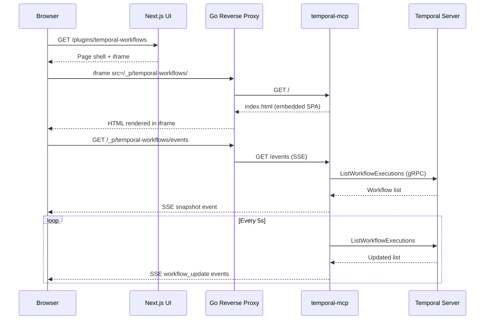
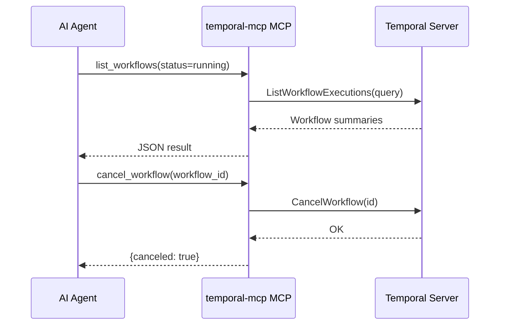

# Temporal Workflows MCP Plugin -- Design Document

## Overview

Build a custom Temporal workflows MCP server plugin (`temporal-mcp`) that provides workflow administration tools for AI agents and an embedded UI for humans. Follows the same architecture as `kanban-mcp`: Go binary with MCP tools, REST API, embedded SPA, SSE live updates, deployed via Helm, registered as RemoteMCPServer CRD.

The plugin connects directly to Temporal Server (gRPC) and is stateless -- no local database.

**Scope:** New plugin in `go/plugins/temporal-mcp/` + Helm chart in `helm/tools/temporal-mcp/`. Also: update the existing AGENTS/Workflows stub page to point to the stock Temporal UI, and wire the new plugin into PLUGINS section.

## Detailed Requirements

1. MCP server (Go binary) with 4 tools for Temporal workflow administration
2. Embedded single-file SPA (vanilla JS, no build step) with SSE live updates
3. Stateless -- connects directly to Temporal Server gRPC, no local DB
4. Deployed as a separate K8s service via Helm chart
5. Registered as RemoteMCPServer CRD with `ui.enabled: true`, section "PLUGINS"
6. Implements kagent plugin bridge protocol (theme, badges, navigation)
7. Workflow list filterable by status: running, completed, failed
8. Workflow detail view for specific workflow (activity history)
9. Workflow actions: cancel, signal (HITL approval)
10. Namespace hardcoded to "kagent", Temporal address via `TEMPORAL_HOST_PORT` env var
11. AGENTS/Workflows nav item → stock Temporal UI plugin (replace stub)
12. PLUGINS/temporal-workflows → this new custom plugin

## Architecture Overview

```
┌──────────────────────────────────────────────────────┐
│ KAgent UI (Browser)                                  │
│                                                      │
│  AGENTS/Workflows ──→ Stock Temporal UI (iframe)     │
│  PLUGINS/Temporal Workflows ──→ Custom plugin (iframe)│
└──────────┬───────────────────────────┬───────────────┘
           │                           │
           ▼                           ▼
┌──────────────────┐      ┌─────────────────────────┐
│ Stock Temporal UI │      │ temporal-mcp (Go binary) │
│ (temporalio/ui)   │      │ :8080                    │
│ :8080             │      │  /mcp    - MCP endpoint  │
└────────┬─────────┘      │  /events - SSE stream    │
         │                 │  /api/*  - REST API      │
         │                 │  /       - Embedded SPA  │
         │                 └────────────┬─────────────┘
         │                              │
         ▼                              ▼
┌──────────────────────────────────────────────────────┐
│ Temporal Server (gRPC :7233)                         │
│ Namespace: kagent                                    │
└──────────────────────────────────────────────────────┘
```

### Data Flow

```
UI (embedded HTML) ──HTTP──→ temporal-mcp REST API ──gRPC──→ Temporal Server
AI Agent ──MCP──→ temporal-mcp MCP tools ──gRPC──→ Temporal Server
```

## Components and Interfaces

### 1. Go Binary: `temporal-mcp`

**Location:** `go/plugins/temporal-mcp/`

```
go/plugins/temporal-mcp/
├── main.go                          # Entry point, config → temporal client → server
├── server.go                        # HTTP mux: /mcp, /events, /api/*, /
├── Dockerfile
├── internal/
│   ├── config/config.go             # CLI flags + TEMPORAL_* env fallback
│   ├── temporal/client.go           # Temporal gRPC client wrapper (list, describe, cancel, signal)
│   ├── mcp/tools.go                 # 4 MCP tool handlers
│   ├── api/handlers.go              # REST handlers (workflows list, detail, cancel, signal)
│   ├── sse/hub.go                   # SSE fan-out hub for live updates
│   └── ui/
│       ├── embed.go                 # //go:embed index.html
│       └── index.html               # Full SPA — CSS + JS, no build step
```

### 2. Configuration

**Location:** `internal/config/config.go`

```go
type Config struct {
    Addr             string // listen address, default ":8080"
    Transport        string // "http" or "stdio", default "http"
    TemporalHostPort string // Temporal gRPC address, default "temporal-server:7233"
    TemporalNamespace string // Temporal namespace, default "kagent"
    PollInterval     time.Duration // SSE poll interval for workflow changes, default 5s
    LogLevel         string // "debug", "info", "warn", "error"
}
```

Env vars: `TEMPORAL_ADDR`, `TEMPORAL_HOST_PORT`, `TEMPORAL_NAMESPACE`, `TEMPORAL_POLL_INTERVAL`, `TEMPORAL_LOG_LEVEL`

### 3. Temporal Client Wrapper

**Location:** `internal/temporal/client.go`

```go
type Client struct {
    client    client.Client       // Temporal SDK client
    namespace string
}

func NewClient(hostPort, namespace string) (*Client, error)

func (c *Client) ListWorkflows(ctx context.Context, filter WorkflowFilter) ([]*WorkflowSummary, error)
func (c *Client) GetWorkflow(ctx context.Context, workflowID string) (*WorkflowDetail, error)
func (c *Client) CancelWorkflow(ctx context.Context, workflowID string) error
func (c *Client) SignalWorkflow(ctx context.Context, workflowID, signalName string, data interface{}) error
func (c *Client) Close()
```

**Types:**

```go
type WorkflowFilter struct {
    Status    string // "running", "completed", "failed", "" (all)
    AgentName string // parsed from workflow ID pattern "agent-{name}-{session}"
    PageSize  int
    NextToken []byte
}

type WorkflowSummary struct {
    WorkflowID string    `json:"WorkflowID"`
    RunID      string    `json:"RunID"`
    AgentName  string    `json:"AgentName"`  // parsed from workflow ID
    SessionID  string    `json:"SessionID"`  // parsed from workflow ID
    Status     string    `json:"Status"`     // Running, Completed, Failed, Canceled, Terminated, TimedOut
    StartTime  time.Time `json:"StartTime"`
    CloseTime  *time.Time `json:"CloseTime,omitempty"`
    TaskQueue  string    `json:"TaskQueue"`
}

type WorkflowDetail struct {
    WorkflowSummary
    Activities []ActivityInfo `json:"Activities"`
}

type ActivityInfo struct {
    Name      string    `json:"Name"`
    Status    string    `json:"Status"`
    StartTime time.Time `json:"StartTime"`
    Duration  string    `json:"Duration"`
    Attempt   int       `json:"Attempt"`
    Error     string    `json:"Error,omitempty"`
}
```

**Agent name parsing:** Workflow IDs follow the pattern `agent-{agentName}-{sessionID}`. The client parses this to extract agent name and session ID for display.

**Temporal SDK query syntax:**
```go
// List running workflows
query := "WorkflowType = 'AgentExecutionWorkflow' AND ExecutionStatus = 'Running'"

// List by agent (using WorkflowId prefix)
query := "WorkflowId STARTS_WITH 'agent-k8s-agent-'"
```

### 4. MCP Tools

**Location:** `internal/mcp/tools.go`

4 tools registered:

| Tool | Input | Description |
|------|-------|-------------|
| `list_workflows` | `status?`, `agent_name?`, `page_size?` | List workflows filtered by status and/or agent name |
| `get_workflow` | `workflow_id` | Get workflow detail with activity history |
| `cancel_workflow` | `workflow_id` | Cancel a running workflow |
| `signal_workflow` | `workflow_id`, `signal_name`, `data?` | Send signal (e.g., HITL approval) |

```go
func NewServer(tc *temporal.Client) *mcpsdk.Server {
    server := mcpsdk.NewServer(&mcpsdk.Implementation{
        Name:    "temporal-workflows",
        Version: "v1.0.0",
    }, nil)

    mcpsdk.AddTool(server, &mcpsdk.Tool{
        Name:        "list_workflows",
        Description: "List Temporal workflows, optionally filtered by status (running/completed/failed) and agent name.",
    }, handleListWorkflows(tc))

    mcpsdk.AddTool(server, &mcpsdk.Tool{
        Name:        "get_workflow",
        Description: "Get detailed information about a specific workflow including activity history.",
    }, handleGetWorkflow(tc))

    mcpsdk.AddTool(server, &mcpsdk.Tool{
        Name:        "cancel_workflow",
        Description: "Cancel a running workflow.",
    }, handleCancelWorkflow(tc))

    mcpsdk.AddTool(server, &mcpsdk.Tool{
        Name:        "signal_workflow",
        Description: "Send a signal to a running workflow (e.g., HITL approval).",
    }, handleSignalWorkflow(tc))

    return server
}
```

### 5. REST API

**Location:** `internal/api/handlers.go`

| Method | Path | Description |
|--------|------|-------------|
| GET | `/api/workflows` | List workflows (`?status=running&agent=k8s-agent`) |
| GET | `/api/workflows/:id` | Get workflow detail with activities |
| POST | `/api/workflows/:id/cancel` | Cancel workflow |
| POST | `/api/workflows/:id/signal` | Send signal (`{signal_name, data}`) |
| GET | `/events` | SSE stream |
| POST | `/mcp` | MCP Streamable HTTP endpoint |
| GET | `/` | Embedded SPA |

### 6. SSE Live Updates

**Location:** `internal/sse/hub.go`

The SSE hub polls Temporal at a configurable interval (default 5s) to detect workflow status changes and broadcasts updates to connected clients.

```go
type Hub struct {
    tc       *temporal.Client
    clients  map[chan *Event]struct{}
    mu       sync.RWMutex
    interval time.Duration
}

func (h *Hub) Start(ctx context.Context) // background poller
func (h *Hub) ServeSSE(w http.ResponseWriter, r *http.Request)
```

**Event types:**
```json
{"type": "snapshot", "data": {"workflows": [...]}}
{"type": "workflow_update", "data": {"WorkflowID": "...", "Status": "Completed", ...}}
```

On SSE connect: client receives `snapshot` event with current workflow list. Then incremental `workflow_update` events as statuses change.

### 7. Embedded SPA

**Location:** `internal/ui/index.html`

Single HTML file, vanilla JS, no build step. Implements:

- **Workflow list view** — table with columns: Agent, Workflow ID, Status, Start Time, Duration
- **Status filter tabs** — All / Running / Completed / Failed
- **Workflow detail panel** — click a row to expand activity timeline
- **Action buttons** — Cancel (running workflows), Signal (HITL approval)
- **SSE live updates** — auto-refreshes when workflow statuses change
- **kagent plugin bridge** — `kagent.connect()`, theme support, badge with running workflow count
- **Status badges** — color-coded: green (completed), blue (running), red (failed), gray (canceled)

### 8. HTTP Server Wiring

**Location:** `server.go`

```go
func NewHTTPServer(cfg *config.Config, tc *temporal.Client, hub *sse.Hub) *http.Server {
    mcpServer := temporalmcp.NewServer(tc)
    mcpHandler := mcpsdk.NewStreamableHTTPHandler(func(*http.Request) *mcpsdk.Server {
        return mcpServer
    }, nil)

    mux := http.NewServeMux()
    mux.Handle("/mcp", mcpHandler)
    mux.HandleFunc("/events", hub.ServeSSE)
    mux.HandleFunc("/api/workflows", temporalapi.WorkflowsHandler(tc))
    mux.HandleFunc("/api/workflows/", temporalapi.WorkflowHandler(tc))
    mux.Handle("/", ui.Handler())

    return &http.Server{Addr: cfg.Addr, Handler: mux}
}
```

### 9. Helm Chart

**Location:** `helm/tools/temporal-mcp/`

```
helm/tools/temporal-mcp/
├── Chart.yaml
├── values.yaml
├── templates/
│   ├── _helpers.tpl
│   ├── deployment.yaml
│   ├── service.yaml
│   ├── configmap.yaml
│   └── remotemcpserver.yaml
```

**RemoteMCPServer CRD:**
```yaml
apiVersion: kagent.dev/v1alpha2
kind: RemoteMCPServer
metadata:
  name: {{ include "temporal-mcp.fullname" . }}
  namespace: {{ .Release.Namespace }}
spec:
  description: Temporal workflow administration MCP server
  protocol: STREAMABLE_HTTP
  sseReadTimeout: 5m0s
  terminateOnClose: true
  timeout: 30s
  url: {{ include "temporal-mcp.serverUrl" . }}
  ui:
    enabled: true
    pathPrefix: "temporal-workflows"
    displayName: "Temporal Workflows"
    icon: "git-branch"
    section: "PLUGINS"
```

**values.yaml:**
```yaml
replicas: 1

image:
  registry: localhost:5001
  repository: kagent-dev/kagent/temporal-mcp
  pullPolicy: Always
  tag: ""

service:
  type: ClusterIP
  port: 8080

resources:
  requests:
    cpu: 50m
    memory: 64Mi
  limits:
    cpu: 200m
    memory: 256Mi

config:
  TEMPORAL_ADDR: ":8080"
  TEMPORAL_HOST_PORT: "temporal-server:7233"
  TEMPORAL_NAMESPACE: "kagent"
  TEMPORAL_POLL_INTERVAL: "5s"
  TEMPORAL_LOG_LEVEL: "info"
```

### 10. AGENTS/Workflows Nav Update

The existing stock Temporal UI RemoteMCPServer (`helm/kagent/templates/temporal-ui-remotemcpserver.yaml`) should have its section changed from `"PLUGINS"` to `"AGENTS"` so it appears under the AGENTS section as "Workflows".

Update the CRD:
```yaml
spec:
  ui:
    enabled: true
    pathPrefix: "temporal"
    displayName: "Workflows"
    icon: "git-branch"
    section: "AGENTS"
```

Then remove the hardcoded "Workflows" entry from `AppSidebarNav.tsx` `NAV_SECTIONS` and delete the stub page at `ui/src/app/workflows/page.tsx`.

## Data Models

No local data models -- stateless plugin. All data comes from Temporal Server via gRPC.

**Temporal SDK types used:**
- `workflowservice.ListWorkflowExecutionsRequest/Response` — workflow listing with visibility queries
- `workflowservice.DescribeWorkflowExecutionResponse` — workflow detail
- `client.CancelWorkflow()` — cancel
- `client.SignalWorkflow()` — send signal

## Error Handling

| Error Source | Handling |
|-------------|----------|
| Temporal server unreachable | REST API returns 503; SSE broadcasts connection error; UI shows banner |
| Invalid workflow ID | REST API returns 404; MCP tool returns error result |
| Cancel non-running workflow | REST API returns 400; MCP tool returns descriptive error |
| Signal delivery failure | REST API returns 500; MCP tool returns error with details |
| SSE poll failure | Log warning, retry on next interval, broadcast error event to clients |

## Acceptance Criteria

**Given** the temporal-mcp Helm chart is installed and Temporal server is running,
**When** a user navigates to PLUGINS/Temporal Workflows in the sidebar,
**Then** the embedded SPA loads showing the workflow list from Temporal namespace "kagent".

**Given** workflows are running in Temporal,
**When** the embedded SPA is open,
**Then** running workflows appear in the list with live SSE updates as statuses change.

**Given** the user clicks the "Running" filter tab,
**When** there are running and completed workflows,
**Then** only running workflows are displayed.

**Given** a running workflow is displayed,
**When** the user clicks a workflow row,
**Then** the detail panel expands showing activity history (LLM turns, tool calls).

**Given** a running workflow is displayed,
**When** the user clicks "Cancel",
**Then** the workflow is canceled via Temporal API and the status updates to "Canceled".

**Given** a workflow is waiting for HITL approval,
**When** the user sends a signal via the UI or MCP tool,
**Then** the signal is delivered to the workflow.

**Given** an AI agent invokes the `list_workflows` MCP tool with `status=running`,
**When** there are running workflows,
**Then** the tool returns a JSON list of running workflow summaries with agent names.

**Given** the stock Temporal UI RemoteMCPServer has `section: "AGENTS"`,
**When** a user views the sidebar,
**Then** "Workflows" appears under the AGENTS section, loading the stock Temporal UI in an iframe.

**Given** the temporal-mcp RemoteMCPServer has `section: "PLUGINS"`,
**When** a user views the sidebar,
**Then** "Temporal Workflows" appears under the PLUGINS section, loading the custom embedded SPA.

**Given** the hardcoded "Workflows" entry is removed from NAV_SECTIONS,
**When** Temporal is not enabled (no RemoteMCPServer deployed),
**Then** no "Workflows" link appears in the sidebar.

## Testing Strategy

1. **Unit tests** — Temporal client wrapper with mocked gRPC; MCP tool handlers; REST handlers; config parsing
2. **SSE tests** — Hub subscription, broadcast, snapshot on connect
3. **Integration tests** — Against local Temporal dev server (`temporal server start-dev`)
4. **E2E tests** — Kind cluster with Temporal + temporal-mcp Helm charts, verify plugin appears in sidebar, workflow list loads

## Appendices

### A. Technology Choices

| Choice | Rationale |
|--------|-----------|
| Kanban MCP pattern | Proven plugin architecture, consistent with existing codebase |
| Temporal Go SDK client | Direct gRPC access to workflow listing, no intermediate proxy needed |
| SSE polling (not NATS) | Plugin is stateless, simple polling avoids NATS dependency for the admin UI |
| Vanilla JS SPA | Same as Kanban MCP, no build step, single embedded file |
| PascalCase JSON | Consistent with Kanban MCP convention (GORM-style responses) |

### B. Mermaid: Plugin Request Flow



### C. Mermaid: MCP Tool Flow


