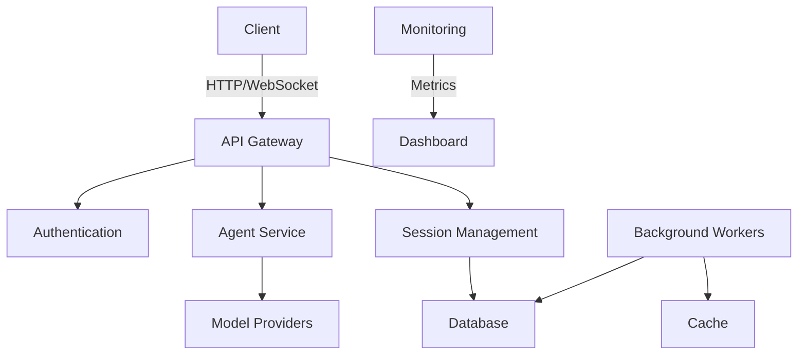

# System Architecture

## Overview
Adolphe.AI is built on a modern, scalable architecture designed for high availability and performance. This document outlines the key components and their interactions.

## High-Level Architecture



## Core Components

### 1. Frontend
- **Framework**: Next.js 14 with App Router
- **State Management**: React Context + SWR
- **UI Components**: Shadcn UI + Tailwind CSS
- **Real-time Updates**: WebSockets

### 2. Backend Services

#### API Gateway
- **Tech Stack**: Next.js API Routes
- **Features**:
  - Request routing
  - Rate limiting
  - Request validation
  - Response formatting

#### Agent Service
- **Responsibilities**:
  - Message processing
  - Agent orchestration
  - Tool execution
  - Memory management

#### Session Management
- **Features**:
  - Conversation history
  - Context management
  - User state persistence

### 3. Data Layer

#### Database
- **Primary Database**: PostgreSQL
- **Schema**:
  ```sql
  CREATE TABLE agents (
    id SERIAL PRIMARY KEY,
    name VARCHAR(255) NOT NULL,
    description TEXT,
    config JSONB NOT NULL,
    created_at TIMESTAMP DEFAULT NOW(),
    updated_at TIMESTAMP DEFAULT NOW()
  );
  ```

#### Cache
- **Technology**: Redis
- **Use Cases**:
  - Session storage
  - Rate limiting
  - Temporary data

## Integration Points

### Model Providers
- OpenAI (GPT-4, GPT-3.5)
- Anthropic Claude
- Custom models

### Authentication
- JWT-based authentication
- OAuth 2.0 providers
- API key management

## Deployment Architecture

### Development
- Local development with Docker Compose
- Hot-reload for frontend and backend

### Staging/Production
- Containerized deployment with Kubernetes
- Horizontal pod autoscaling
- Managed database services
- CDN for static assets

## Security Considerations

### Data Protection
- Encryption at rest (AES-256)
- Encryption in transit (TLS 1.3)
- Regular security audits

### Access Control
- Role-based access control (RBAC)
- Principle of least privilege
- Audit logging

## Performance

### Caching Strategy
- Edge caching for static assets
- Database query caching
- Response caching for frequent requests

### Scaling
- Stateless services for horizontal scaling
- Database read replicas
- Connection pooling

## Monitoring and Observability

### Metrics
- Request/response times
- Error rates
- Resource utilization

### Logging
- Structured logging with JSON format
- Centralized log management
- Retention policies

### Alerting
- Anomaly detection
- Threshold-based alerts
- On-call rotation

## Future Considerations
- Multi-region deployment
- Edge computing for lower latency
- Support for more model providers
- Plugin architecture for custom integrations
